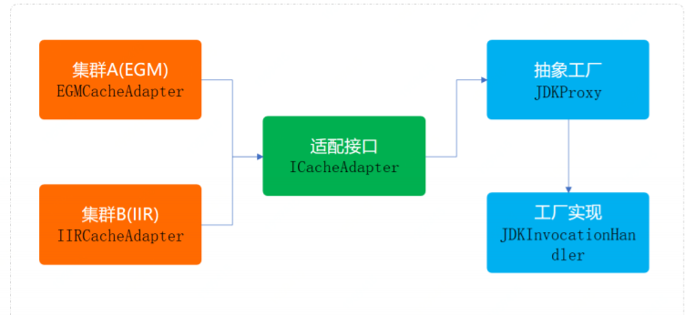

# 一、创建型模式

## 工厂方法

### 业务场景

多种类型商品不同接口，同意发奖服务搭建场景；

### 实现要点

定义一个创建对象的接口，让其子类自己决定实例化哪一个工厂类，工厂模式使其创建过程延迟到子类进行；

案例：itstack-demo-design-1-00为原始项目；itstack-demo-design-1-02为工厂优化项目
### 总结
避免创建者与具体的产品逻辑耦合、满足单一职责，每一个业务逻辑实现都在所属自己的类中完成、满足开闭原则，无需更改使用调用方法就可以在程序中引入新的产品类型。

## 抽象工厂

### 业务场景

替换Redis双集群升级，代理类抽象场景；

### 实现要点

提供一个创建一系列相关或相互依赖的对象的接口，而无需指定他们具体的类。

案例：itstack-demo-design-2-00为原始项目；itstack-demo-design-2-02为抽象工厂优化项目

### 总结
抽象工厂模式，所要解决的问题就是在一个产品族，存在多个不同类型的产品(Redis集群、操作系统)情况下，接口的选择问题。

## 建造者(生成器模式)
### 业务场景  
房屋装修
### 实现要点
itstack-demo-design-3-00 场景模拟工程，模拟装修过程中的套餐选择(豪华、田园、简约)      

itstack-demo-design-3-02 通过建造者设计模式改造代码
### 总结
一些基本物料不会变，而其组合经常变化的时候。

## 原型
### 业务场景
模拟在线考试题库抽提打乱顺序
### 实现要点
itstack-demo-design-4-00 场景模拟工程，模拟在线考试题库抽题打乱顺序  
itstack-demo-design-4-02 通过原型设计模式改造代码
### 总结
- 便于通过克隆方式创建复杂对象、也可以避免重复做初始化操作、 不需要与类中所属的其他类耦合。
## 单例

# 二、结构型模式

## 适配器

## 桥接

## 组合

## 装饰

## 外观

## 享元

## 代理

# 三、行为模式

## 责任链

## 命令

## 迭代器

## 中介者

## 备忘录

## 观察者

## 状态

## 策略

## 模板方法

## 访问者

