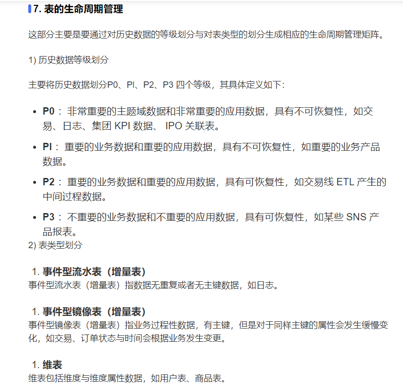

## 数仓分层
#### dim层
为维度层，构建步骤如下：   
- 确定主维表
- 确定从维表
- 确定维度表属性
- 规范化和反规范化
- 特殊维度和实时性维度的处理
#### ODS层
为操作数据层(数据贴源层)，避免出现一下问题：    
1. 数据缺失
2. 数据不准确(与线上业务系统不匹配)
3. 字段命名应该达到统一规范定义
4. 字段类型的规范统一
5. 度量单位的统一
6. 应该将每个字段都写上注释，特别是带有枚举的字段
7. 库表名的命名要规范
#### DWD层
dwd层的数据表往往是一些整合了多个业务过程的一些大宽表，根据一张表存放的业务过程来划分，又有单事务事实表和多事务事实表的区分，根据事实描述方式的不同，又可以分为事务型事实表和累积型快照事实表。dwd的数据往往从ods层加工得来，为的就是方便计算多个事务过程存在联系的指标。
#### DWS层
该层的意义主要是为了计算一些带有汇总含义的指标，比如说最近一个月的销售额，所以主要是加工一些周期型快照事实表，关于这个周期可以是一个小时，一天，一个星期，一个月等等都可以，但是要根据实际的业务需求来。
#### ADS层(数据集市)
应用数据层已经是对整个数据仓库的最高度抽象，一般来讲该层建设紧贴上层应用，也是直接服务于上层业务的，对于数据的使用人员，直接使用ads层的数据就可以了，完全不用理会底层的数据情况，不同的业务线可以建设自己的数据集市，但是这些数据的来源都离不开整个数据仓库的建设。

#### ETL
1. 抽取
2. 转换
数据清洗
3. 加载
    - 首次加载
    - 刷新加载
#### 数据立方体(Data Cube)

1. 切片和切块(Slice and Dice)

    ```sql
    # 切片
    SELECT Locates.地区, Products.分类, SUM(数量)
    FROM Sales, Dates, Products, Locates
    WHERE Dates.季度 = 2
    AND Sales.Date_key = Dates.Date_key
    AND Sales.Locate_key = Locates.Locate_key
    AND Sales.Product_key = Products.Product_key
    GROUP BY Locates.地区, Products.分类

    # 切块
    SELECT Locates.地区, Products.分类, SUM(数量)
    FROM Sales, Dates, Products, Locates
    WHERE (Dates.季度 = 2 OR Dates.季度 = 3) AND (Locates.地区 = '江苏' OR Locates.地区 = '上海')
    AND Sales.Date_key = Dates.Date_key
    AND Sales.Locate_key = Locates.Locate_key
    AND Sales.Product_key = Products.Product_key
    GROUP BY Dates.季度, Locates.地区, Products.分类
    ```
2. 旋转

3. 上卷和下钻

    ```sql
    # 上卷
    SELECT Locates.地区, Products.分类, SUM(数量)
    FROM Sales, Products, Locates
    WHERE Sales.Locate_key = Locates.Locate_key
    AND Sales.Product_key = Products.Product_key
    GROUP BY Locates.地区, Products.分类

    # 下钻
    SELECT Locates.地区, Dates.季度, Products.分类, SUM(数量)
    FROM Sales, Dates, Products, Locates
    WHERE Sales.Date_key = Dates.Date_key
    AND Sales.Locate_key = Locates.Locate_key
    AND Sales.Product_key = Products.Product_key
    GROUP BY Dates.季度.月份, Locates.地区, Products.分类
    ```
4. 其他OLAP操作
    除了上述的几个基本操作，不同的OLAP工具也会提供自有的OLAP查询功能，如钻过，钻透等，本文不一一进行讲解。通常一个复杂的OLAP查询是多个这类OLAP操作叠加的结果。

在线分析处理工具(OLAP)和商务智能(BI)
