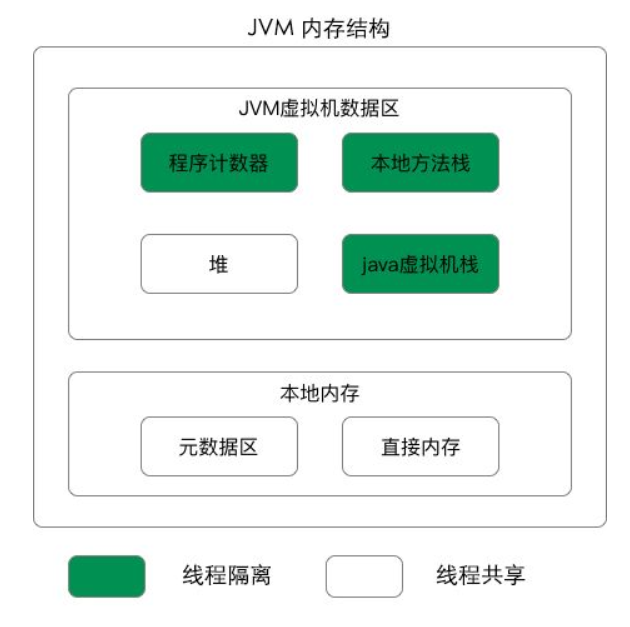
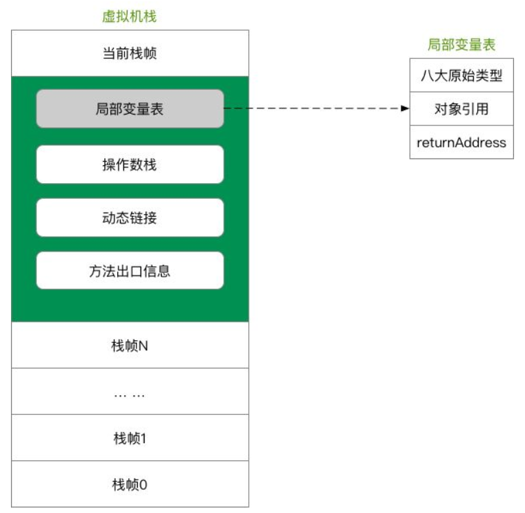

# JVM内存结构

java虚拟机的内存空间分为5个部分：

- 程序计数器
- Java虚拟机栈
- 本地方法栈
- 堆
- 方法区

JDK 1.8 同 JDK 1.7 比，最大的差别就是：元数据区取代了永久代。元空间的本质和永久代类似，都是对 JVM 规范中方法区的实现。不过元空间与永久代之间最大的区别在于：元数据空间并不在虚拟机中，而是使用本地内存。

## 程序计数器

### 程序计数器的定义

程序技术器是一块较小的内存空间，是当前线程正在执行的那条字节指令的地址。若当前线程正在执行时一个本地方法，那么此时程序计数器为Undefined。

### 程序计数器的作用

- 字节码解释器通过改变计数器来依次读取指令，从而实现代码的流程控制。
- 在多线程情况下，程序计数器记录的是当前线程执行的位置，从而当线程切换回来是，就知道上次线程执行到哪了。

## Java虚拟机栈(Java栈)

### Java虚拟机栈的定义

Java虚拟机栈是描述Java放啊发运行过程的内存模型。

Java虚拟机栈会为每一个即将运行的Java方法创建一块叫做"栈帧"区域，用于存放该方法运行过程中的一些信息，如：

- 局部变量表
- 操作数栈
- 动态链接
- 方法出口信息

### 压栈出栈过程

当方法运行过程中需要创建局部变量时，就将局部变量的值存入栈帧中的局部变量中。

Java虚拟机栈的栈顶的栈帧是当前正在执行的活动栈，也就是当前正在执行的方法，PC寄存器也会指向这个地址。只有这个活动的栈帧的本地变量被操作数栈使用，当这个栈帧中调用另一个方法，与之队形的栈帧又会被创建，新创建的栈帧压入栈顶，变为当前的活动栈帧。

方法结束后，当前栈帧被移除，栈帧的返回值变成新的活动栈帧中操作数中的一个操作数。如果没有返回值，那么新的活动栈帧中操作数栈的操作数没有变化。

**注意**：由于Java虚拟机栈是与线程对应的，数据不是线程共享的(也就是线程私有的)，因此不用关心数据一致性问题，也不会存在同步锁的问题。

### 局部变量表

定义为一个数字数组，主要用于存储方法参数、定义在方法体内部的局部变量，数据类型包括基本数据类型，对象引用，以及return address类型。

局部变量表容量大小是在编译期确定下来的。最基本的存储单元是slot，32位占用一个slot，64位类型(long和double)占用两个slot。

对于slot的理解：

- JVM虚拟机会为局部变量中的每个slot都分配一个访问索引，通过这个索引即可成功访问到局部变量表中指定的局部变量值。
- 如果当前帧是由构造方法创建的，该对象引用this，会被存放在index为0的slot处，其余的参数表顺序继续排列。
- 栈帧中局部变量表中的曹魏是可以重复的，如果一个局部变量过了其作用域，那么器作用域之后申明的新的局部变量就有可能会复用过期局部变量的槽位，从而达到节省资源的目的；

在栈帧中，与性能调优关系最为密切的部分，就是局部变量表，方法执行时，虚拟机使用局部变量表完成方法的传递局部变量表中的变量也是重要的垃圾回收根节点，只要被局部变量表中直接或间接引用的对象都不会被回收。

### 操作数栈

- **栈顶缓存技术**：由于操作数是存储在内存中，频繁的进行内存读写操作影响执行速度，将栈顶元素全部缓存到物理CPU的寄存器中，以此降低对内存的读写次数，提升执行引擎的执行效率。
- 每一个操作数栈会拥有一个明确的栈深度，用于存储数值，最大深度在编译期就定义好。32bit类型占用一个栈单位深度，64bit类型占用两个栈深度操作数栈。
- 并非采用方位索引的方式进行数据访问，而是只能通过标准的入栈、出栈操作完成一次数据访问。

### 方法调用

- 静态链接：当一个字节码文件被装载进JVM内部时，如果被调用的目标方法在编译期可知，且运行期间保持不变，这种情况下将调用方的符号引用转为直接引用的过程称为静态链接。

- 动态链接：如果被调用的方法无法在编译期被确定下来，只能在运行期间将调用的方法符号引用转为直接引用，这种引用转换过程具备动态性，因此被称之为动态链接。

- 方法绑定

  - 早起绑定：被调用的目标方法如果在编译期可知，且运行期保持不变。
  - 晚期绑定：被调用的方法在编译期无法被确定，只能在程序运行期根据实际的类型绑定相关的方法。

- 非虚方法：如果方法在编译期就确定了具体的调用版本，则这个版本在运行是不可变的。这种方法称为非虚方法静态方法，私有方法，final方法，实例构造器，父类方法都是非虚方法，除此以外都是虚方法。

- 虚方法表：面向对象的编程中，会很频繁的使用动态分配，如果每次动态分配的过程都要重新在类的方法元数据中搜索合适的目标的话，就可能影响到执行效率，英雌为了提高性能，JVM采用在类的方法区建立一个虚方法表，使用索引表来代替查找。

  - 每个类都有一个虚方法表，表中存放着各个方法的实际入口。
  - 虚方法表会在类加载的阶段被创建，并开始初始化，类的变量初始值准备完成之后，JVM会把该类的方法也初始化完毕。

- 方法重写的本质

  - 找到操作数栈顶的第一个元素所执行的对象的实际类型，记做C。如果在类型C中找到与常量池中描述和简单名称都相符的方法，则进行访问权限校验。
  - 如果通过则返回这个方法的直接引用，查找过程结束；如果不通过，则返回java.lang.IllegalAccessError异常。
  - 否则，按照继承关系从下往上对C的各个父类进行上一步的搜索和验证过程。
  - 如果始终没有找到合适的方法，则抛出java.lang.AbstractMethodError异常。

Java 中任何一个普通方法都具备虚函数的特征（运行期确认，具备晚期绑定的特点），C++ 中则使用关键字 virtual 来显式定义。如果在 Java 程序中，不希望某个方法拥有虚函数的特征，则可以使用关键字 final 来标记这个方法

### Java虚拟机栈的特点
- 运行速度特别快，仅仅次于PC寄存器

- 局部变量表随着栈帧的创建而创建，它的大小在编译时确定，创建时只需分配试下规定的大小即可。在方法运行过程中，局部变量表的大小不会发生改变。

- Java虚拟机栈会出现两种异常：StackOverFlowError和OutMemoryError。

  - StackOverFlowError若Java虚拟机栈的大小不允许动态扩展，那么当线程请求栈的深度超过当前Java虚拟机栈的最大深度时，抛出StackOverFlowError异常。
  - OutOfMemoryError若允许动态扩展，那么线程请求栈时内存用完了，无法再动态扩展时，抛出OutMemoryError异常。

- Java虚拟机栈也是线程私有，随着线程创建而创建，随着线程结束而销毁。
- 出现StackOverFlowError时，内存空间可能还有很多。

常见的运行时异常有
- NullPointerException-空指针异常
- ClassCastException-类型强制转换异常
- IllegalArgumentException-传递非法参数异常
- ArithmeticException-算术运算异常
- ArrayStoreException-向数组中存放与声明类型不兼容对象异常
- IndexOutOfBoundsException-下标越界异常
- NegativeArraySizeException-数字格式异常
- SecurityException-安全异常
- UnsupportedOperationException-不支持的操作异常
## 本地方法栈(C栈)
### 本地方法栈的定义
本地方法栈时为JVM运行Native方法准备的空间，由于很多Native方法都是用C语言实现的，所以它通常又叫C栈。它与Java虚拟栈实现的功能类似，只不过本地方法栈时描述本地方法运行过程的内存模型。
### 栈帧变换过程
本地方法被执行时，在本地方法栈也会创建一块栈帧，用来存放该方法的局部变量、操作数栈、动态链接、方法出口信息等。  
方法执行结束后，相应的栈帧也会出栈，并释放空间。也会抛出StackOverFlowError和OutMemoryError异常。
## 堆
### 堆的定义
堆用来存储对象的内存空间，[^几乎]所有的对象都存储在堆中。  
### 堆的特点
- 线程共享，整个Java虚拟机只有一个堆，所有的线程都访问一个堆。而程序计数器、Java虚拟机栈、本地方法都是一个线程对应一个。  
- 在虚拟机启动时创建。
- 是垃圾回收的主要场所。  
- 堆可分为新生代(Edn区:[^From Survior,To Survior])、老生代
- Java虚拟机规范规则，堆可以在物理内存中不连续，但在逻辑上它应该被视为连续的。
- 关于Survior s0 s1区复制之后有有交换，谁空谁是to  

不同的区域存放不同的生命周期的对象，这样可以根据不同的区域使用不同的垃圾回收算法，更具针对性。  
堆的大小既可以是固定的也可扩展，主流的虚拟机，堆的大小是可扩展的，因此线程请求分配内存，但堆已满，且内存已无法扩展时，就抛出OutOfMemoryError异常。  
>JAVA堆所使用内存式不需要保证连续的。而由于堆是被线程所共享的，所以对它的访问要注意同步问题，方法和属性都需要保证一致性。
### 新生代与老年代
- 老年代比新生代生命周期长
- 新生代与老年代空间默认比例1:2JVM调参数，XX:NewRatio=2,表示新生代占1，老年代占2
- 在HotSpot中，Eden空间和另外两个Survivor空间缺省所占的比例是8:1:1
- 几乎所有的Java对象都是在Edn区被new出来，Eden区放不了大对象，就直接进入了老年代。

### 对象分配过程
- new的对象先放着Eden区，大小有限制
- 如果创建新对象时，Eden空间填满了，就会触发Minor GC,将Eden不再对象引用的对象进行销毁，再加载新的对象放到Eden区，特别注意的是Survivor区满了是不会触发Minor GC的，而是Eden空间填满了，Minor GC才顺便清理Survior区
- 将Eden区中剩余的对象移到Survivor0区
- 再次触发垃圾回收，此时上次Survivor下来的，放到Survivor区的，如果没有回收，就会放到Survivor1区
- 再次经历垃圾回收，又会将幸存者重新放回Survivor0区，依次类推
- 默认是15次循环，超过15次，则会被幸存者区幸存下来的转去老年区jvm参数设置次数：XX:MaxTenuringThreshold=N进行设置
- 频繁在新生区收集，很少在养老区收集，机会不在永久区/元空间搜集
### Full GC/Major GC触发条件
- 显示调用System.gc(),老年待的空间不够，方法区的空间不过等都会触发Full GC,同时对新生代和老年代回收，FULL GC的STW的时间最长，应该避免
- 在出现Major GC之前，会先触发Minor GC,如果老年代的空间还是不够就会触发Major GC,STW的时间长于Minor GC
### GC分类
1. 部分收集(Partial GC):只针对部分区域进行垃圾收集，其中又分为:  
1.1 新生代收集(Minor GC/Young GC)：只针对新生代的垃圾收集器。具体点是Eden区满时触发GC，Survior满不会触发Minor GC。  
1.2 老年代收集(Major GC/Old GC):只针对老年代垃圾收集。  
1.3 混合收集(Mixed GC):指目标是收集整个新生代以及部分老年代的垃圾收集。  
2. 整堆收集(Full GC):收集整个Java堆和方法区的垃圾收集。
### 逃逸分析
- **标量替换**
  - 标量不可分解的量，java的基本数据类型就是标量，标量的对立就是可以被进一步分解的量，而这种量称之为聚合量。而在JAVA中对象就是可以被进一步分解的聚合量
  - 替换过程，通过逃逸分析确定该对象不会被外部访问，并且对象可以被进一步分解时，JVM不会创建该对象，而会将该对象成员变量分解若干个被这个方法使用的成员变量所代替。这些代替的成员变量在栈帧或寄存器上分配空间。
- **对象和数组并非都是在堆上分配内存的**
### TLAB
- TLAB的全称是Thread Local Allocation Buffer,即线程本地分配缓存区，是属于Edn区的，这是一个线程专用的内存分配区域，线程私有，默认开启的(当然也不是绝对的，也要看那种类型的虚拟机)
- 堆是全局共享的，在同一时间，可能会有多个线程在堆上申请空间，但每次对象分配需要同步的进行(虚拟机采用CAS配上失败重试的方法保证更新操作的原子性)但是效率却有点下降
- 所以用TLAB来避免多线程冲突，在给对象分配内存时，每个线程使用自己的TLAB，这样可以使得线程同步，提高了对象分配效率
- 当然并不是所有的对象在TLAB中分配内存成功。如果失败了就会使用锁的机制来保持操作的原子性
- XX:+UseTLAB 使用TLAB设置大小：-XX:+TLABSize
### 四种引用方式
- 强引用：创建一个对象并把这个对象赋值给一个引用变量，普通new出来对象的变量的引用都是强调用，有引用变量指向时永远不会被垃圾回收，jvm即使抛出OOM，可以将引用赋值为null,那么他所指向的对象就会被垃圾回收
- 软引用：如果一个对象具有软引用，内存对象足够，垃圾回收器就不会回收它，如果内存空间不足，就会回收这些对象的内存。只要垃圾回收器没有回收它，该对象就可以被程序占用
- 弱引用：非必需对象，当JVM进行垃圾回收时，无论内存是否充足，都会回收被弱引用关联的对象。
- 虚引用：虚引用并不会决定对象的生命周期，如果一个对象仅持有虚引用，那么它就和没有引用一样，在任何时候被垃圾回收器回收。
## 方法区
### 方法区的定义
Java虚拟机规范中定义方法区是堆的一个逻辑部分。方法区存放以下信息：  
- 已经被虚拟机加载的类信息
- 常量
- 静态变量
- 即时编译器编译后的代码
### 方法区的特点
- 线程共享。方法区是堆的一个逻辑部分，因此和堆一样，都是线程共享。整个虚拟机中只有一个方法区。
- 永久代。方法区中的信息已办需要长期存在，而且它又是堆的逻辑分区，因此用堆的划分方法，把方法区称为"永久代"。
- 内存回收效率低。方法区中的信息一般需要长期存在，回收一遍之后可能只有少量信息无效。主要回收目标是：对常量池的回收；对类型的卸载。
- Java虚拟机规范对方法区的要求比较宽松。和堆一样，允许固定大小，也允许动态扩展，还允许不实现垃圾回收。
### 运行时常量池
方法区中存放:类信息、常量、静态变量、即时编译器编译后的代码。常量就存放在运行时常量池中。  
当类被Java虚拟机加载后，.class文件中的常量就放在方法区区的运行时常量池中。而且在运行期间，可以向常量池总添加新的变量。如String类的intern()方法就能在运行期间向常量池中添加字符串常量。
### 直接内存(堆外内存)
直接内存是除Java虚拟机之外的内存，但也可能被Java使用。
#### 操作直接内存
在NINO中引入一种基于通道和缓存的IO方式。它可以通过调用本地方法直接分配Java虚拟机之外的内存，然后通过一个存储在堆中的DirectByteBuffer对象直接操作该内存，而无须先将外部内存中的数据复制到堆中再进行操作，从而提高了数据操作的效率。  
直接内存的大小不受Java虚拟机控制，但既然是内存，当内存不足时就会抛出OutOfMemoryError异常。
#### 直接内存与堆内存比较
- 直接内存申请空间耗费更高的性能
- 直接内存读取IO的性能要由于普通的堆内存
- 直接内存作用链：本地IO->直接内存->本地IO
- 堆内存作用链：本地IO->直接内存->非直接内存->直接内存->本地IO
>服务器管理员在配置虚拟机参数时，会根据实际内存设置-Xmx等参数信息，但经常忽略直接内存，使得个内存区域总和大于物理内存限制，从而导致动态扩展出现OutOfMemoryError异常。

HotSpot虚拟机对象

垃圾回收集策略与算法

HotSpot垃圾回收器

内存分配与回收策略

JVM性能调优

类文件结构

类加载的时机

类加载的过程

类加载器