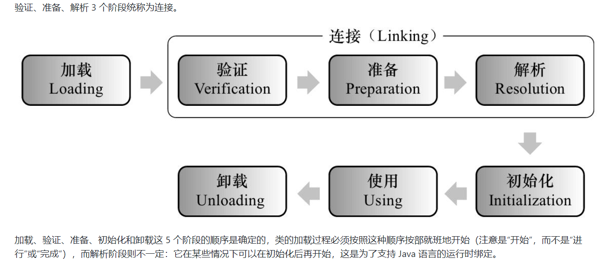

# 类加载的时机
## 类的生命周期
类从被加载到虚拟机内存开始，到卸载出内存为止，它的整个生命周期包括一下7个阶段：
- 加载
- 验证
- 准备
- 解析
- 初始化
- 使用
- 卸载  


## 类加载过程中"初始化"开始的时机
Java虚拟机规范没有强制约束类加载过程的第一阶段(即：加载)什么时候开始，但对于"初始化"阶段，有着严格的规定。有且仅有5种情况必须立即对类进行"初始化"：
- 在遇到new、putstatic、getstatic、invokestatic字节码指令时，如果类尚未初始化，则需要先触发其初始化。
- 对类进行反射调用时，如果类还没有初始化，则需要先触发初始化。
- 初始化一个类时，如果其父类还没初始化，则需要先初始化父类。
- 虚拟机启动时，用于需要指定一个包含main()方法的主类，虚拟机会先初始化这个主类。
- 当使用JDK1.7的动态语言支持时，如果一个java.lang.invoke.MethodHandle实例最后的解析结果为REF_getStatic、REF_putStatic、REF_invokeStatic的方法句柄，并且这个方法句柄所对应的类还没初始化，则需要先触发其初始化。  

这5种场景中的行为称为对一个类进行主动引用，除此之外，其它所有引用类的方式都不会触发初始化，称为被动引用。
## 被动引用演示Demo
**Demo1**
```java
/**
 * 被动引用 Demo1:
 * 通过子类引用父类的静态字段，不会导致子类初始化。
 *
 * @author ylb
 *
 */
class SuperClass {
    static {
        System.out.println("SuperClass init!");
    }

    public static int value = 123;
}

class SubClass extends SuperClass {
    static {
        System.out.println("SubClass init!");
    }
}

public class NotInitialization {

    public static void main(String[] args) {
        System.out.println(SubClass.value);
        // SuperClass init!
    }

}
```
对于静态字段，只有直接定义这个字段的类才会被初始化，因此通过其子类来引用父类中定义的静态字段，只会触发父类的初始化而不会触发子类的初始化。  
**Demo2**
```java
/**
 * 被动引用 Demo2:
 * 通过数组定义来引用类，不会触发此类的初始化。
 *
 * @author ylb
 *
 */

public class NotInitialization {

    public static void main(String[] args) {
        SuperClass[] superClasses = new SuperClass[10];
    }

}
```
这段代码不会触发父类的初始化，但会触发“[L 全类名”这个类的初始化，它由虚拟机自动生成，直接继承自 java.lang.Object，创建动作由字节码指令 newarray 触发。
**Demo3**
```java
/**
 * 被动引用 Demo3:
 * 常量在编译阶段会存入调用类的常量池中，本质上并没有直接引用到定义常量的类，因此不会触发定义常量的类的初始化。
 *
 * @author ylb
 *
 */
class ConstClass {
    static {
        System.out.println("ConstClass init!");
    }

    public static final String HELLO_BINGO = "Hello Bingo";

}

public class NotInitialization {

    public static void main(String[] args) {
        System.out.println(ConstClass.HELLO_BINGO);
    }

}
```
编译通过之后，常量存储到 NotInitialization 类的常量池中，NotInitialization 的 Class 文件中并没有 ConstClass 类的符号引用入口，这两个类在编译成 Class 之后就没有任何联系了。
## 接口的加载过程
接口加载过程与类加载过程稍有不同。  
当一个类在初始化时，要求其父类全部都已经初始化过了，但是一个接口在初始化时，并不要求其父接口全部都完成了初始化，当真正用到父接口的时候才会初始化。