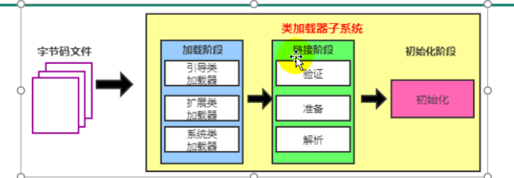
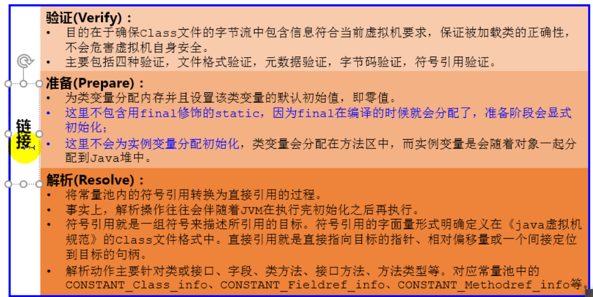
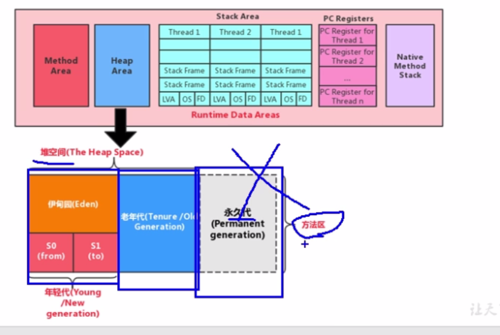
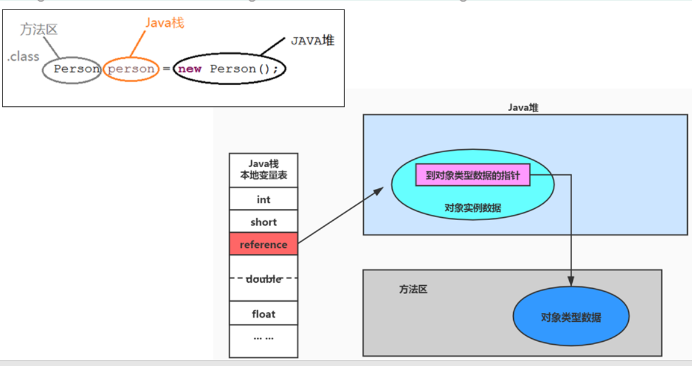

## 第一章JVM与Java体系结构
#### 参考数目
Java虚拟机规范、深入Java虚拟机(JVM高级特性与最佳实战)、升入理解Java虚拟机(JVM高级特性与最佳实战)  
JVM的位置：  
    
#### JVM的整体结构

1. 方法区、栈线程共享
2. java栈、本地方法栈、程序技术器每个线程独占
3. 执行引擎：解释器、及时编译器、垃圾回收器(高级语言-机器语言)
#### java代码执行流程
java程序-(编译)-字节码文件-(执行)-操作系统

#### jvm的架构模型  
1. 栈的指令集架构
    - 设计和实现简单，适用于资源受限的系统；
    - 避开了寄存器的分配难题:使用零地址指令方式分配
    - 指令流中的指令大部分是零地址指令，其执行过程依赖于操作栈。指令集更小，编译器容易实现。
    - 不需要硬件支持，可移植性更好，更好实现跨平台
    
2. 基于寄存器架构的特点 
    - 典型的应用是x86的二进制指令集.
    - 指令集架构则完全依赖硬件，可移植性差
    - 性能优秀和执行更高效
    - 花费更少的指令区完成一下操作
    - 基于寄存器架构的指令集往往都以一地址指令、二地址指令和三地址指令为主，而即将于栈式架构的指令集却是以零地址指令为主。
   
反编译指令:javap -v 字节码文件
#### JVM的生命周期
1. 启动  
   Java虚拟机的启动时通过引导类加载创建一个初始类来完成的，这个类是有虚拟机的具体实现指定。
2. 执行  
   - 一个运行中的Java虚拟机有着一个清晰的任务：执行Java程序。
   - 程序开始执行时它才运行，程序结束时他就停止。
   - 执行一个所谓的Java程序时候，正正在执行的是一个叫做Java虚拟机的进程。
3. 退出  
   - 程序正常执行结束
   - 程序在执行过程中遇到异常或错误而异常终止
   - 由于操作系统出现错误而导致Java虚拟机进程终止  
   - 某线程调用Runtime类或System类的exit方法，或Runtime类的halt方法，并且安全管理器也允许这次exit或halt操作。
   
#### JVM发展历程
1. Sun Classic VM第一款虚拟机；只提供了解释器，与JIT编译器是二选一执行；
2. Exact VM  
   可以知道内存中某个位置的数据具体是什么类型。
   Exact Memory Management:准确式内存管理  
   编译器与解释器混合工作模式  
   热点探测  
   只在Solaris平台使用
   
3. HotSpot VM  
   jdk1.3，HotSpot VM开始默认为虚拟机  
   热点代码探测技术  
   - 通过技术器找到最具编译价值代码，触发即时编译或栈上替换   
   - 通过编译器与解释器协同工作，在最优化的程序响应时间与最佳执行性能中取得平衡  
   
4. BEA的JRockit  
   专注于服务器端应用：都靠即时编译器，最快的JVM;Misson Control服务套件，  、
   
5. J9  
   
## 第二章类加载子系统

#### 类加载器和类的加载过程  
1. 类加载子系统作用  

   - 类加载子系统负责从文件系统或者网络中加载Class文件，class文件在文件
      开头有特定的文件标识。
   - ClassLoader只负责class文件的加载，至于它是否可以运行，则由Execution
      Engine决定。
   - 加载的类信息存放于一块称为方法区的内存空间。除了类的信息外，方法区中还会
      存放运行时常量池信息，可能还包括字符串面量和数字常量(这部分常量信息是Class 
      文件中常量池的内存映射)
     

2. 类加载过程
   加载(Loading)--验证(Verfication)--准备(Preparation)--解析(Resolution)--初始化(Initalization)
   
   - 加载：  
      1. 通过一个类的全限定名获取定义此类的二进制字节流  
      2. 将这个字节流所代表的静态存储结构转化为方法区的运行时数据结构  
      3. 在内存中生成一个代表这个类的java.lang.Class对象，作为方法区这个类的各种数据的访问入口；
   
      
   
2. 链接

   
3. 初始化

   
client==类变量、类方法  
类变量的声明可以在，类方法后；因类变量初始化是在链接的preare阶段  
#### 类加载器分类  
JVM支持两种类型的类加载器：引导类加载器(Bootstrap ClassLoader)和自定义类加载器(User-Defined ClassLoader)   
  
四者是包含关系，非继承关系  
  
- 启动类加载器(引导类加载器,bootstrap classLoader)
   1. 由C和C++实现 
   2. 加载java核心库
   3. 没有父类加载器
   4. 加载扩展类和应用程序类加载器，并指定为他们的父类加载器
   5. Boostrap启动类只加载包名为java、javax、sun等开头的类
- 扩展类加载器(虚拟机自带加载器)  
   1. 由java编写
   2. 派生于ClassLoader类
   3. 父类加载器为启动类加载器
   4. 从java.ext.dirs系统属性所指定的目录中加载，或从JDk的安装目录jre/lib/ext子目录(扩展目录)下加载类库。如果用户创建的JAR放在此目录中，也会自动由扩展类加载器加载。
- 应用程序类加载器(虚拟机自带的加载器AppClassLoader)   
   1. java编写  
   2. 派生于ClassLoader类  
   3. 父类加载器为扩展类加载器
   4. 它负责加载环境变量classpath或系统属性java.class.path指定路径下的类库  
   5. 该类加载时程序中默认的类加载器，一般来说，Java应用的类都是由它来完成加载
   6. 通过ClassLoader#getSystemClassLoader()方法可以获取该类加载器
- 用户自定义类加载器的原因  
   1. 隔离加载类  
   2. 修改类加载的方式
   3. 扩展加载类
   4. 防止源码泄露
- 用户自定义类加载器实现步骤  
   1. 继承抽象类java.lang.ClassLoader类的方式，实现自己的类加载器。
   2. 在jdk1.2之前，会去继承ClassLoader类并重写loadClass()方法，实现自定的类加载器。在JDK1.2之后，建议把自定义的类加载逻辑在findClass()方法中
   3. 如果没有太多需求，可以直接继承URLClassLoader类
#### 关于ClassLoader  

  
#### 双亲委派机制  
即把请求交由父类处理，它时一种任务委派模式。   

优势：   
   - 避免类的重复加载
   - 保护程序的安全，防止核心API被篡改
沙箱安全机制  
#### 其他
1. 在JVM中表示两个Class对象是否为同一个类存在两个必要条件：  
   - 类的完整类名必须一样。
   - 加载这个类的ClassLoader（指ClassLoader的实例对象）必须相同。 
2. 对类的使用  
   - 主动使用  
      1. 创建类的实例  
      2. 访问某个类或接口的静态变量，或者对该静态变量赋值  
      3. 调用类的静态方法  
      4. 反射
      5. 初始化一个类的子类
      6. Java虚拟机启动时被标明为启动类的类
      7. JDK 7提供了动态语言支持
   - 被动使用  
## 第三章运行时数据区概念及线程(3-10,12章)
1. 概述
   
   灰色为单线程私有，红色为多线程共享；  
   - 每个线程:独立包括程序计数器、栈、本地栈
   - 线程间共享:堆、堆外内存(永久代或元数据--方法区、代码缓存)
   - 95%Heap堆，5%方法区
   
   

2. 线程
   - 守护线程
   - 普通线程   

jconsole可以看到后台的线程
   - 虚拟机线程  
   - 周期任务线程 
   - GC线程
   - 编译线程
   - 信号调度线程 
## 第四章程序技术器(PC寄存器)  
1. 介绍
   

2. 举例说明
   
   
3. 两个常见问题  
   - 使用PC寄存器存储字节码指令地址有什么作用？为什么使用PC寄存器记录当前线程的执行地址呢？  
   因为CPU需要不断切换各个线程，这个时候切换回来以后，就得知道接着开始从哪里开始执行。   
   JVM的字节码解释器就需要通过改变PC寄存器的值来明确一下一条应该执行什么样的字节。   
   - PC寄存器为什么被设置为线程私有的？  
   为了能够准确地记录各个线程正在执行的当前字节码指令地址，最好的办法是为每一个线程都分配一个PC寄存器。
## 第五章虚拟机栈

   栈可能出现的异常  

      1. stackoverflowerror
      2. outofmoryerror  

   虚拟机基本内容

      1. 设置内存大小  
      我们可以使用参数-Xss选项设置最大栈空间，栈的大小直接决定了函数调用最大可达深度。[文档](https://docs.oracle.com/en/java/javase/11/tools/java.html#GUID-3B1CE181-CD30-4178-9602-230B800D4FAE)  

#### 栈的存储单位
   每个线程都有自己的栈，每个栈都是以栈帧的格式存在。  
   在线程上正在执行的每一个方法都各自对应一个栈帧。  
   栈帧是一个内存区块，是一个数据集，维系着方法执行过程中的各种信息。  
#### 栈运行的原理
   先进后出，压栈，出栈  
   在一条活动线程中，一个时间点上，只会有一个活动的栈帧。这个栈帧就是当前栈帧，与之对应的方法称之为当前方法，对应定义方法的类叫当前类。  
   
#### 栈的内部结构
   - 局部变量表
   - 操作数栈(或表达式栈)
   - 动态链接(或执行运行时常量池的方法引用)
   - 方法返回地址(或方法正常退出或者异常退出的定义
   - 一些附件信息

   

1. 局部变量表(local variables本地变量表)
   - 一个数字数组，主要用于存储方法参数和定义在方法体内的局部变量。包括基本数据类型、对象引用、returnAddress类型；
   - 是私有的数据，不存在数据安全问题；
   - 局部变量表所需的容量的大小是在编译期间确定下来的；
   - 方法嵌套调用的次数由栈的大小决定。
   - 局部变量表中的变量只在当前方法调用中有效。

   关于Slot的理解
   - 局部变量表中，最基本的存储单元是slot(变量槽)
   - 32位占一个槽，64位占两个slot
   - JVM会为局部变量表中的每一个Slot都分配一个访问索引，通过这个索引即可访问到局部变量表中指定的局部变量值。
   - 当一个实例方法被调用的时候，它的方法参数和方法体内部定义的局部变量将会按照顺序被复制到局部标量表中的每一个Slot上；
   - 如果需要访问局部变量表中一个64bit的局部变量值时，只需要使用前一个索引即可。
   - 如果当前帧是由构造方法或者实例方法创建的，那么该对象引用this将会存放在index为0的slot，其余的参照按照参数顺序继续排列。  
 
   静态变量和局部变量的对比
   - 变量的分类：
      1. 数据类型：基本数据类型；引用数据类型
      2. 声明位置：   
      成员变量：--在使用前，都经过默认初始化赋值。   
      类变量：linking的prepare阶段:给变量默认赋值-->inital阶段:给变量显示赋值即静态代码块赋值，  
      实例变量：随着对象的创建，会在堆空间中分配实例变量空间，并进行默认赋值；  
      局部变量：在使用前必须进行显示赋值。  
2. 操作数栈(Operand Stack)  
   可以使用数组或链表来实现。  
3. 代码追踪  
4. 栈顶缓存技术  
   将栈顶元素全部缓存在物理CPU的寄存器中，以此降低对内存的读/写次数，提高执行引擎的执行效率。  
#### 动态链接  
将这些符号引用转换为调用方法的直接引用。

#### 方法的调用  
   - 静态连接-早期绑定-非虚方法
   - 动态链接-晚期绑定-虚方法

1. 虚方法与非虚方法  
   非虚方法：静态方法、私有方法、final方法、实例构造器、父类方法  
   其他方法称为虚方法。  

   - 普通调用指令： 
      1. invokestatic:调用静态方法，解析阶段确定唯一方法版本。(非虚)   
      2. invokespecial:调用<init>方法、私有及父类方法，解析阶段确定唯一方法版本。(非虚)  
      3. invokevictual:调用所有虚方法。
      4. invokeinterface:调用接口方法

   - 动态调用指令
      1. invkedynamic:动态解析出需要调用的方法，然后执行；

      静态类型语言是判断变量自身的类型信息；动态类型语言是判断变量值的类型信息，变量没有类型信息，变量值才有类型信息。  

   - 方法重写的本质   
   1. 找到操作数栈顶的第一个元素所执行的对象的实际类型，记作 C。
   2. 如果在类型C中找到与常量中的描述符合简单名称都相符的方法则进行访问权限校验，如果通过则返回这个方法的直接引用，查找过程结束；如果不通过，则返回java.1ang.I11egalAccessError异常。
   3. 否则，按照继承关系从下往上依次对C的各个父类进行第2步的搜索和验证过程。
   4. 如果始终没有找到合适的方法，则抛出java.lang.AbstractMethodError异常。

      I11ega1 AccessError介绍：
      程序试图访问或修改一个属性或调用一个方法，这个属性或方法，你没有权限访问。一般的，这个会引起编译器异常。这个错误如果发生在运行时，就说明一个类发生了不兼容的改变。  
   
   建立虚方法表：在类链接阶段
#### 方法返回地址  
## 第六章本地方法接口
简单地讲，一个Native Method就是一个Java调用非Java代码的接口。一个Native Metiod是这样一个Java方法：该方法的实现由非Java语言实现，比如C。这个特征并非Java所特有，很多其它的编程语言都有这一机制，比如在c++中你可以用extern"c"告知c++编译器去调用一个C的函数。  

"A native method is a Java method whose implementation is provided by non-java code.     

在定义一个native methodi时，并不提供实现体（有些像定义一个Javainterface),因为其实现体是由非java语言在外面实现的。

本地接口的作用是融合不同的编程语言为Java所用，它的初衷是融合C/C++程序。  

使用native关键字来修饰的方法为本地方法。

native Method的必要性：
1. 与Java外的环境的交互
2. 与操作系统交互
3. Sun's

## 第七章本地方法栈  
Java虚拟机栈用于管理Java方法的调用，而本地方法栈用于管理本地方法的调用。

- 本地方法栈，也是线程私有的。
- 允许被实现成固定或者是可动态扩展的内存大小。（在内存流出方面是相同的)  
   1. 如果线程请求分配的栈容量超过本地方法栈允许的最大容量，Java虚拟机将会抛出一个StackoverflowError异常。  
   2. 如果本地方法栈可以动态扩展，并且在尝试扩展的时候无法申请到足够的内存，或者在创建新的线程时没有足够的内去创建对应的本地方法栈，那么Jva虚拟机将会抛出一个OutofMemoryError异常。

- 本地方法是使用C语言实现的。它的具体做法是Native Method Stack中登记native方法，在 Execution Engine执行时加载本地方法库。   
- 当某个线程调用一个本地方法时，它就进入了一个全新的并且不再受虚拟机限制的世界。它和虚拟机拥有同样的权限。  
   1. 本地方法可以通过本地方法接口来访问虚拟机内部的运行时数据区。  
   2. 它甚至可以直接使用本地处埋器中的寄存器
   3. 直接从本地内存的堆中分配任意数量的内存。

- 并不是所有的JM都支持本地方法。因为Java虚拟机规范并没有明确要求本地方法栈的使用语言、具体实现方式、数据结构等。如果JVM产品不打算支持native方法，也可以无需实现本地方法栈。    
- 在Hotspot JVM中，直接将本地方法栈和虚拟机栈合二为一。  

## 第八章堆
1. 堆的核心概述
2. 设置堆内存大小与OOM
3. 年轻代与老年代
4. 图解对象分配过程
5. Minor GC、Major GC、Full GC
6. 堆空间分代思想
7. 内存分配策略
8. 为对象分配内存：TLAB
9. 小结堆空间的参数设置
10. 堆是分配对象的唯一选择吗

#### 堆的核心概述
1. 概述
   - 一个JVM实例只存在一个堆内存，堆也是Java内存管理的核心区域。  

   - Java堆区在JVM启动的时候即被创建，其空间大小也就确定了。是JVM管理的最大一块内存空间。
      1. 堆内存的大小是可以调节的。

   - 《Java虚拟机规范》规定，堆可以处于物理上不连续的内存空间中，但在逻辑上它应该被视为连续的。
   - 所有的线程共享Java堆，在这里还可以划分线程私有的缓冲区(Thread Local Allocation Buffer,TLAB).
   - 在bin目录下使用Java VisualVM工具   
   - 《Java虚拟机规范》中对Java堆的描述是：所有的对象实例以及数组都应当在运行时分配在堆上。(The heap is the run-ime data area from which memory for all class instances and arrays is allocated
      1. 我要说的是：“几乎”所有的对象实例都在这里分配内存。一从实际使用角度看的。
   - 数组和对象可能永远不会存储在栈上，因为栈帧中保存引用，这个引用指向对象或者数组在堆中的位置。
      
   - 在方法结束后，堆中的对象不会马上被移除，仅仅在垃圾收集的时候才会被移除。
   - 堆，是GC(Garbage Collection,垃圾收集器)执行垃圾回收的重点区域。
2. 内存细分
   - Java 7之前堆内存逻辑上分为三部分：新生区+养老区+永久区  
      1. Yong Generation Space 新生区 Yong/New  
         由被划为Enden区和Survivor区
      2. Tenure generation space 养老区  Old/Tenure  
      3. Permanent Space 永久区 Perm
   - Java 8及之后堆内存逻辑上分为三部分：新生区+养老区+元空间    
      1. Yong Generation Space 新生区  Yong/New  
         又被划为Enden区和Survivor 区
      2. Tenure generation space 养老区  Old/Tenure  
      3. Meta Spacee 元空间 Meta  
   
   
   -XX:+PrintGCDetails可以定义堆空间中的结构大小
#### 设置堆内存大小与OOM
1. 设置堆空间大小  
   - Java堆区用于存储Java对象实例，那么堆的大小在J启动时就已经设定好了，大家可以通过选项”-mx“和“-Xms“来进行设置，
      1. “-ms“用于表示堆区的起始内存，等价于-XX:InitialHeapsize
      2. “-Xmx“则用于表示堆区的最大内存，等价于-XX:MaxHeapsize
   - 一旦堆区中的内存大小超过“-mx“所指定的最大内存时，将会抛出OutofMemoryError异常，通常会将-Xms和-Xmx两个参数配置相同的值，其目的是为了能够在java垃级回收机制清理完堆区后不需要重新分隔计算堆区的大小，从而提高性能
   - 默认情况下，初始内存大小：物理电脑内存大小/64，最大内存大小：物理电脑内存大小/4
      1. 设置空间大小的参数
         -Xm5用来设置城空间（年经代+老年代）的切始内存大小
         -X是vm的运行参数
         ms是memory start
         -Xmx用来设置推空间（年经代，老年代》的最大内存大小
      2. 默认雄空间的大小
         初始内存大小：物理电萝内存大小/64
         最大内存大小：物理电菌内存大小/4
      3. 手动设置：-Xm5600m-XmX600m 开发中建议将切始推内存和最大的耀内存设置成相同的值。
      4. 命令使用  
         jps:查看进程id
         jstack -gc 9228:查看进程gc情况
         
         -XX:+PrintGCDetails
2. oom的说明与举例  

#### 年轻代与老年代
- 存储在JN中的Java对象可以被划分为两类：
   1. 一类是生命周期较短的瞬时对象，这类对象的创建和消亡都非常迅速
   2. 另外一类对象的生命周期却非常长，在某些极端的情况下还能够与JVM的生命周期保持一致。
- Java堆区进一步细分的话，可以划分为年轻代(YoungGen)和老年代(oldGen)
- 其中年轻代又可以划分为Eden空间、Survivor0空间和Survivor1空间（有时也叫做from区、to区)  
- 配置新生代与老年代在堆结构的占比。
   1. 默认-X:NewRatio=2,表示新生代占1，老年代占2，新生代占整个堆的1/3
   2. 可以修改-XX:NewRatio=4,表示新生代占1，老年代占4，新生代占整个堆的1/5
- 命令查看  
   jinfo -flag NewRatio 6988

新生代：
- 在HotSpot中，Eden空间和另外两个Survivor空间缺省所占的比例是8：1：1
- 当然开发人员可以通过选项“-XX:SurvivorRatio”调整这个空间比例。比
   -XX:SurvivorRatio=8
- 几乎所有的Java对象都是在Eden区被new出来的。
- 绝大部分的Java对象的销毁都在新生代进行了。
   1. IBM公司的专门研究表明，新生代中80号的对象都是“朝生夕死”的。
- 可以使用选项”-Xmn"设置新生代最大内存大小
   1. 这个参数一般使用默认值就可以了
   2. 自适应参数：-XX:-UseAdaptivesizepolicy，-关闭自适应内存分配策略暂时不用  
#### 图解对象分配过程   
为新对象分配内存是一件非常严谨和复杂的任务，JVM的设计者们不仅需要考虑内存如何分配、在哪里分配等问题，并且由于内存分配算法与内存回收算法密切相关，所以还需要考虑GC执行完内存回收后是否会在内存空间中产生内存碎片。
1. new的对象先放伊甸园区。此区有大小限制。
2.M当伊甸园的空间填满时，程序又需要创建对象，JVM的垃圾回收器将对伊甸园区进行垃圾回收(Minor GC),将伊甸园区中的不再被其他对象所引用的对象进行销毁。再加载新的对象放到伊甸园区
3. 然后将伊甸园中的剩余对象移动到幸存者0区。
4. 如果再次触发垃圾回收，此时上次幸存下来的放到幸存者0区的，如果没有回收，就会放到幸存者1区。
5. 如果再次经历垃圾回收，此时会重新放回幸存者0区，接着再去幸存者1区。
6. 啥时候能去养老区呢？可以设置次数。默认是15次。
   - 可以设置参数：-XX:MaxTenuringThreshold=<N>进行设置.
7. 在养老区，相对悠闲。当养老区内存不足时，再次触发GC:Major GC,进行养老区的内存清理。
8. 若养老区执行了Major GC之后发现依然无法进行对象的保存，就会产生OOM异常java.lang.OutofMemoryError:Java heap space

总结：
- 针对幸存者s日，s1区的总结：复制之后有交换，谁空谁是to.
- 关于垃圾回收：频繁在新生区收集，很少在养老取收集，几乎不在永久区/元空间收集。

常用调优工具：  
1. JDK命令:jinfo,jstate,javap,jmap
2. Eclipse:Memory Anaylyzer Tool  
3. Jconsole
4. VisualVM
5. Jprofiler
6. Java Flight Recorder
7. GCViewer
8. GC Easy
#### Minor GC、Major GC、与FUll GC
JVM在进行GC时，并非每次都对上面三个内存区域(新生代、老年代；方法区)一起回收的，大部分时候回收的都是指新生代。   
针对HotSpot VM的实现，它里面的GC按照回收区域又分为两大种类型：一种是部分收集(Partial GC),一种是整堆收集(Fu11 GC)
- 部分收集：不是完整收集整个]ava堆的垃圾收集其中又分为：
   1. 新生代收集(Minor GC/Young GC):只是新生代的垃圾收集
   2. 老年代收集(Major GC/oldGc):只是老年代的垃圾收集。
      - 目前，只有CMS GC会有单独收集老年代的行为。
      - 注意，很多时候Major GC会和Fu11GC混淆使用，需要具体分辨是老年代回收还是整堆回收。
   3. 混合收集(Mixed GC):收集整个新生代以及部分老年代的垃圾收集。
      - 目前，只有G1 GC会有这种行为
- 整堆收集(Fu11 Gc):收集整个java堆和方法区的垃圾收集。

年轻代Gc(Minor GC)触发机制：
   1. 当年轻代空间不足时，就会触发Minor GC,这里的年轻代满指的是Eden代满，Survivor满不会引发GC。(每次Minor GC会清理年轻代的内存。)
   2. 因为]ava对象大多都具备朝生夕灭的特性，所以Minor GC非常频繁，一般回收速度也比较快。这一定义既清晰又易于理解。
   3. Minor GC会引发STW,暂停其它用户的线程，等垃圾回收结束，用户线程才恢复运行。

老年代Gc(Major GC/Fu11 GC)触发机制：
   1. 指发生在老年代的GC，对象从老年代消失时，我们说“Major GC”或“Fu11Gc”发生了。
   2. 出现了Major GC,经常会伴随至少一次的Minor GC(但非绝对的，在Parallel Scavenge收集器的收集策略里就有直接进行Major GC的策略选择过程)。
      - 也就是在老年代空间不足时，会先尝试触发Minor GC。如果之后空间还不足，则触发Major GC
   3. Major GC的速度一般会比Minor GC慢10倍以上，STw的时间更长。
   4. 如果Major GC后，内存还不足，就报ooM了。
   5. Major GC的速度一般会比Minor GC慢10倍以上。

Fu11Gc触发机制：（后面细讲)触发Fu11Gc执行的情况有如下五种：  
1. 调用System.gc()时，系统建议执行Fu11Gc,但是不必然执行
2. 老年代空间不足
3. 方法区空间不足
4. 通过Minor GC后进入老年代的平均大小大于老年代的可用内存
5. 由Eden区、survivor space0(From Space)区向survivor space1(To Space)区复制时，对象大小大于To Space可用内存，则把该对象转存到老年代，且老年代的可用内存小于该对象大小   
说明：fu11 gc是开发或调优中尽量要避免的。这样暂时时间会短一些。
#### 内存分配策略
如果对象在Eden出生并经过第一次MinorGC后仍然存活，并且能被Survivor容纳的话，将被移动到Survivor空间中，并将对象年龄设为1。对象在Survivor区中每熬过一次MinorGC,年龄就增加1岁，当它的年龄增加到一定
程度（默认为15岁，其实每个VM、每个GC都有所不同）时，就会被晋升到老年代中。     
对象晋升老年代的年龄阈值，可以通过选项-XX:MaxTenuringThreshold来设置。

针对不同年龄段的对象分配原则如下所示：
- 优先分配到Eden
- 大对象直接分配到老年代
   1. 尽量避免程序中出现过多的大对象
- 长期存活的对象分配到老年代
- 动态对象年龄判断
   1. 如果Survivor区中相同年龄的所有对象大小的总和大于Survivor空间的一半，年龄大于或等于该年龄的对象可以直接进入老年代，无须等到MaxTenuringThreshold中要求的年龄。
- 空间分配担保  
   -XX:HandlePromotionFailure

#### 为对象分配内存：TLAB
- 堆区是线程共享区域，任何线程都诃以访问到堆区中的共享数据
- 由于对象实例的创建在V中非常频繁，因此在并发环境下从堆区中划分内存空间是线程不安全的
- 为避免多个线程操作同一地址，需要使用加锁等机制，进而影响分配速度。

什么是TLAB:
-从内存模型而不是垃圾收集的角度，对Eden区域继续进行划分，JVM为每个线程分配了一个私有缓存区域，它包含在Eden空间内。
- 多线程同时分配内存时，使用TLAB可以避免一系列的非线程安全问题，同时还能够提升内存分配的吞吐量，因此我们可以将这种内存分配方式称之为快速分配策略。
- 据我所知所有OpenJDK衍生出来的JVM都提供了TLAB的设计。

TLAB的再说明：
- 尽管不是所有的对象实例都能够在TLAB中成功分配内存I但JVM确实是将TLAB作为内存分配的首选。
- 在程序中，开发人员可以通过选项“-XX:UseTLAB”设置是否开启TLAB空间。
- 默认情况下，TLAB空间的内存非常小，仅占有整个Eden空间的1%，当然我们可以通过选项“-XX:TLABWasteTargetPercent”设置TLAB空间所占用Eden空间的百分比大小。
- 一旦对象在TLAB空间分配内存失败时，JVM就会尝试着通过使用加锁机制确保数据操作的原子性，从而直接在Eden空间中分配内存。

#### 堆空间的参数设置
1. 官网说明：
https://docs.oracle.com/javase/8/docs/technotes/tools/unix/java.html
2. -XX:+PrintFlagsInitial:查看所有的参数的默认初始值   
   具体查看某个参数的指令：jps:查看当前运行中的进程  
      jps:查看当前运行中的进程  
      jinfo -flag SurvivorRatio 进程id
3. -XX:+PrintFlagsFinal查看所有的参数的最终值（可能会存在修改，不再是初始值)
4. -Xms:初始堆空间内存(默认为物理内存的1/64)
5. -Xmx:最大堆空间内存（默认为物理内存的1/4）
6. -Xmn:设置新生代的大小。（初始值及最大值）
7. -XX:NewRatio:配置新生代与老年代在堆结构的占比
8. XX:SurvivorRatio:设置新生代中Eden和s0/Sl空间的比例
9. XX:MaxTenuringThreshold:设置新生代垃圾的最大年龄
10. -XX:+PrintGCDetails:输出详细的GC处理日志
   - 打印gc简要信息：①-XX:+PrintGC 、-verbose:gc
11. XX:HandlePromotionFailure:是否设置空间分配担保

在发生Minor GC.之前，虚拟机会检查老年代最大可用的连续空间是否大于新生代所有对象的总空间。
   - 如果大于，则此次Minor GC是安全的
   - 如果小于，则虚拟机会查看-X:HandlePromotionFailure设置值是否允许担保失败。
      1. 如果HandlePromotionFailure=true,那么会继续检查老年代最大可用连续空间是否大下历次晋升到老年代的对象的平均大小。
      - 如果大于，则尝试进行一次Minor GC,但这次Minor GC依然是有风险的：
      - 如果小于，则改为进行一次u11GC。
      2. t如果HandlePromotionFailure=false,则改为进行一次Fu11GC。
在JDK6 Update:24(jdk7)之后，HandlePromotionFailure参数不会再影响到虚拟机的空间分配担保策略，观察OpenJDK中的源码变化，虽然源码中还定义了HandlePromotionFailure参数，但是在代码中己经不会再使用它。JDK6 Update24之后的规则变为只要老年代的连续空间大于新生代对象总大小或者历次晋升的平均大小就会进行Minor GC,否则将进行Ful1GC。
#### 堆是不是分配对象的唯一选择  
逃逸分析：
- 如何将堆上的对象分配到栈，需要使用逃逸分析手段。
- 这是一种可以有效减少Java程序中同步负载和内存堆分配压力的跨函数全局数据流分析算法。
- 通过逃逸分析，Java Hotspot编译器能够分析出一个新的对象的引用的使用范围从而决定是否要将这个对象分配到堆上。
- 逃逸分析的基本行为就是分析对象动态作用域：
   1. 当一个对象在方法中被定义后，对象只在方法内部使用，则认为没有发生逃逸
   2. 当一个对象在方法中被定义后，它被外部方法所引用，则认为发生逃逸。例如作为调用参数传递到其他地方中。

参数设置：
- 在JDK6u23版本之后，HotSpot中默认就已经开启了逃逸分析
- 如果使用的是较早的版本，开发人员则可以通过：
   1. 选项“-XX:+DoEscapeAnalysis"显式开启逃逸分析
   2. 通过选项“-XX:+PrintEscapeAnalysis"查看逃逸分析的筛选结果。

结论：  
开发中能使用局部变量的，就不要使用在方法外定义。  

代码优化：  
使用逃逸分析，编译器可以对代码做如下优化：  
一、栈上分配。将堆分配转化为栈分配。如果一个对象在子程序中被分配，要使指向该对象的指针永远不会逃逸，对象可能是栈分配的候选，而不是堆分配。  
二、同步省略。如果一个对象被发现只能从一个线程被访问到，那么对于这个对象的操作可以不考虑同步。   
三、分离对象或标量替换。有的对象可能不需要作为一个连续的内存结构存在也可以被访问到，那么对象的部分（或全部）可以不存储在内存，而是存储在CPU寄存器中。   
## 第九章方法区
1. 栈、堆、方法区的交互关系
2. 方法区的理解
3. 设置方法区大小与OOM
4. 方法区的内部结构
5. 方法区使用举例
6. 方法区的细节演示
7. 方法区的垃圾回收
8. 总结
#### 栈、堆、方法区的交互关系

https://docs.oracle.com/javase/specs/jvms/se8/html/jvms-2.html#jvms-2.5.4

##### 方法区的基本理解：   
- 方法区(Method Area)与Java堆一样，是各个线程共享的内存区域
- 方法区在JVM启动的时候被创建，并且它的实际的物理内存空间中和Java堆区一样都可以是不连续的。
- 方法区的大小，跟堆空间一样，可以选择固定大小或者可扩展。
- 方法区的大小决定了系统可以保存多少个类，如果系统定义了太多的类，导致方法区溢出，虚拟机同样会抛出内存溢出错误：java.lang.OutofMemoryError:
PermGen space java.lang.OutofMemoryError:Metaspace
- 关闭JVM就会释放这个区域的内存。
- 方法区使用本地内存
#### 设置方法区大小与OOM  

“=”号赋值
#### 方法区的内部结构

经典版本：  

类型信息：  
对每个加载的类型（类class、接口interface、枚举enum、注解annotation),JVM必须在方法区中存储以下类型信息：
1. 这个类型的完整有效名称（全名=包名·类名）
2. 这个类型直接父类的完整有效名（对于nterface或是java.lang.0bject,都没有父类）
3. 这个类型的修饰符(public,abstract,final的某个子集)
4. 这个类型直接接口的一个有序列表

域(Field)信息:  
1. JVM必须在方法区中保存类型的所有域的相关信息以及域的声明顺序。
2. 域的相关信息包括：域名称、域类型、域修饰符(public,private,protected,static,final,volatile,transient的某个子集)  

方法(Method信息:  
JVM必须保存所有方法的以下信息，同域信息一样包括声明顺序：   
1. 方法名称
2. 方法的返回类型（或vo1d)
3. 方法参数的数量和类型（按顺序）方法的修饰符(public,private,protected,static,final,
synchronized,native,abstract的一个子集)
4. 方法的字节码(bytecodes)、操作数栈、局部变量表及大小(abstract和native方法除外)
5. 异常表(abstract和native方法除外)
   - 每个异常处理的开始位置、结束位置、代码处理在程序计数器中的偏移地址、被捕获的异常类的常量池索引  
   - java -v -p className
6. final static 变量在编译阶段就被分配

运行时常量池：   

常量池内存储的数据类型包括：  
- 数量值 
- 字符串值
- 类引用
- 字段引用
- 方法引用
95
## 第十章对象的实例化内存布局与访问定位
## 第十一章直接内存
## 第十二章执行引擎
## 第十三章StringTable
## 第十四章垃圾回收概念
## 第十五章垃圾回收相关算法
## 第十六章垃圾回收相关概念
## 第十七章垃圾回收器