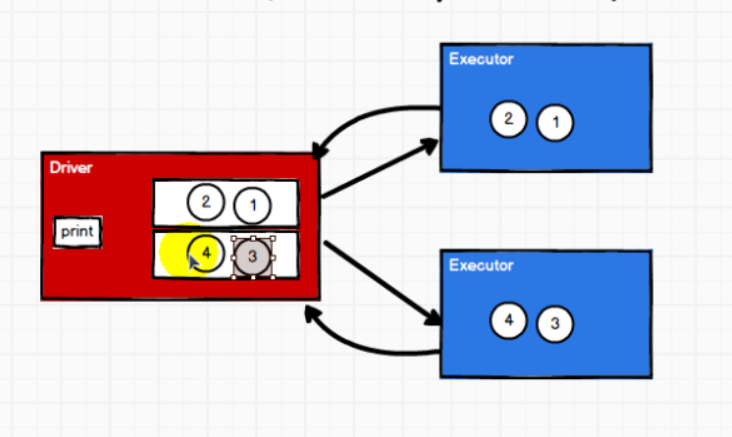

# RDD
返回的是rdd算子  
reduceBykey 和 groupBykey的区别：  
相同：  
1. 分区不变
2. 都会进行shuffle操作，都需数据落盘
3. 性能都比较低

不同：  
1. groupByKey:可能会使数据打乱重组(shuffle)；
2. groupByKey:由于不同分区需要等待，中间需要落盘数据；(shuffle操作必须落盘处理，不能再内存中等待数据，会导致数据溢出。shuffle操作性能低)；  
3. reduceByKey是进行两两聚合，在shuffle前分区内进行聚合，使得落盘数据小；进行了预聚合(combine)
4. reduceByKey性能优于groupBykey，groupBykey功能优于reduceBykey
5. redueceByKey：分区内和分区间计算规则一样。

groupBykey+map => reduceByKey  
reduceByKey、flodByKey、aggregateByKey、combineByKey的区别 ？    
    1. reduceByKey: 相同 key 的第一个数据不进行任何计算，分区内和分区间计算规则相同   
    2. FoldByKey: 相同 key 的第一个数据和初始值进行分区内计算，分区内和分区间计算规则相同。  
    3. AggregateByKey：相同 key 的第一个数据和初始值进行分区内计算，分区内和分区间计算规则可以不相同   
    4. CombineByKey:当计算时，发现数据结构不满足要求时，可以让第一个数据转换结构。分区内和分区间计算规则不相同.  
# action com/itguigu/rdd/operator/action/  

## Spark01_RDD_Operator_Action.scala
rdd.collect():行动算子触发作业(JOB)的执行  
底层代码调用的是环境对象的runJob  
底层代码会创建ActiveJob并提交作业

## Spark02_RDD_Operator_Action.scala
reduce:行动算子直接返回结果两两计算;  
collect:会将不同分区的数据安装分区顺序采集到Driver端内存中，形成数组。  
count:数据源中数据的个数；  
first:获取数据源中数据的第一个；  
take:获取数据源中n个数据
takeOrdered:数据排序后，取N个数据；  

## Spark03_RDD_Operator_Action.scala
aggregate:分区内计算，分区间计算；直接返回结果；  
aggregateByKey:初始只会参与分区内计算；  
aggregate:初始值会参与分区内和分区间计算；  
fold:分区内和分区间计算规则相同；  

## Spark04_RDD_Operator_Action.scala
countByKey:计算相同KEY的个数；    
countByValue:计算相同值的个数；  
WordCount案例可以用那些实现Spark03_WordCount  
1. groupBy
```java
  /**groupBy
   * 1. 使用makeRDD，参数：List；创建一个rdd
   * 2. 使用flatMap分词
   * 3. 使用groupby分组
   * 4. 使用mapValue转换数据结构并累加
   */
```
2. groupByKey性能较低
```java
  /**groupByKey
   * 1. 使用makeRDD，参数：List；创建一个rdd
   * 2. 使用flatmap分词
   * 3. 使用map转换数据结构
   * 4. 使用groupByKey进行分组，并转换数据结构
   * 5. 使用mapValue进行累加
   */
```
3. reduceByKey
```java
 /**reduceByKey
   * 1. 使用makeRDD，参数：List；创建一个rdd
   * 2. 使用flatmap分词
   * 3. 使用map转换数据结构
   * 4. 使用reduceByKey进行累加数据
```
4. aggregateByKey
```java
  /**aggregateByKey
   * 1. 使用makeRDD，参数：List；创建一个rdd
   * 2. 使用flatmap分词
   * 3. 使用map转换数据结构
   * 4. 使用aggregateByKey进行累加数据
```
5. foldByKey
```java
/**foldByKey
   * 1. 使用makeRDD，参数：List；创建一个rdd
   * 2. 使用flatmap分词
   * 3. 使用map转换数据结构
   * 4. 使用foldByKey聚合
```
6. combineByKey
```java
  /**combineByKey
   * 1. 使用makeRDD，参数：List；创建一个rdd
   * 2. 使用flatmap分词
   * 3. 使用map转换数据结构
   * 4. 使用combineByKey聚合
```
7. countByKey
```java

  /**countByKey
   * 1. 使用makeRDD，参数：List；创建一个rdd
   * 2. 使用flatmap分词
   * 3. 使用map转换数据结构
   * 4. 使用countByKey聚合
```
8. countByValue
```java
 /**countByValue
   * 1. 使用makeRDD，参数：List；创建一个rdd
   * 2. 使用flatmap分词
   * 3. 使用map转换数据结构
   * 4. 使用countByKey聚合
```
9. reduce，aggregate,fold

## Spark05_RDD_Operator_Action
saveAsTextFile:  
saveAsObjectFile:  
saveAsSequenceFile:要求数据格式必须为KV类型  

## Spark06_RDD_Operator_Action
collect和foreach:其实是Driver端内存的循环遍历方法  
foreach:其实是Executor端内存数据打印  

算子：operator（操作）  
RDD的方法和Scala集合对象的方法不一样  
- 集合对象的方法都是在同一个节点的内存中完成的
  
- RDD的方法可以将计算逻辑发送到Executor端(分布式节点)执行;
  

为了区分不同的处理效果，所以将RDD的方法称为算子。  
RDD方法外的操作都是在Driver端执行的，而方法内部的逻辑代码是在Executor端执行。  

## Spark07_RDD_Operator_Action
报算子的没有序列化的问题：

rdd算子中传递的函数是包含闭包操作的，会进行检测功能

# com/itguigu/rdd/serial/Spark01_RDD_Serial.scala(序列化)
- 类的构造参数其实是类的属性，需要对类进行闭包检测；

# Kryo序列化框架
- 简单数据类型、数组、字符串可以进行Kryo进行序列化；

# 依赖关系


## Spark01_RDD_Dep(血缘)
## Spark02_RDD_Dep(依赖)
- 窄依赖

- 宽依赖(Shuffle依赖)

## 依赖与任务数的关系
- 窄依赖与任务数关系

  
- 宽依赖与任务数(分为两个阶段)

- 阶段的划分：
  
- 任务划分：
    - Application:初始化一个SparkContext即生成一个Application;
    - Job:一个action算子就会生成一个Job;
    - Stage:Stage等于宽依赖(ShuffleDependency)的个数加1;
    - Task:一个Stage阶段中，最后一个RDD的分区的个数就是Task的个数。  

      注意：Appliction->Job->Stage->Task每一层都是1对n的关系；  
      阶段和任何名称相同；

# 5.1.4.8 RDD持久化
## Spark01_RDD_Persist Spark02_RDD_Persist

是对象重用了，但数据无法重用。
实现数据重复使用：
## 实现持久化

Spark03_RDD_Persist
## RDD CheckPoint检查点
1. 代码Spark04_RDD_Persist

## cache与persist的区别
1. 代码 Spark05_RDD_Persist  和 Spark06_RDD_Persist
2. 数据安全性和血缘依赖
*************************************
## 5.1.4.9 RDD分区器
#### 代码
com/itguigu/rdd/part/Spark01_RDD_Part.scala
#### 内容
分区器：hash分区器、range分区器、自定义分区器
## 5.1.4.10 RDD文件读取与保持
#### 代码
com/itguigu/rdd/io/Spark01_RDD_IO_Save.scala  
com/itguigu/rdd/io/Spark01_RDD_IO_Load.scala
#### 内容
文件格式分为:text文件、csv文件、sequence文件、object文件
文件系统分为：本地文件系统、HDFS、HBASE、数据库
文件的读取和保存

## 累加器
com/itguigu/acc/Spark01_Acc.scala 
executor将相加的值没有传递给Driver  

com/itguigu/acc/Spark02_Acc.scala   
累加器实现

累加器用来把 Executor 端变量信息聚合到 Driver 端。在 Driver 程序中定义的变量，在
Executor 端的每个 Task 都会得到这个变量的一份新的副本，每个 task 更新这些副本的值后，
传回 Driver 端进行 merge。 

com/itguigu/acc/Spark04_Acc_WordCount.scala  
自定义wordcount累加器   

## 5.3广播变量 
广播变量用来高效分发较大的对象。向所有工作节点发送一个较大的只读值，以供一个
或多个 Spark 操作使用。比如，如果你的应用需要向所有节点发送一个较大的只读查询表，
广播变量用起来都很顺手。在多个并行操作中使用同一个变量，但是 Spark 会为每个任务
分别发送。   

spark中的广播变量就可以将闭包的数据保存到Executor的内存中   
spark中的广播变量不能更改，分布式共享只读变量

## 需求一
com/itguigu/req/Spark01_Req1_HotCategoryTop10Analysis.scala  
com/itguigu/req/Spark02_Req1_HotCategoryTop10Analysis.scala
com/itguigu/req/Spark03_Req1_HotCategoryTop10Analysis.scala  
com/itguigu/req/Spark04_Req1_HotCategoryTop10Analysis.scala   

## 需求二
com/itguigu/req/Spark05_Req2_HotCategoryTop10SessionAnalysis.scala  

## 需求三
com/itguigu/req/Spark06_Req3_PageflowAnalysis.scala  
com/itguigu/req/Spark07_Req3_PageflowAnalysis.scala


  