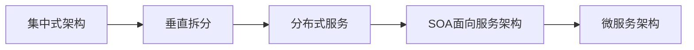

# 第一天

## 1.系统架构演变概述

**目标：**了解项目架构的演变过程

**小结：**



## 2.微服务架构说明

**目标：**了解SOA与微服务架构的区别以及说出微服务架构的特点 

**分析：**

​	SOA使用了ESB组件的面向服务架构；ESB自身实现复杂；应用服务粒度较大，所有服务之间的通信经过ES B会降低通信速度；部署、测试ESB比较麻烦。

**小结：**

​	**微服务架构：**是一套使用小服务或者单一业务来开发单个应用的方式或途径。

​	微服务架构特点：

- 单一职责
- 服务粒度小
- 面向服务（对外暴露REST api）
- 服务之间相互独立

与使用ESB的SOA架构的区别：微服务架构没有使用ESB，有服务治理注册中心；业务粒度小。

## 3.服务调用方式说明

**目标：**能够说出服务调用方式种类

**小结：**

- RPC:基于socket，速度快，效率高；webservice 、dubbo
- HTTP:基于TCP，封装比较臃肿；对服务和调用方没有任何技术、语言的限定、自由灵活；RESTful，springCloud

## 4.Spring RestTemplate示例工程导入

**目标：**了解Spring RestTemplate的应用

**分析：**

一般情况有以下三种http客户端工具包可以方便进行http服务调用

- httpClient
- okHttp
- JDK原生URLConnection

Spring提供了一个RestTemplate模板工具类，对基于Http的客户端进行了封装，并且实现了对象与json的序列化和 反序列化，非常方便。

**小结：**

```java
package com.itheima.test;

import com.itheima.pojo.User;
import org.junit.Test;
import org.junit.runner.RunWith;
import org.springframework.beans.factory.annotation.Autowired;
import org.springframework.boot.test.context.SpringBootTest;
import org.springframework.test.context.junit4.SpringRunner;
import org.springframework.web.client.RestTemplate;

@RunWith(SpringRunner.class)
@SpringBootTest
public class RestTemplateTest {

    @Autowired
    private RestTemplate restTemplate;

    @Test
    public void test(){
        String url = "http://localhost/user/8";
        //restTemplate可以对json格式字符串进行反序列化
        User user = restTemplate.getForObject(url, User.class);
        System.out.println(user);
    }
}

```

## 5.Spring Cloud概述

**目标：**Spring Cloud整合的组件和版本特征

**小结：**

- 整合的组件可以有很多，常见的组件有：eureka组件中心，Gateway网关、Ribbon负载均衡、Feign服务调用、Hystrix熔断器。在有需要的时候项目中添加启动器依赖即可。
- 版本依赖：以英文单词命名(以伦敦地铁站名)

## 6.创建微服务工程

**目标：**创建微服务父工程itcast-springcloud、用户服务工程user-service、消费服务工程consumer-demo

**分析：**

需求：查询数据库中的用户数据并输出到浏览器

- 父工程itcast-springcloud：添加spring boot 父坐标和管理其他组件的依赖
- 用户服务工程user-service：整合mybaits查询数据库中用户数据；提供查询用户服务
- 消费服务工程consumer-demo：利用查询用户数据并输出到浏览器

**小结：**

```xml
<!-- springCloud -->
<dependency>
    <groupId>org.springframework.cloud</groupId>
    <artifactId>spring-cloud-dependencies</artifactId>
    <version>${spring-cloud.version}</version>
    <type>pom</type>
    <scope>import</scope>
</dependency>
```

通过`scope`的import继承`spring-cloud-dependencies`工程中的依赖

## 7.搭建配置user-service工程

**目标：**配置user-service工程并能够根据用户id查询数据库中用户

**分析：**

需求：可以访问http://localhost:9091/user/8并返回用户数据

实现步骤：

1. 添加启动器(web、通用Mapper);
2. 创建启动引导类和配置文件；
3. 修改配置文件的参数；
4. 编写测试代码（UserMapper，UserService,UserController）;
5. 测试

**小结：**

- 添加了启动器依赖

```xml
<dependencies>
    <dependency>
        <groupId>org.springframework.boot</groupId>
        <artifactId>spring-boot-starter-web</artifactId>
    </dependency>
    <!-- 通用Mapper启动器 -->
    <dependency>
        <groupId>tk.mybatis</groupId>
        <artifactId>mapper-spring-boot-starter</artifactId>
    </dependency>
    <!-- mysql驱动 -->
    <dependency>
        <groupId>mysql</groupId>
        <artifactId>mysql-connector-java</artifactId>
    </dependency>
</dependencies>
```

- 编写配置文件

```yml
server:
  port: 9091

spring:
  datasource:
    driver-class-name: com.mysql.jdbc.Driver
    url: jdbc:mysql://localhost:3307/springcloud
    username: root
    password: 123456
mybatis:
  type-aliases-package: com.itheima.user.pojo
```

## 8.搭建配置consumer-demo工程

**目标：**编写测试类使用restTemplate访问user-service的路径根据id查询用户 

**分析：**

需求：访问http://localhost:8080/consumer/8使用RestTemplate获取http://localhost:9091/user/8的数据

实现步骤：

1. 添加启动器依赖
2. 创建启动引导类(注册RestTemplate)和配置文件
3. 编写测试代码（ConsumerController中使用restTemplate访问服务获取数据）
4. 测试

**小结：**

- 服务管理 

  1. 如何自动注册和发现 

  2. 如何实现状态监管 

  3. 如何实现动态路由

      服务如何实现负载均衡 

  服务如何解决容灾问题

   服务如何实现统一配置

## 9.Eureka注册中心说明

**目标：**说出Eureka的主要功能

**小结：**

Eureka的主要功能是进行服务管理，定期检查服务状态，返回服务地址列表；


## 10.搭建eureka-server工程

**目标：**添加eureka对应依赖和编写引导类搭建eureka服务并可访问eureka服务界面

**分析：**

Eureka是服务注册中心，只做服务注册；自身并不提供服务也不消费服务。可以搭建web工程使用Eureka，可以使用spring Boot方式搭建。

搭建步骤：

1. 创建工程
2. 添加启动器依赖
3. 编写引导类（添加Eureka的服务注解）和配置文件
4. 修改配置文件（端口，应用名称）
5. 启动测试

**小结：**

- 启动器依赖

```xml
<dependencies>
    <dependency>
        <groupId>org.springframework.cloud</groupId>
        <artifactId>spring-cloud-starter-netflix-eureka-server</artifactId>
    </dependency>
</dependencies>
```

- 配置文件

```yml
server:
  port: 10086
spring:
  application:
    name: eureka-server
eureka:
  client:
    service-url:
      # eureka服务地址，如果是集群需要指定其他集群eureka集群地址
      defaultZone: http://127.0.0.1:10086/eureka
    # 不注册自己
    register-with-eureka: false
    # 不拉取服务
    fetch-registry: false
```

## 11.服务注册与发现

**目标：**将user-service的服务注册到eureka并在comsumer-demo中可以根据服务名称调用

**分析：**

- 服务注册：在服务提供工程user-service上添加Eureka客户端依赖；自动将服务注册到EurekaServer服务地址列表。
  - 添加依赖
  - 改造启动引导类；添加开启Eureka客户端的注解
  - 修改配置问价；设置Eureka服务地址
- 服务发现:在服务消费工程consumer-demo上添加Eureka客户端依赖；可以使用工具类根据服务名称获取对应服务地址列表
  - 添加依赖
  - 改造启动引导类；添加开启Eureka客户端的注解
  - 修改配置问价；设置Eureka服务地址
  - 改造处理器类ConsumerController，使用工具类DiscoveryClient根据服务名称获取对应服务地址列表。

**小结：**

- 添加Eureka客户端依赖

```xml
<dependency>
    <groupId>org.springframework.cloud</groupId>
    <artifactId>spring-cloud-starter-netflix-eureka-server</artifactId>
</dependency>
```

- 添加启动引导类

  ```java
  @RestController
  @RequestMapping("/consumer")
  public class ConsumerController {
  ```

- 修改配置

```yml
spring:
  application:
    name: consumer-demo
eureka:
  client:
    service-url:
      defaultZone: http://127.0.0.1:10086/eur
```

## 12. Eureka Server高可用配置

**目标：**可以启动两台eureka-server实例；在eureka管理界面看到两个实例

**分析：**

Eureka Server是一个web应用，可以启动多个实例(配置不同端口)保证Eureka Server的高可用。

**小结：**

高可用配置：将Eureka Server作为一个服务注册到其他Eureka Server，这样多个Eureka Server之间就能够互相发现对方，同步服务，实现Eureka Server集群。

## 13. Eureka客户端与服务端配置

**目标：**配置eureka客户端user-service的注册、续约等配置项，配置Eureka客户端consumer-demo的获取服务间隔时间；了解失效剔除和自我保护

**分析：**

- Eureka客户端工程
  - user-service服务提供工程
    - 服务地址使用ip方式
    - 续约
  - consumer-demo服务消费
    - 获取服务地址的频率
- Eureka服务端工程
  - 失效剔除
  - 自我保护

**小结：**

- user-service

```yml
 instance:
    #更倾向使用 ip地址，而不是host名
    prefer-ip-address: true
    # ip地址
    ip-address: 127.0.0.1
    #续约间隔时间,默认30s
    lease-renewal-interval-in-seconds: 5
    # 服务失效时间，默认90s
    lease-expiration-duration-in-seconds: 5
```

- consumer-demo

```yml
eureka:
  client:
    service-url:
      defaultZone: http://127.0.0.1:10086/eureka
    # 拉取服务地址列表间隔时间
    registry-fetch-interval-seconds: 10
```

- eureka-server

```yml
eureka:
  client:
    service-url:
      # eureka服务地址，如果是集群需要指定其他集群eureka集群地址
      # defaultZone: ${defaultZone:http://127.0.0.1:10086/eureka}
      defaultZone: http://127.0.0.1:10086/eureka
    # 不注册自己
      register-with-eureka: false
    # 不拉取服务
      fetch-registry: false
  server:
    # 服务失效剔除时间间隔，默认60秒
    eviction-interval-timer-in-ms: 60000
    # 关闭自我保护模式默认打开
    enable-self-preservation: false
```

## 14.负载均衡Ribbon简介

**目标：**描述负载均衡和ribbon的作用

**分析：**

负载均衡是一个算法，可以通过该算法实现从地址列表中获取一个地址进行服务调用。

在Spring Cloud中提供了负载均衡器;Ribbon 	

**小结：**

Ribbon提供了轮询和随机负载均衡算法，默认是轮询，实现从地址列表中使用负载均衡算法获取地址进行服务调用

## 15. Ribbon负载均衡应用

**目标：**配置启动两个用户服务，在consumer-demo中使用服务名实现根据用户id获取用户

**分析：**

需求：可以使用RestTemplate访问http://user-service/user/8获取服务数据

 可以使用Ribbon负载均衡；在执行RestTemplate发送服务地址请求的时候，使用负载均衡拦截器，根据服务名获取服务地址列表，使用Ribbon负载均衡算法从服务地址列表中选择一个服务地址，访问该地址获取服务数据。

实现步骤：

- 启动多个user-service实例(9091,9092)
- 修改RestTemplate实例化方法，添加负载均衡注解；
- 修改ConsumerController
- 测试

**小结：**

在实例化RestTemplate的时候使用@LoadBalanced，服务地址直接可以使用服务名。

## 16.熔断器Hystrix简介

**目标：**了解熔断器的Hystrix的作用

**小结：**	

Hystrix是一个延迟和容错库，用户隔离访问远程访问，防止出现级联失败。

## 17.线程隔离&服务降级

**目标：**了解什么是线程隔离和服务降级

**分析：**

Hystrix解决雪崩效应

- 线程隔离：用户请求不直接访问服务，而是使用线程池中空闲的线程访问服务，加速失败判断时间。
- 服务降级：及时返回服务调用失败的结果，让线程不因为等待服务而阻塞。

**小结：**

- 添加依赖

```xml
<dependency>
    <groupId>org.springframework.cloud</groupId>
    <artifactId>spring-cloud-starter-netflix-eureka-server</artifactId>
</dependency>
```

- 开启熔断

```java
/*@SpringBootApplication
@EnableEurekaClient //开启Eureke客户端发现功能
@EnableCircuitBreaker //开启熔断*/


@SpringCloudApplication
```

- 降级逻辑

```java
@RestController
@RequestMapping("/consumer")
@Slf4j
@DefaultProperties(defaultFallback = "defaultFallback")
public class ConsumerController {

    @Autowired
    private RestTemplate restTemplate;

    @Autowired
    private DiscoveryClient discoveryClient;

    @GetMapping("/{id}")
    //@HystrixCommand(fallbackMethod = "queryByIdFallback")
    @HystrixCommand
    /*public User queryById(@PathVariable Long id){
        *//*String url ="http://localhost:9091/user/"+id;
        //获取eureka中注册的user-server的实例
        List<ServiceInstance> serviceInstances = discoveryClient.getInstances("user-service");
        ServiceInstance serviceInstance = serviceInstances.get(0);
        url = "http://" + serviceInstance.getHost()+":"+serviceInstance.getPort()+"/user/"+id;
        System.out.println(serviceInstance.getHost());*//*
        String url = "http://user-service/user/"+id;
        return restTemplate.getForObject(url, User.class);
    }*/
    public String  queryById(@PathVariable Long id){
        String url = "http://user-service/user/"+id;
        return restTemplate.getForObject(url, String.class);
    }
    public String queryByIdFallback(Long id ){
        log.error("查询用户信息失败，id: {}",id);
        return "对不起，网络太拥挤";
    }
    public String defaultFallback(){

        return "默认提示：对不起，网络太拥挤";
    }
}
```

- 修改超时配置

hystrix: command: default: execution: isolation: thread: timeoutInMilliseconds: 2000

## 18. 服务熔断演示

**目标：**了解熔断器工作原理

**小结：**


可以通过配置服务器熔断参数修改默认：

```yml
hystrix:
  command:
    default:
      circuitBreaker:
        errorThresholdPercentage: 50 # 触发熔断错误比例阈值，默认值50%
        sleepWindowInMilliseconds: 10000 # 熔断后休眠时长，默认值5秒
        requestVolumeThreshold: 10 # 熔断触发最小请求次数，默认值是20
```

# 第二天

## 1. Feign应用

**目标：**Feign的作用；使用Feign实现consumer-demo代码中调用服务

**分析：**

1. 导入启动器依赖
2. 开启Feign功能
3. 编写Feign客户端
4. 编写一个处理器ConsumerFeignController，注入Feign客户端并使用
5. 测试

**小结：**

Feign主要作用：自动根据参数拼接http请求地址

- 启动器依赖

```xml
<dependency>
    <groupId>org.springframework.cloud</groupId>
    <artifactId>spring-cloud-starter-openfeign</artifactId>
</dependency>
```

- Feign客户端

  ```java
  //声明一个当前类是一个Feign客户端，指定服务名为user-server
  @FeignClient("user-service")
  public interface UserClient {
  
      //http://user-service/user/12
      @GetMapping("/user/{id}")
      User queryById(@PathVariable Long id);
  }
  ```

## 2. Feign负载均衡及熔断

**目标：**可以配置Feign内置ribbon配置项和Hystrix熔断的Fallback配置

**分析：**

- 负载均衡
- 服务熔断
- 请求压缩
- 日志级别

都可以通过配置项在Feign中开启使用。

**小结：**

在消费工程Consumer-demo中的配置文件

```yml
ribbon:
  ConnectTimeout: 1000 # 连接超时时长
  ReadTimeout: 2000 # 数据通信超时时长
  MaxAutoRetries: 0 # 当前服务器的重试次数
  MaxAutoRetriesNextServer: 0 # 重试多少次服务
  OkToRetryOnAllOperations: false # 是否对所有的请求方式都重试
feign:
  hystrix:
    enabled: true # 开启Feign的熔断功能
  compression:
    request:
      enabled: true # 开启请求压缩
      mime-types: text/html,application/xml,application/json # 设置压缩的数据类型
      min-request-size: 2048 # 设置触发压缩的大小下限
    response:
      enabled: true
logging:
  level:
    com.itheima: debug
```

## 3. Spring Cloud Gateway网关简介

**目标：**Spring Cloud Gateway网关简介

**小结：**

Spring Cloud Gateway的核心就是一些列的过滤器，可以将客户端的请求转发到不同的微服务。主要作用：过滤和路由。

## 4. Spring Cloud Gateway入门

**目标：**搭建网关服务工程测试网关服务作用

**分析：**

需求：通过网系统heima-getway将包含有/user的请求路由到http://1270.0.1：9091/user/用户id

实现步骤：

1. 创建工程
2. 添加启动器依赖
3. 编写启动引导类和配置文件 
4. 修改配置文件，设置路由信息
5. 启动测试

http://1270.0.1:10010/user/8 ->http://127.0.0.1:9091/user/8

**小结：**

- 启动器依赖

```xml
<dependencies>
    <dependency>
        <groupId>org.springframework.cloud</groupId>
        <artifactId>spring-cloud-starter-gateway</artifactId>
    </dependency>
    <dependency>
        <groupId>org.springframework.cloud</groupId>
        <artifactId>spring-cloud-starter-netflix-eureka-client</artifactId>
    </dependency>
</dependencies>
```

- 创建配置文件内容

```yml
server:
  port: 10010
spring:
  application:
    name: api-getway
  cloud:
    gateway:
      routes:
        #路由id可以随意
        - id: user-service
          # 代理的服务地址
          uri: http://127.0.0.1:9091
          # 路由断言：可以匹配映射路径
          predicates:
            - Path=/user/**
eureka:
  client:
    service-url:
      defaultZone: http://127.0.0.1:10086/eureka
  instance:
    prefer-ip-address: true
```

5.面向服务的路由

**目标：**使用在eureka注册的服务作为路由地址

**分析：**

如果将路由服务地址写死明显是不合理的；在Spring Cloud Gateway中可以配置动由路由解决。

**小结：**

面向服务的路由只需要在配置文件中指定路由路径类似这样：`lb://user-service`

服务名必须在eureka中注册

## 6.路由前缀处理

**目标：**可以对请求到网关服务的地址添加或去除前缀

**分析：**

提供服务地址:http://127.0.0.1:9091/user/8

- 添加前缀：对请求地址添加前缀路径之后再作为代理的服务地址；

http://127.0.0.1:10010/8 ->http://127.0.0.1:9091/user/8添加前缀路径/user

- 去除前缀：将请求地址中路径去除一些前缀路径之后再作为代理的服务地址；

http://127.0.0.1:10010/api/user/8 ->http://127.0.0.1:9091/user/8去除前缀路径/api

**小结：**

客户端的请求地址与服务器的服务地址如果不一致的时候，可以通过配置路径过滤器实现路径前缀的添加和去除。

## 7.过滤器简介

**目标：**Gateway默认过滤器的用法和过滤器类型

**小结：**

- 用法：在配置文件中指定要使用的过滤器名称；
- 类型：局部和全局
- 使用场景：请求鉴权、异常处理、记录调用时长等。

## 8.自定义局部过滤器

**目标：**按照默认过滤器编写并配置一个自定义局部过滤器，该过滤器可以通过配置文件中的参数名称获取请求的参数值。

**分析：**

需求：在过滤（MyParamGatewayFilterFactory）其中将http://localhost:10010/api/user/8?name=itcast中的参数name的值获取到并输出到控制台；并且参数名是可变的，也就是不一定每次都是name；需要可以通过配置过滤器的时候做到配置参数名。

实现步骤：

1. 配置过滤器； 
2. 编写过滤器；
3. 测试

**小结：**

- 配置：与其他过滤器的配置一致

- 实现过滤器

```java
package com.itheima.getway.filter;

import org.springframework.cloud.gateway.filter.GatewayFilter;
import org.springframework.cloud.gateway.filter.factory.AbstractGatewayFilterFactory;
import org.springframework.http.server.reactive.ServerHttpRequest;
import org.springframework.stereotype.Component;

import java.util.Arrays;
import java.util.List;

@Component
public class MyParamGatewayFilterFactory extends AbstractGatewayFilterFactory<MyParamGatewayFilterFactory.Config> {

    static final String PARAM_KEY ="param";

    public MyParamGatewayFilterFactory(){
        super(Config.class );
    }

    public List<String> shortcutFieldOrder() {
        return Arrays.asList(PARAM_KEY);
    }

    @Override
    public GatewayFilter apply(Config config) {
        return (exchange, chain) -> {
            //http://localhost:10010/api/user/8?name=itcast   config.param ==> name
            //获取请求参数中param对应的参数名的参数值
            ServerHttpRequest request = exchange.getRequest();
            if(request.getQueryParams().containsKey(config.param)){
                request.getQueryParams().get(config.param).
                    forEach(value -> System.out.printf("----------局部过滤器-----%s = %s-----",config.param, value));
            }
            return chain.filter(exchange);
        };
    }

    public static class Config{
        //对应配置过滤器的时候的参数名
        private String param;

        public String getParam(){
            return param;
        }

        public void setParam(String param){
            this.param = param;
        }

    }
}
```

## 9.自定义全局过滤器

**目标：**定义一个全局过滤器检查请求中是否携带token参数

**分析：**

需求：编写全局过滤器，在过滤器中检查请求地址是否携带token参数。如果token参数的值存在则放行；；如果token的参数值为空或者不存在则设置返回的状态为：未授权也不再执行下去。

实现步骤：

1. 编写全局过滤器
2. 测试

**小结：**

```java
@Component
public class MyGloabalFilter implements GlobalFilter, Ordered {
    @Override
    public Mono<Void> filter(ServerWebExchange exchange, GatewayFilterChain chain) {
        System.out.println("-------------全局过滤器MyGloabalFilter--------------");
        String token = exchange.getRequest().getQueryParams().getFirst("token");
        if(StringUtils.isBlank(token)){
            //设置响应状态码为未授权
            exchange.getResponse().setStatusCode(HttpStatus.UNAUTHORIZED);
            return exchange.getResponse().setComplete();
        }
        return chain.filter(exchange);
    }

    @Override
    public int getOrder() {
        //值越小越先执行
        return 0;
    }
}
```

## 10. Gateway其他配置说明

**目标：**Gateway网关的负载均衡和熔断参数配置

**小结：**

网关服务配置文件

```yml
server:
  port: 10010
spring:
  application:
    name: api-getway
  cloud:
    gateway:
      globalcors:
        cors-configurations:
          '[/**]':
            #allowedOrigins: * # 这种写法或者下面的都可以，*表示全部
            allowedOrigins:
              - "http://docs.spring.io"
            allowedMethods:
              - GET

      routes:
        #路由id可以随意
        - id: user-service
          # 代理的服务地址
          #uri: http://127.0.0.1:9091
          # 在eureka中动态获取服务
          uri: lb://user-service
          # 路由断言：可以匹配映射路径
          predicates:
            #- Path=/user/**
            #- Path=/**
            - Path=/api/user/**
          filters:
            # 添加请求路径的前缀
            #- PrefixPath=/user
            # 表示过滤1个路径，2表示两个路径，以此类推
            - StripPrefix=1
            - MyParam=name
      #默认过滤器，对所有路由都生效
      default-filters:
        - AddResponseHeader=X-Response-Foo, Bar
        - AddResponseHeader=abc-myname, itheima

eureka:
  client:
    service-url:
      defaultZone: http://127.0.0.1:10086/eureka
  instance:
    prefer-ip-address: true
hystrix:
  command:
    default:
      execution:
        isolation:
          thread:
            timeoutInMilliseconds: 6000
ribbon:
  ConnectTimeout: 1000
  ReadTimeout: 2000
  MaxAutoRetries: 0
  MaxAutoRetriesNextServer: 0
```

Gateway网关一般直接给终端请求使用；Feign一般用在微服务之间调用。

## 11. Spring Cloud Config分布式配置中心简介

**目标：**分布式配置中心的作用

**小结：**


spring cloud config作用：可以通过修改在git仓库中的配置文件实现其他所有微服务的配置文件的修改。

## 12.搭建配置中心微服务

**目标：**创建码云的远程公开git仓库，搭建配置中心微服务config-server**

**分析：**

- 创建git仓库:在码云上创建仓库
- 搭建配置中心config-server：使用spring boot方式搭建和配置

**小结：**

- 配置中心依赖

```xml
<dependencies>
    <dependency>
        <groupId>org.springframework.cloud</groupId>
        <artifactId>spring-cloud-starter-netflix-eureka-client</artifactId>
    </dependency>
    <dependency>
        <groupId>org.springframework.cloud</groupId>
        <artifactId>spring-cloud-config-server</artifactId>
    </dependency>
</dependencies>
```

- 配置中心的配置文件

```yml
server:
  port: 12000
spring:
  application:
    name: config-server
  cloud:
    config:
      server:
        git:
          uri: https://github.com/luckyLJY/heima-config.git

eureka:
  client:
    service-url:
      defaultZone: http://127.0.0.1:10086/eureka
```

## 13.获取配置中心配置

**目标：**改造用户微服务user-server，配置文件信息不再由微服务项目提供，而是从配置中心获取。

**分析：**

需求：将服务提供工程user-service的application.yml配置文件删除，修改为从配置中心config-server中获取。

实现步骤

- 添加启动依赖
- 修改配置文件
- 启动测试

**小结：**

将原来的application.yml删除；然后添加bootstrap.yml，该文件也是sping boot的默认配置文件，其内容经常配置一些项目中固定的配置项。如果是项目经常变动的应该配置到application.yml中，现在使用了配置中心则应该配置到git仓库中对于配置文件

- 依赖

  ```xml
  <dependency>
      <groupId>org.springframework.cloud</groupId>
      <artifactId>spring-cloud-starter-config</artifactId>
      <version>2.1.1.RELEASE</version>
  </dependency>
  ```

- 配置文件

```yml
spring:
  cloud:
    config:
      # 要与仓库中的配置文件的application保持一致
      name: user
      # 要与仓库中的配置文件的profile保持一致
      profile: dev
      # 要与仓库中的配置文件所属的版本（分支）一样
      label: main
      discovery:
        # 使用配置中心
        enabled: true
        # 配置中心服务名
        service-id: config-server

eureka:
  client:
    service-url:
      defaultZone: http://127.0.0.1:10086/eureka
```

## 14. Spring Cloud Bus简介

**目标：**了解Spring cloud Bus作用

**小结：**

Spring Could Bus将git仓库的文件更新，在不重启系统的情况下实现，及时同步到各个微服务

## 15. Spring Cloud Bus应用

**目标：**启动RbbitMQ通过修改码云中的配置文件后发送Post请求实现及时更新用户微服务中的配置项

**分析：**

需求：在码云的git仓库中修改user-dev.yml配置文件，实现不重启user-service的情况下可以及时更新配置文件。

实现步骤：

- 启动RabbitMQ
- 修改配置中心config-server
- 修改服务提供工程user-service
- 测试

**小结：**

- 添加启动器在

```xml
config-server
<dependency>
    <groupId>org.springframework.cloud</groupId>
    <artifactId>spring-cloud-bus</artifactId>
</dependency>
<dependency>
    <groupId>org.springframework.cloud</groupId>
    <artifactId>spring-cloud-stream-binder-rabbit</artifactId>
</dependency>
user-service
<dependency>
<groupId>org.springframework.cloud</groupId>
<artifactId>spring-cloud-bus</artifactId>
</dependency>
<dependency>
<groupId>org.springframework.cloud</groupId>
<artifactId>spring-cloud-stream-binder-rabbit</artifactId>
</dependency>
<dependency>
<groupId>org.springframework.boot</groupId>
<artifactId>spring-boot-starter-actuator</artifactId>
</dependency>

```

- 修改配置文件

```yml
config-server
server:
  port: 12000
spring:
  application:
    name: config-server
  cloud:
    config:
      server:
        git:
          uri: https://gitee.com/goheima/heima-config.git
  # 配置rabbitmq信息；如果是都与默认值一致则不需要配置
  rabbitmq:
    host: localhost
    port: 5672
    username: guest
    password: guest
eureka:
  client:
    service-url:
      defaultZone: http://127.0.0.1:10086/eureka
management:
  endpoints:
    web:
      exposure:
        # 暴露触发消息总线的地址
        include: bus-refresh
bootstrap.yml
spring:
  cloud:
    config:
      # 要与仓库中的配置文件的application保持一致
      name: user
      # 要与仓库中的配置文件的profile保持一致
      profile: dev
      # 要与仓库中的配置文件所属的版本（分支）一样
      label: main
      discovery:
        # 使用配置中心
        enabled: true
        # 配置中心服务名
        service-id: config-server
    # 配置rabbitmq信息；如果是都与默认值一致则不需要配置
  rabbitmq:
    host: localhost
    port: 5672
    username: guest
    password: guest

eureka:
  client:
    service-url:
      defaultZone: http://127.0.0.1:10086/eureka
```

userController

```java
@RefreshScope //刷新配置 添加
```

## 16. spring cloud技术体系


