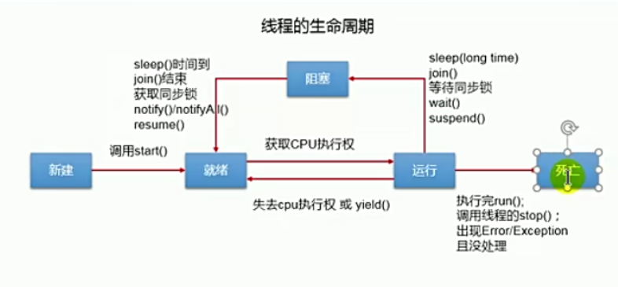

程序：是为完成特定任务、用某种语言编写的一组指令的集合。
进程：是程序的一次执行过程，或是正在运行的程序。
线程：进程可进一步细化为线程，是一个程序内部的一条执行路径。
## 创建多线程的方式
- 继承Thread类的方式
  1. 创建一个继承于Thread类的子类  
  2. 重写Thread类的run()-->将此线程执行的操作声明在run()中
  3. 创建Thread类的子类对象
  4. 通过此对象调用start()
    
**注意**
1. 我们启动一个线程，必须调用start(),不能调用run()的方式启动线程
2. 如果再启动一个线程，必须重新创建一个Thread子类的对象，调用此对象的start()方法
    
- 实现Runnable接口的方式
    1. 创建一个实现Runnable接口的类
    2. 实现类去实现Runnable中的抽象方法：run()
    3. 创建实现类的对象
    4. 将此对象作为参数传递到Thread类的构造器中，创建Thread类的对象
    5. 通过Thread类的对象调用start()
    
**两者的对比**  
开发中：优先选择实现Runnable接口的方式  
原因：  
1. 实现的方式没类的单继承性的局限性
2. 实现的方式更适合来处理多个线程共享数据的情况  

相同：  
两种方式都需要重写run(),将线程要执行的逻辑声明在run()中。启动时都调用
Thread中的start()方法
## Thread类中的常用方法：
* 测试Thread中的常用方法：
* 1. start():启动当前线程；调用当前线程的run()
* 2. run():通常需要重写Thread类中的此方法，将创建的线程要执行的操作声明在此方法中
* 3. currentThread():静态方法，返回执行当前代码的线程
* 4. getName():获取当前线程的名字
* 5. setName():设置当前线程的名字
* 6. yield():释放当前cpu的执行权
* 7. join():在线程a中调用线程b的join(),此时线程a就进入阻塞状态，直到线程b完全执行完以后，线程a才结束阻塞
* 8. stop():已过时。当执行此方法是，强制结束当前线程。
* 9. sleep(long milltime):让当前线程"睡眠"指定的millitime毫秒。在指定的millitime毫秒时间内，当前线程是阻塞状态
* 10. isAlive():判断当前线程是否存活
  
线程通信：wait()/notify()/notifyAll()在Object中  
Java分为守护线程和用户线程  
## 线程的生命周期
Thread中的State枚举类中定义了状态  
- 新建(new)
- 就绪
- 运行
- 阻塞
- 死亡  

## 线程的同步

面试题：如何解决线程安全问题？有几种方式  
解决方式：  
方式一：  
- 同步代码块  WindowTest(实现Runnable)

  synchronized(同步监视器){
     //需要被同步的代码

  }  

 说明：1.操作共享数据的代码，即为需要被同步的代码。  -->不能包含代码多了，也不能包含代码少了。  
      2.共享数据：多个线程共同操作的变量。比如：ticket就是共享数据。  
      3.同步监视器，俗称：锁。任何一个类的对象，都可以充当锁。  
         要求：多个线程必须要共用同一把锁。  

      补充：在实现Runnable接口创建多线程的方式中，我们可以考虑使用this充当同步监视器。

- WindowTest2(继承Thread)

**注意使用同一个对象**：将监视器对象定义为static；或者使用类；

方式二：同步方法。   
- WindowTest3(使用同步方法解决实现Runnable接口的线程安全问题)
    如果操作共享数据的代码完整的声明在一个方法中，我们不妨将此方法声明同步的。
  
- WindowTest4解决Thread的方法  
WindowTest4:使用同步方法处理继承Thread类的方式中的线程安全问题;解决该问题要保证**当前运行同步方法必须为同一个线程**  
  关于同步方法的总结：
    1. 同步方法仍然涉及到同步监视器，只是不需要我们显式的声明。
    2. 非静态的同步方法，同步监视器是：this  
       静态的同步方法，同步监视器是：当前类本身
       方式三:Lock锁
1. 同步代码块(已经进入了方法体，分配了相应资源)
2. 同步方法(在方法体之外)
  
方式三：JDK5.0新增,lock锁   
1. 面试题：synchronized 与 Lock的异同？
  相同：二者都可以解决线程安全问题
  不同：synchronized机制在执行完相应的同步代码以后，自动的释放同步监视器
       Lock需要手动的启动同步（lock()），同时结束同步也需要手动的实现（unlock()）

2.优先使用顺序：  
Lock  同步代码块（已经进入了方法体，分配了相应资源）  同步方法（在方法体之外）

## 死锁
同步代码编写注意死锁

## 线程通信  
1. CommunicationTest例子  
- 涉及到的三个方法：
    - wait():一旦执行此方法，当前线程就进入阻塞状态，并释放同步监视器。
    - notify():一旦执行此方法，就会唤醒被wait的一个线程。如果有多个线程被wait，就唤醒优先级高的那个。
    - notifyAll():一旦执行此方法，就会唤醒所有被wait的线程  
- 说明
    - wait(),notify(),notifyAll()三个方法必须使用在同步代码块或同步方法中。
    - wait(),notify(),notifyAll()三个方法的调用者必须是同步代码块或同步方法中的同步监视器。
      否则，会出现否则，会出现IllegalMonitorStateException异常  
    - wait(),notify(),notifyAll()三个方法定义在java.lang.Object类中。
- 面试题:sleep()和wait()的异同？
    1. 相同点：一旦执行方法，都可以使得当前的线程进入阻塞状态。
    2. 不同点：
        - 两个方法声明的位置不同：Thread类中声明sleep(),object类中声明wait()  
        - 调用的要求不同:sleep()可以在任何需要的场景下调用。Object类中声明wait()
        - 关于是否释放同步监视所：如果两个方法都使用在同步代码块或同步方法中，sleep()
    不会释放锁，wait()会释放锁。

  

