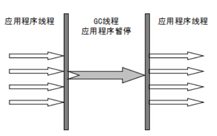
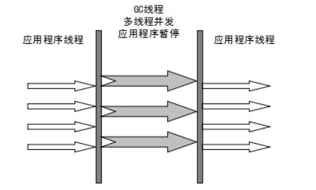
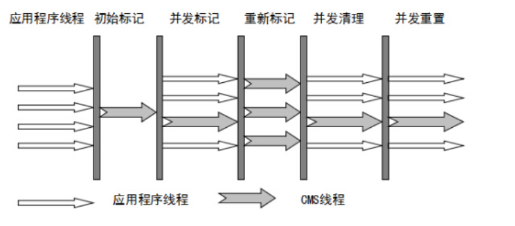

# HotSpot垃圾收集器
HotSpot虚拟机提供了多种垃圾收集器，每种收集器都有各自的特点，虽然我们要对各个收集器进行比较，但并非为了跳出一个最好的收集器。我们需要的是对具体应用最合适的收集器。  
## 新生代垃圾收集器
### Serial垃圾收集器(单线程)
只开启一条GC线程进行垃圾回收，并且在垃圾收集过程中停止一切用户线程，即Stop The World。  
一般客户端应用所需内存较小，不会创建太多对象，而且堆内存不大，因此垃圾收集器回收时间短，即使在这段时间停止一切用户线程，也不会感觉卡顿。因此Serial垃圾收集器适合客户端使用。  
由于Serial收集器只使用一条GC线程，避免了线程切换的开销，从而简单高效。  

### ParNew垃圾收集器(多线程)
ParNew是Serial的多线程版本，多条GC线程并行地进行垃圾清理。但清理过程依然需要Stop The World。  
ParNew追求"低停顿时间"，与Serial唯一区别就是使用了多线程进行垃圾收集，在多CPU环境下性能比Serial会有一定程度的提升；但线程切换需要额外的开销，因此在单CPU环境中表现不如Serial。  

### Parallel Scavenge垃圾收集器(多线程)
Parallel Scavenge和ParNew一样，都是多线程、新生代垃圾收集器。但是两者有巨大的不同点：  
- Parallel Scavenge:追求CPU吞吐量，能够在较短时间内完成指定任务，因此适合没有交互的后台计算。
- ParNew:追求降低用户停顿时间，适合交互式应用。  

吞吐量 = 运行用户代码时间 / (运行用户代码时间 + 垃圾收集时间)  
追求高吞吐量，可以通过减少GC执行实际工作的时间，然而，仅仅偶尔运行GC意味着每当GC运行时将有许多工作要做，因为在此期间积累在堆中的对象数量很高 。单个GC需要化更多的时间来完成，从而导致更高的暂停时间。而考虑到低暂停时间，最好频繁运行GC以便更快速完成，反过来又导致吞吐量下降。
- 通过参数-XX:GCTimeRadio设置垃圾回收时间占总CPU时间的百分比。
- 通过参数-XX:MaxGCPauseMillis设置垃圾处理过程最久停顿时间。
- 通过命令-XX:+UseAdaptiveSizePolicy开启自适应策略。我们只要设置好堆的大小和MaxGCPauseMills或GCTimeRadio,收集器会自动调整新生代的大小、Eden和Survivor的比例、对象进入老年代的年龄，以最大程度上接近我们设置的MaxGCPauseMills或GCTimeRadio。
## 老年代垃圾收集器
### Serial Old垃圾收集器(单线程)
Serial Old收集器是Serial的老年代版本，都是单线程收集器你，只启用一条GC线程，都适合客户端应用。他们的唯一区别就是：Serial Old工作是老年代，使用"标记-整理"算法；Serial工作在新生代，使用"复制算法"。  
### Paranllel Old(垃圾收集器)(多线程)
Paraller Old收集器是Parallel Scavenge的老年代版本，追求CPU吞吐量
## CMS垃圾收集器
CMS(Concurrent Mark Sweep,并发标记清除)收集器是以获取最短回收停顿时间为目标的收集器(追求低停顿)，它在垃圾收集时使得用户线程和GC线程并发执行，因此 在垃圾收集过程中用户也不会感觉到明显的卡顿。  
- 初始标记：Stop The World,仅使用一条初始标记线程对所有与GC Roots直接关联的对象进行标记。
- 并发标记：使用多条标记线程，与用户线程并发执行。此过程进行可达性分析，标记出所有废弃对象。速度很慢。
- 重新标记：Stop The World,使用多条标记线程并发执行，将刚才并发标记过程中新出现的废弃对象标记出来。 
- 并发清除：只使用一条GC线程，与用户线程并发执行，清除刚才标记的对象。这个过程非常耗时。  

并发标记与并发清除过程耗时最长，且可以与用户线程一起工作，因此，总体上说，CMS收集器的内存回收过程是与用户线程一起并发执行的。

CMS的缺点:
- 吞吐量低
- 无法处理浮动垃圾
- 使用"标记-清除"算法产生碎片空间，导致频繁Full GC  

对于产生碎片空间的问题，可以通过开启-XX:+UseCMSCompactAtFullCollection,在每次Full GC完成后都会进行以内存压缩整理，将零散在各处的对象整理到一块。设置参数-XX:CMSFullGCsBeforeCompaction告诉CMS，经过N次Full GC之后再进行一次内存整理。
## G1通用垃圾收集器
G1是一款面向服务端应用的垃圾收集器，它没有新生代和老年代的概念，而是将堆划分为一块块独立的Regin。当要进行垃圾收集时，首先估计每个Region中的垃圾的数量，每次都从垃圾回收价值最大的Regin开始回收，因此可以获得最大的回收效率。  
从整体上看，G1是基于"标记-整理"算法实现的收集器，从局部(两个Regin之间)上看是基于"复制"算法实现的，者意味着运行期间不会产生内存空间碎片。
这里抛出问题？
> 一个对象和它内部所引用的对象可能不在同一个Regin中，那么当垃圾回收时，是否需要扫描整个堆内存才能完整地进行一次可达性分析？
  
并不！每个Regin都有一个Remembered Set,用于记录本区域中所有对象引用的对象所在的区域，进行可达性分析时，只要在GC Roots中再加上Remembered Set即可防止对整个堆内存进行遍历。  
如果不计算维护Remembered Set的操作，G1收集器的工作过程分为以下步骤：
- 初始标记：Stop The World,仅使用一条初始标记线程对所有与GC Roots直接关联的对象进行标记。
- 并发标记：使用一条标记线程与用户线程并发执行。此过程进行可达性分析，速度很慢。
- 最终标记：Stop The World,使用多条标记线程并发执行
- 筛选回收：回收废弃对象，此时也要Stop The World，并使用多条筛选回收线程并发执行。
