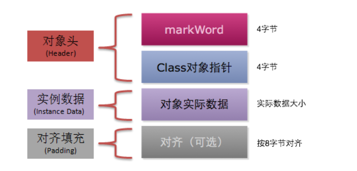

# HotSpot虚拟对象探秘
## 对象的内存布局
在HotSpot虚拟机中，对象的内存分为以下3块区域
- 对象头(Header)
- 实例数据(Instance Data)
- 对齐填充(Padding)

### 对象头
对象头记录了对象在运行过程中所需要使用的一些数据：
- 哈希码
- GC分代年龄
- 锁状态标志
- 线程持有的锁
- 偏向线程ID
- 偏向时间戳
对象头可能包含类型指针，通过该指针能确定对象属于哪个类。如果对象是一个数组，那么对象头还会包括数组长度。
### 实例数据
实例数据部分就是成员变量的值，其中包括父类成员变量和本类成员变量。
### 对齐填充
用于确保对象的总长度为8字节的整数倍。  
HotSpot VM的自动内存管理系统要求对象的大小必须是8字节的整数倍。而对象头部正好是8字节的倍数(1被或2倍)，因此对象实例数据部分没有对齐时，就需要通过对齐填充来补全。
>对齐填充并不是必然存在，也没有特别的含义，它仅仅起着占位符的作用。
## 对象的创建过程
### 类加载检查
虚拟机在解析.class文件时，若遇到一条new指令，首先它会去检查常量池中是否有这个类的符号引用，并且检查这个符号引用所代表的类是否已被加载、解析和初始化过。如果没有，那么必须先执行相应的类加载过程。
### 为新生对象分配内存
对象所需内存的大小在类加载完成后便可完全确定，接下来从堆中划分一块对应大小的内存给新的对象。分配堆中内存有两种方式：
- **指针碰撞**
