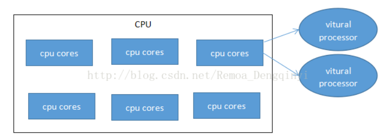
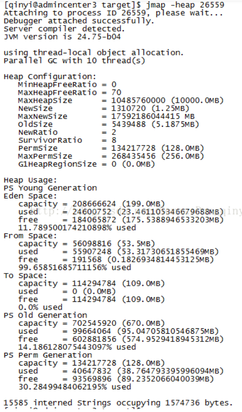
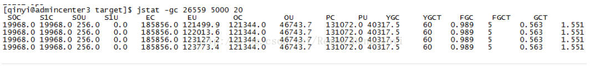
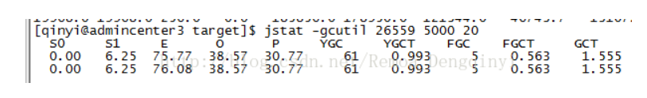

## 环境说明
- Linux内核版本:4.4.7  
    ```sh
    cat /pro/version
    ```
    

- Linux发行版本:Centos6.8
    ```sh
    cat /etc/issue或lsb_release -a
    ```
    

- JDK版本:jdk1.7
    ```sh
    java -version
    ```
    

- 磁盘空间查看
    ```sh
    df -h
    ```
    

- 查看内存情况
    ```sh
    cat /proc/meminfo
    ```
    
    - 参数说明   
        1. MemTotal：总内存为62.81GB；
        2. MemFree：空闲内存为20.29GB；
        3. Buffers：用来给文件做缓冲的内存为0.59GB；
        4. Cached：被高速缓冲存储器使用的内存大小为28.12GB；
        5. SwapCeched：交换空间；
        6.  Active：活跃使用的缓冲或高速缓冲存储器页面文件的大小；
        7. InActive：不经常使用的缓冲或高速缓冲存储器页面文件的大小；

- CPU情况
    1. 查看物理封装中的处理器数量  
        ```sh
        cat /proc/cpuinfo | grep 'physical id' | sort|uniq
        ```
        
    2. 查看逻辑处理器列表
        ```sh
        cat /proc/cpuinfo | grep 'processor' | sort|uniq
        ```
        
    3. 查看位于相同物理封装中的CPU处理核心（内核）数量：
        ```sh
        cat /proc/cpuinfo  | grep 'siblings' | sort | uniq
        ```
        
    4. 查看CPU处理核心（内核）列表：
        

综上，该服务器的CPU为1个物理封装的处理器（physical id），该处理器中CPU处理核心（cpu cores）数量为6个，每个CPU处理核心可划分为2个逻辑处理器（processor），因此该物理处理器中共有12个逻辑处理器（processor）。  


## 查看java进程总体运行情况：
```sh
top | grep java
```  

说明：

    第一列：PID，进程id31933

    第二列：USER，用户qinyi

    第三列：PR，优先级为20

    第四列：NI，nice值为0，负值表示高优先级，正值表示低优先级

    第五列：VIRT，进程使用的虚拟内存总量为12.7Gb=1.5875GB

    第六列：RES，进程使用的、未被换出的物理内存大小为79Mb

    第七列：SHR，共享内存大小为27Mb

    第八列：S，进程状态为睡眠，R为运行，S为睡眠，T为跟踪/停止，Z为僵尸进程

    第九列：%CPU，上次更新到现在的CPU时间占用百分比为0.3%

    第十列：%MEM，进程使用的物理内存占用百分比为0.1%

    第十一列：TIME+，进程使用的CPU时间为0分0秒

    第十二列：COMMAND：命令名为Java

附注：TOP统计信息区参数说明：

说明：

    A)10:27:13：当前时间；

    B)up 17 days, 20:06：系统运行了17天20小时6分钟了；

    C)20 users：当前登录用户数为20；

    D)load average：0.18,0.56,0.70：系统负载，任务队列的平均长度，1分钟内的平均值为0.18，5分钟内的平均值为0.56，15分钟内的平均值为0.70（数字越小越好）；

    E)Tasks：407 total, 1 running, 406 sleeping, 0 stopped, 0 zombie：共有407个进程，其中正在运行的进程为1个，睡眠的进程为406个，0个停止，0个僵尸进程；

    F)Cpus：0.7%us, 1.2%sy, 0.0%ni, 98.0%id,0.2%wa, 0.0%hi, 0.0%si, 0.0%st：

    CPU情况：用户空间占用CPU百分比为0.7%，

    内核空间占用CPU百分比为1.2%，

    用户进程空间内改变过优先级的进程占用CPU百分比为0.0%，

    空闲CPU百分比为98.0%，

    等待输入输出的CPU百分比为0.2%，

    硬件中断占用CPU百分比为0.0%，

    软中断占用CPU百分比为0.0%，

    虚拟机占用CPU百分比为0.0%；

    G)Mem:65860128k total, 43885228k used, 21974900k free, 619152k buffers：

    物理内存共有62.81GB，已使用的物理内存为41.85GB，还有空闲物理内存20.96GB，用来给文件做缓冲的内存为0.59GB；

    H)Swap：0k total, 0k used, 0k free, 29484168k cached：

    交换区内存大小：0，被高速缓冲存储器使用的内存大小为：28.12GB

## jps查看java进程
1. 查看传递给JVM相关参数：
    ```sh
    jps -v
    ```
    

    参数说明：    
    
        ①-Djava.aet.headless=true：Headless模式缺少了显示设备、键盘和鼠标，程序激活了headless模式表示程序不能依靠硬件来帮忙，要依靠系统的计算能力模拟出这些特性来；

        ②-Xmx10000m：设置应用程序的最大内存（堆）大小为10000MB；

        ③-XX:MaxHeapFreeRatio=70：设置堆内存的最大空闲比例，默认为70，当堆内存的空闲内存大于这个数值时，便会压缩堆空间，得到一个较小的堆；

        ④-XX:MaxPermSize=256m：JVM允许分配的最大非堆内存为256MB；

        ⑤-XX:PermSize=128m：JVM初始分配的非堆内存为128MB；

        ⑥-Xms:8m：JVM初始分配的堆内存为8MB

2. 输出应用程序的Main函数所在的类的完整路径或者应用程序jar包的完整路径

    ```sh
    jps -l 
    ```

    

## jmap查看堆情况

1. jmap pid

    

    打印的列分别为：共享对象的起始地址、映射大小、共享对象的绝对路径

2. jmap -heap pid

    

    说明：

        A）Heap Configuration：堆内存初始化配置；
        B）MinHeapFreeRatio=0：堆内存最小空闲比率0%；
        C）MaxHeapFreeRatio=70：堆内存最大空闲比率为70%，当堆内存的空闲内存大于这个数值时，便会压缩堆空间，得到一个较小的堆；
        D）MaxHeapSize=10000.0MB：堆内存最大为10000MB；
        E）NewSize=1.25MB：堆新生代大小为1.25MB；
        F）MaxNewSize=17592186044415 MB：堆新生代最大大小为1677215MB；
        G）OldSize=5.1875MB：老年代大小为5.1875MB；
        H）NewRatio=2：新生代和老年代的大小比率为2；
        I）SurvivorRatio=8：新生代中Eden区和Survivor区的大小比率为8；
        J）PermSize=128.0MB：永久代的初始大小为128.0MB；
        K）MaxPermSize=256.0MB：永久代最大为1256.0MB；
        L）G1HeapRegionSize=0：G1平分java堆而产生区域的大小，此处为0，说明未划分；
        M）Young Generation：新生代；
        N）Eden Space：Eden区的内存分布；
        O）From Space：其中一个Survivor区的内存分布；
        P）To Space：另一个Survivor区的内存分布；
        Q）Old Generation：老年代
        R）Perm Generation：永久代

3. jmap -histo:live 26559：查看对重存货对象数量和大小

    

## jstat查看程序的资源和性能

1. jstat -gc pid 时间间隔 打印次数

    

    说明：

        A）S0C：年轻代第一个survivor的容量（字节）
        B）S1C：年轻代第二个survivor的容量（字节）
        C）S0U：年轻代第一个survivor已使用的容量（字节）
        D）S1U：年轻代第二个survivor已使用的容量（字节）
        E）EC：年轻代中Eden的空间（字节）
        F）EU：年代代中Eden已使用的空间（字节）
        G）OC：老年代的容量（字节）
        H）OU：老年代中已使用的空间（字节）
        I）PC：永久代的容量
        J）PU：永久代已使用的容量
        K）YGC：从应用程序启动到采样时年轻代中GC的次数
        L）YGCT：从应用程序启动到采样时新生代中GC所使用的时间（单位：S）
        M）FGC：从应用程序启动到采样时老年代中GC（FULL GC）的次数
        N）FGCT：从应用程序启动到采样时老年代中GC所使用的时间（单位：S）
        O）GCT：从应用程序启动到采样时用于垃圾回收的总时间（单位：S）等于YGCT + FGCT

2. jstat -gcutil 26559 5000 20

    

    说明：

        A）S0：新生代中第一个survivor已使用的占当前容量百分比
        B）S1：新生代中第二个survivor已使用的占当前容量百分比
        C）E：新生代中Eden已使用的占当前容量百分比
        D）O：老年代中已使用的占当前容量百分比
        E）P：永久代中已使用的占当前容量百分比