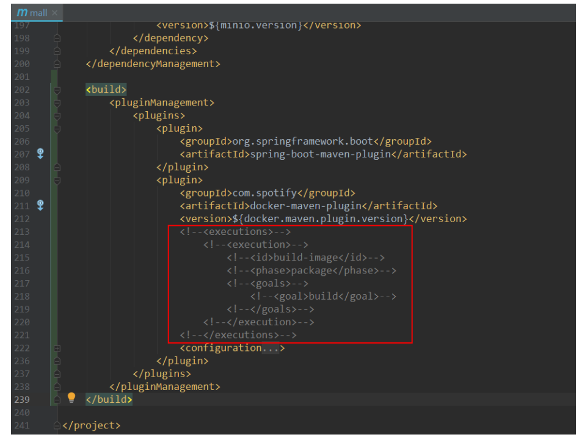
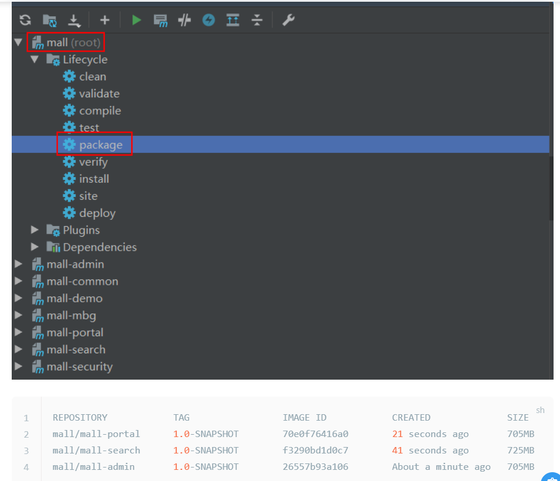
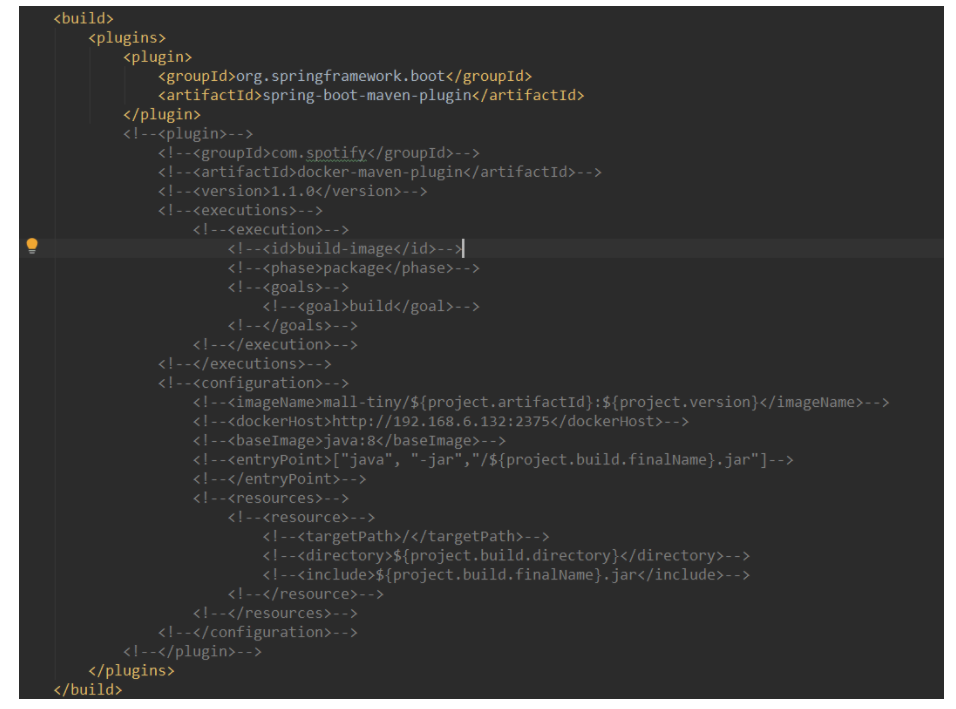
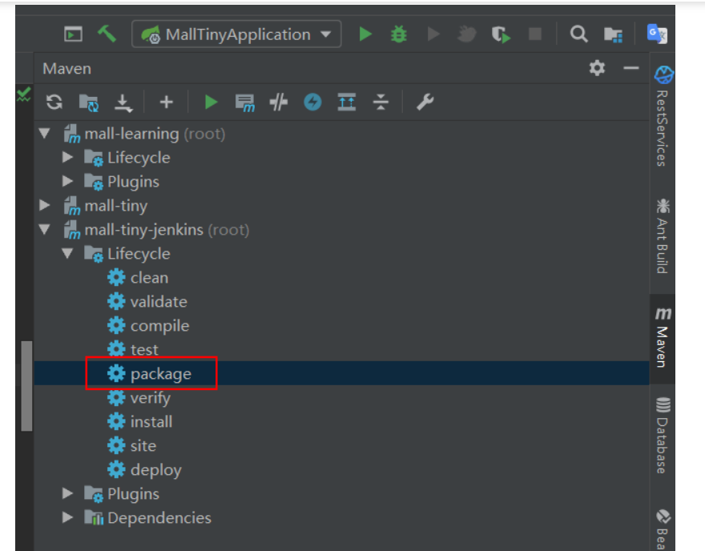
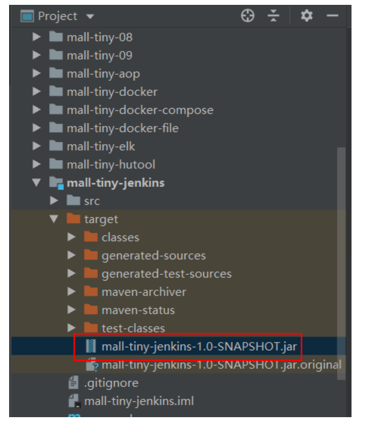
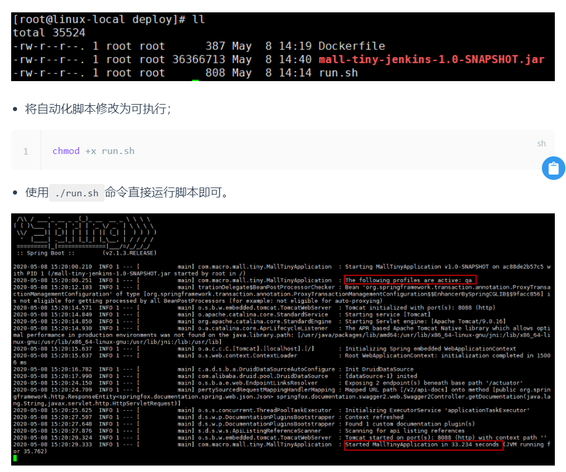
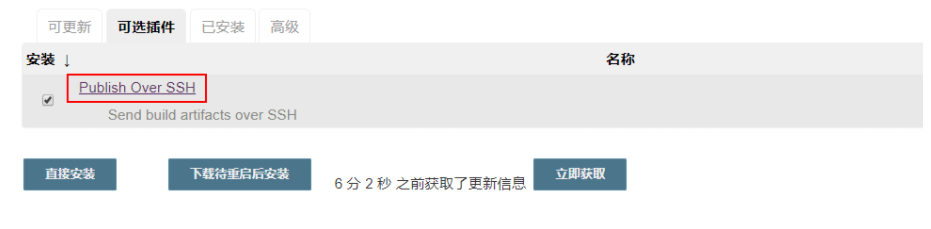
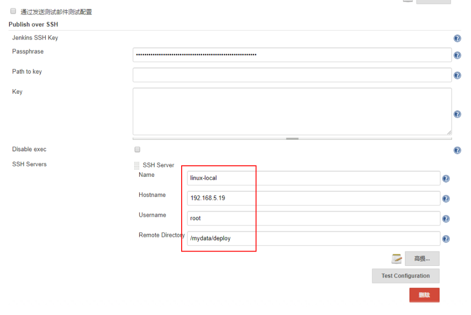
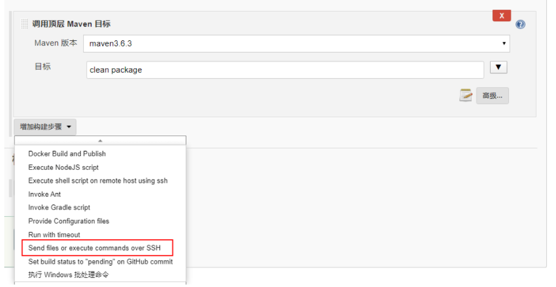
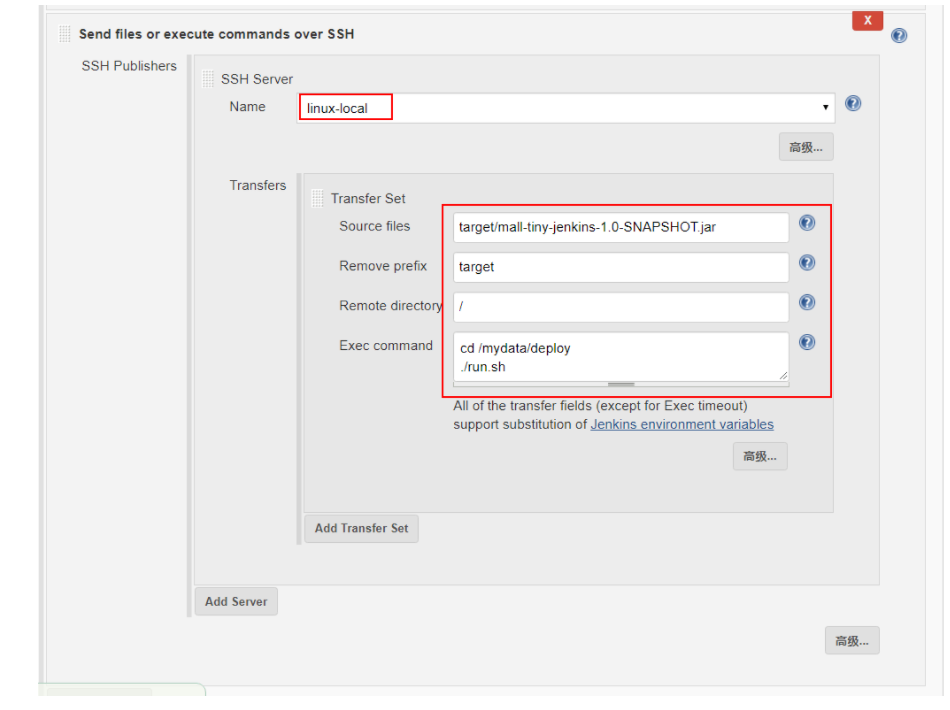

## 在Linux环境下的部署(基于Docker容器)
springBoot应用部署
#### 构建所有Docker镜像并上传
- 修改项目根目录下的pom.xml中的docker.host属性：
    ```xml
    <properties>
        <docker.host>http://192.168.3.101:2375</docker.host>
    </properties>
    ```
- 如果项目根项目的pom.xml中的docker-maven-plugin的<executions>节点被注释掉了就打开注释，使项目在打包时直接构建Docker镜像；  
    
- 直接双击根项目mal的package命令可以一次性打包所有应用的Docker进行；
    
#### 部署mall-admin
    ```sh
    docker run -p 8080:8080 --name mall-admin \
    --link mysql:db \
    --link redis:redis \
    -v /etc/localtime:/etc/localtime \
    -v /mydata/app/admin/logs:/var/logs \
    -d mall/mall-admin:1.0-SNAPSHOT
    ```
注意：如果想使用Logstash收集日志的话，需要将应用容器连接到Logstsh，添加如下配置即可 

    ```sh
    --link logstash:logstash \
    ```
#### 部署mall-search
    ```sh
    docker run -p 8081:8081 --name mall-search \
    --link elasticsearch:es \
    --link mysql:db \
    -v /etc/localtime:/etc/localtime \
    -v /mydata/app/search/logs:/var/logs \
    -d mall/mall-search:1.0-SNAPSHOT
    ```
#### 部署mall-port
    ```sh
    docker run -p 8085:8085 --name mall-portal \
    --link mysql:db \
    --link redis:redis \
    --link mongo:mongo \
    --link rabbitmq:rabbit \
    -v /etc/localtime:/etc/localtime \
    -v /mydata/app/portal/logs:/var/logs \
    -d mall/mall-portal:1.0-SNAPSHOT
    ```
#### 开启防火墙
    ```sh
    firewall-cmd --zone=public --add-port=8080/tcp --permanent
    firewall-cmd --zone=public --add-port=8081/tcp --permanent
    firewall-cmd --zone=public --add-port=8085/tcp --permanent
    firewall-cmd --reload
    ```
## 半自动化部署
#### 项目打包
- 这次我们不使用Docker的Maven插件来打包，先在pom.xml中注释掉它；
    
- 使用Maven的package命令直接将应用打成Jar包
    
- 此时在target目录下就会生成一个Jar包，我们打包Docker镜像的时候会用到它。
    

#### DockerFile
```shell
# 该镜像需要依赖的基础镜像
FROM java:8
# 将当前目录下的jar包复制到docker容器的/目录下
ADD mall-tiny-jenkins-1.0-SNAPSHOT.jar /mall-tiny-jenkins-1.0-SNAPSHOT.jar
# 声明服务运行在8088端口
EXPOSE 8088
# 指定docker容器启动时运行jar包
ENTRYPOINT ["java", "-jar","/mall-tiny-jenkins-1.0-SNAPSHOT.jar"]
# 指定维护者的名字
MAINTAINER macro
```
#### 自动化脚本
可以作为通用脚本来使用的模板脚本，只需改变其中的一些参数即可，具体执行流程为：停止旧服务->删除旧容器->删除旧镜像->打包新镜像->运行新镜像。  

```shell
#!/usr/bin/env bash
# 定义应用组名
group_name='mall-tiny'
# 定义应用名称
app_name='mall-tiny-jenkins'
# 定义应用版本
app_version='1.0-SNAPSHOT'
# 定义应用环境
profile_active='qa'
echo '----copy jar----'
docker stop ${app_name}
echo '----stop container----'
docker rm ${app_name}
echo '----rm container----'
docker rmi ${group_name}/${app_name}:${app_version}
echo '----rm image----'
# 打包编译docker镜像
docker build -t ${group_name}/${app_name}:${app_version} .
echo '----build image----'
docker run -p 8088:8088 --name ${app_name} \
--link mysql:db \
-e 'spring.profiles.active'=${profile_active} \
-e TZ="Asia/Shanghai" \
-v /etc/localtime:/etc/localtime \
-v /mydata/app/${app_name}/logs:/var/logs \
-d ${group_name}/${app_name}:${app_version}
echo '----start container----'
```
下面讲下自动化脚本里面值得注意的地方：

- group_name、app_name、app_version可以用来定义打包镜像的属性；
- profile_active可以让你的应用使用不同环境下的配置，比如使用qa可以启用测试环境的配置，使用prod可以启用生产环境配置，真正的一包多用；
- docker rmi这步一定要有，如果不删除旧镜像，当新镜像打包的时候会产生none镜像；
- docker run命令中的-e TZ="Asia/Shanghai"时区一定要设置，否则容器时间会和宿主机会相差8个小时。

#### 部署运行
- 直接上传我们的应用Jar包、DockerFile文件和自动化部署到指定目录下

## 结合Jenkins自动化部署
#### [自动部署](https://mp.weixin.qq.com/s/tQqvgSc9cHBtnqRQSbI4aw)
#### 使用Publish Over SSH
这里推荐安装这款Jenkins插件，它的主要作用是可以通过SSH在不同服务器之间传输文件和执行命令。比如说我们把Jenkins装在了测试服务器上，我们可以使用Jenkins在测试服务器上从Git仓库获取代码，然后打成Jar包。打包完成后我们可以通过这个插件将Jar包传输到正式服务器上去，然后执行正式服务器上的自动化脚本，从而实现正式服务器上的自动化部署。

- 首先我们可以在系统管理->插件管理中找到该插件，然后进行安装；

- 然后在系统管理->插件管理中添加相应的SSH配置；

- 配置完成后创建一个应用的构建任务，源码管理和构建中的Maven打包配置和之前的Jenkins教程中一样，只有最后一步不同，添加构建步骤为通过SSH发送文件并执行命令;

- 配置好我们的SSH Publisher，主要是源文件路径和目标文件路径，以及需要执行的脚本

- 之后执行构建任务即可实现自动化部署了，此方法在两台不同服务器之间同样适用！
