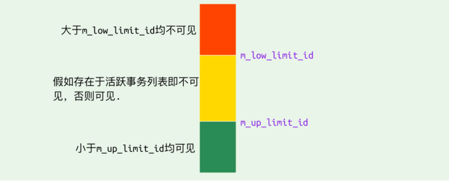

## 一致性非锁定读和锁定读
### 一致性非锁定读
对于一致性非锁定读的实现，通常做法是加一个版本号或者时间戳字段，在更新数据的同时版本号+1或者更新时间戳。查询时，将当前可见的版本号与对应记录的版本号进行比对，如果记录的版本号小于可见版本，则表示该记录可见。    
在InnoDB存储引擎中，多版本就是对非锁定读的实现。如果读取的行正在执行行DELETE或UPDATE操作，这时读取操作不会去等待行上的锁的释放。相反地，InnoDB存储引擎会去读取行的一个快照数据，对于这种读取历史数据的方式，我们叫它快照读。   
在Repeatable Read和Read Committed两个隔离级别下，如果是执行普通的select语句(不包括select ... lock in share mode,select ... for update)则会使用一致性非锁定读(MVCC)。并且在Repeatable Read下MVCC实现了可重复读和防止部分幻读。   
### 锁定读
如果执行的是下列语句，就是锁定读。   
- select ... lock in share mode
- select ... for update 
- insert、update、delete操作

在锁定读下，读取的是数据的最新版本，这种读被称为当前读。锁定读会对读取到的记录加锁:  
- select ... lock in share mode：对记录加S锁其他事务也可以加S锁，如果加X锁则会被阻塞。    
- select ... for update、insert、update、delete：对记录加X锁，且其他事务不能加任何锁。  
在一致性非锁定读下，即使读取的记录已被其它事务加上 X 锁，这时记录也是可以被读取的，即读取的快照数据。上面说了，在 Repeatable Read 下 MVCC 防止了部分幻读，这边的 “部分” 是指在 一致性非锁定读 情况下，只能读取到第一次查询之前所插入的数据（根据 Read View 判断数据可见性，Read View 在第一次查询时生成）。但是！如果是 当前读 ，每次读取的都是最新数据，这时如果两次查询中间有其它事务插入数据，就会产生幻读。所以， InnoDB 在实现Repeatable Read 时，如果执行的是当前读，则会对读取的记录使用 Next-key Lock ，来防止其它事务在间隙间插入数据。 
## InnoDB对MVCC的实现
MVCC的实现依赖于：隐藏字段、Read View、undo log。在内部实现中，InnoDB通过数据行的DB_TRX_ID和Read View来判断数据的可见性，如不可见，则通过数据行的DB_ROLL_PTR找到undo log中历史版本。每个事务读到的数据版本可能是不一样的，在同一个事务中，用户只能看到该事务创建Read View之前已经提交的修改和该事务本身做的修改。   
### 隐藏字段
在内部，InnoDB存储引擎为每行数据添加了三个隐藏字段:    
- DB_TRX_ID(6字节):表示最后一次插入或更新该行的事务id。此外，delete操作在内部视为更新，只不过在记录头Record header中的deleted_flag字段将其标记为已删除   
- DB_ROLL_PTR(7字节):回滚指针，指向该行的undo log。如果改行未被更新，则为空。  
- DB_ROW_ID(6字节):如果没有设置主键且该表没有唯一非空索引时，InnoDB会使用该id来生成聚族索引  
### ReadView
```sql
class ReadView {
  /* ... */
private:
  trx_id_t m_low_limit_id;      /* 大于等于这个 ID 的事务均不可见 */

  trx_id_t m_up_limit_id;       /* 小于这个 ID 的事务均可见 */

  trx_id_t m_creator_trx_id;    /* 创建该 Read View 的事务ID */

  trx_id_t m_low_limit_no;      /* 事务 Number, 小于该 Number 的 Undo Logs 均可以被 Purge */

  ids_t m_ids;                  /* 创建 Read View 时的活跃事务列表 */

  m_closed;                     /* 标记 Read View 是否 close */
}
```
Read View主要用来做可见性判断，里面保存了"当前对本事务不可见的其他活跃事务"   
主要有有以下字段：  
- m_low_limit_id:目前出现的最大的事务ID+1，即下一个将被分配的事务ID。大于等于这个ID的数据版本均不可见。   
- m_up_limit_id:活跃事务列表m_ids中最小的事务ID，如果m_ids为空，则m_up_limit_id为m_low_limit_id。小于这个ID的数据版本均可见。   
- m_ids:Read View创建时其他未提交的活跃事务ID列表。创建Read View时，将当前未提交事务ID记录下来，后续即使它们修改了记录行的值，对于当前事务也是不可见的。m_ids不包括当前事务自己和已提交的事务(正在内存中)。  
- m_creator_trx_id:创建该Read View的事务ID  

事务可见性示意图:   

### undo-log
undo log主要有两个作用：  
- 当事务回滚时用于数据恢复到修改前的样子。    
- 另一个作用是MVCC，当读取记录时，若记录被其他事务占用或当前版本对改事务不可见，则可以通过undo log读取之前的版本数据，以此实现非锁定读。   

在InnoDB存储引擎中undo log分为两种：insert undo log和update undo log:    
1. insert undo log:指在insert操作中产生的undo log。因为insert操作的记录只对事务本身可见，对其他不可见，故该undo log可以在事务提交后直接删除。不需要进行purge操作  
insert时的数据初始状态：

2. update undo log:update或delete操作中产生的undo log。该undo log可能需要提供MVCC机制，因此不能再事务提交时进行删除。提交时放入undo log链表,等待purge线程进行最后的删除。   


不同事务或者相同事务的对同一记录行的修改，会使该记录行的 undo log 成为一条链表，链首就是最新的记录，链尾就是最早的旧记录。