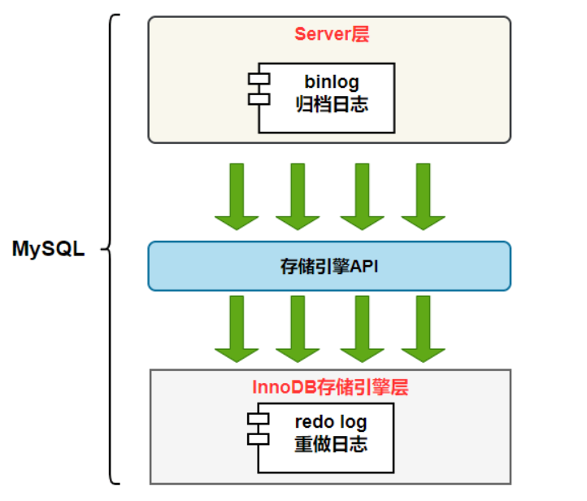
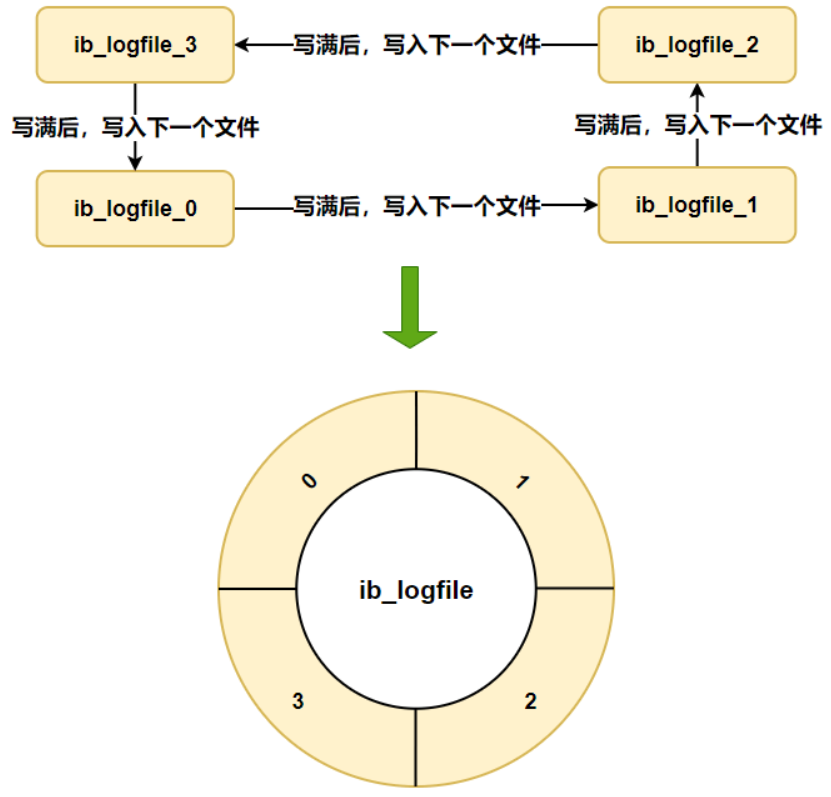
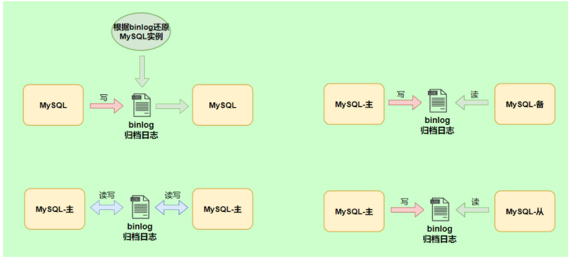
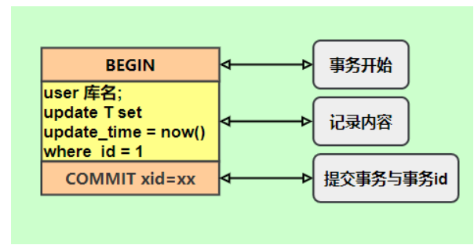
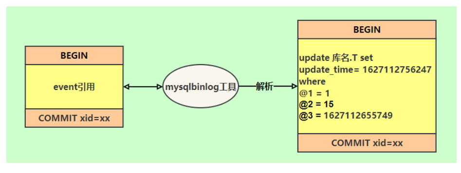

# MySQL索引详解
## 索引的优缺点
**优点：**
- 使用索引可以大大加快数据的检索速度（大大减少检索的数据量）, 这也是创建索引的最主要的原因。
- 通过创建唯一性索引，可以保证数据库表中每一行数据的唯一性。

**缺点：**
- 创建索引和维护索引需要耗费许多时间。当对表中的数据进行增删改的时候，如果数据有索引，那么索引也需要动态的修改，会降低 SQL 执行效率。
- 索引需要使用物理文件存储，也会耗费一定空间。

## 索引的底层数据结构
### Hash表&B+树
哈希表是键值对的集合，通过键(key)即可快速取出对应的值(value)，因此哈希表可以快速检索数据（接近 O（1））。  
为何能够通过 key 快速取出 value呢？ 原因在于 哈希算法（也叫散列算法）。通过哈希算法，我们可以快速找到 value 对应的 index，找到了 index 也就找到了对应的 value。
```java
hash = hashfunc(key)
index = hash % array_size

```
但是！哈希算法有个 Hash 冲突 问题，也就是说多个不同的  key 最后得到的 index 相同。通常情况下，我们常用的解决办法是 链地址法。链地址法就是将哈希冲突数据存放在链表中。就比如 JDK1.8 之前 HashMap 就是通过链地址法来解决哈希冲突的。不过，JDK1.8 以后HashMap为了减少链表过长的时候搜索时间过长引入了红黑树。  
为了减少 Hash 冲突的发生，一个好的哈希函数应该“均匀地”将数据分布在整个可能的哈希值集合中。   
既然哈希表这么快，为什么MySQL 没有使用其作为索引的数据结构呢?
1. Hash 冲突问题 ：我们上面也提到过Hash 冲突了，不过对于数据库来说这还不算最大的缺点。 
2. Hash 索引不支持顺序和范围查询(Hash 索引不支持顺序和范围查询是它最大的缺点： 假如我们要对表中的数据进行排序或者进行范围查询，那 Hash 索引可就不行了。  
试想一种情况:
```java
SELECT * FROM tb1 WHERE id < 500;Copy to clipboardErrorCopied

```
在这种范围查询中，优势非常大，直接遍历比 500 小的叶子节点就够了。而 Hash 索引是根据 hash 算法来定位的，难不成还要把 1 - 499 的数据，每个都进行一次 hash 计算来定位吗?这就是 Hash 最大的缺点了。
### B树&B+树
B树也称B-树，全称为多路平衡查找树，B+树是B树的一种变体。B树和B+树中的B是平衡的意思。  
目前大部分数据库系统及文件系统都采用B-Tree或其他变种B+Tree作为索引结构。  
**B树&B+树两者有和异同呢？**
- B树的所有节点既存放键也存放数据，而B+树只有叶子节点存放key和data，其他内存节点只存放key。
- B树的叶子节点都是独立的；B+树的叶子节点有一条引用链指向它相邻的叶子节点。
- B树的检索的过程相当于对范围内的每个节点的关键字做二分查找，可能还没有到达叶子节点，检索就结束了。而B+树的检索效率就很稳定了，从任何查找都是从根节点到叶子节点的过程，叶子节点的顺序检索很明显。  

在 MySQL 中，MyISAM 引擎和 InnoDB 引擎都是使用 B+Tree 作为索引结构，但是，两者的实现方式不太一样。（下面的内容整理自《Java 工程师修炼之道》）   
MyISAM 引擎中，B+Tree 叶节点的 data 域存放的是数据记录的地址。在索引检索的时候，首先按照 B+Tree 搜索算法搜索索引，如果指定的 Key 存在，则取出其 data 域的值，然后以 data 域的值为地址读取相应的数据记录。这被称为“非聚簇索引”。   
InnoDB 引擎中，其数据文件本身就是索引文件。相比 MyISAM，索引文件和数据文件是分离的，其表数据文件本身就是按 B+Tree 组织的一个索引结构，树的叶节点 data 域保存了完整的数据记录。这个索引的 key 是数据表的主键，因此 InnoDB 表数据文件本身就是主索引。这被称为“聚簇索引（或聚集索引）”，而其余的索引都作为辅助索引，辅助索引的 data 域存储相应记录主键的值而不是地址，这也是和 MyISAM 不同的地方。在根据主索引搜索时，直接找到 key 所在的节点即可取出数据；在根据辅助索引查找时，则需要先取出主键的值，在走一遍主索引。 因此，在设计表的时候，不建议使用过长的字段作为主键，也不建议使用非单调的字段作为主键，这样会造成主索引频繁分裂。
## 索引类型
### 主键索引
数据表的主键列使用的就是主键索引。  
一张数据表有只能有一个主键，并且主键不能为 null，不能重复。  
在 MySQL 的 InnoDB 的表中，当没有显示的指定表的主键时，InnoDB 会自动先检查表中是否有唯一索引的字段，如果有，则选择该字段为默认的主键，否则 InnoDB 将会自动创建一个 6Byte 的自增主键。  
### 二级索引(辅助索引)  
二级索引又称为辅助索引，是因为二级索引的叶子节点存储的数据是主键，也就是说，通过二级索引，可以定位主键的位置。  
唯一索引，普通索引，前缀索引等索引属于二级索引。  
1. 唯一索引：唯一索引也是一种约束。唯一索引的属性不能出现重复的数据，但允许数据为NULL，一张表允许创建多个唯一索引。建立唯一索引的目的大部分时候都是为了该属性列的数据的唯一性，而不是为了查询效率。  
2. 普通索引：普通索引的唯一作用就是为了快速查询数据，一张表允许创建多个普通索引，并允许数据重复和NULL。  
3. 前缀索引：前缀索引只适用于字符串类型的数据。前缀索引是对文本的前几个字符创建索引，相比普通索引建立的数据更小，因为只取前几个字符。  
4. 全文索引：全文索引主要是为了检索大文本数据中的关键文本的信息。  
## 聚集索引与非聚集索引
### 聚集索引
聚集索引即索引结构和数据一起存放的索引。主键索引属于聚集索引。  
在MySql中，InnoDB引擎的表的.ibd文件就包含了该表的索引和数据，对于InnoDB引擎表来说，该表的索引(B+树)的每个非叶子节点存储索引，叶子节点存储索引和索引对应的数据。   
#### 聚集索引的优点 
聚集索引的查询速度非常的快，因为整个B+树本身就是一颗多平衡树，叶子节点也都是有序的，定位到索引的节点，就相当于定位到了数据。  
#### 聚集索引的缺点
1. 依赖于有序的数据：因为B+树是多路平衡树，如果索引的数据不是有序的，那么就需要在插入时排序，如果数据是整型还好，否则类似于字符串或UUID这种又长又难比较的数据，插入或查找的速度肯定比较慢。  
2. 更新代价大：如果对索引列的数据被修改时，那么对应的索引也将会被修改，而且聚集索引的叶子节点还存放着数据，修改代价肯定是较大的，所以对于主键索引来说，主键一般都是不可被修改的。  
### 非聚集索引
非聚集索引即索引结构和数据分开存放的索引。  
二级索引属于非聚集索引。   
#### 非聚集索引的优点
更新代价比聚集索引要小。非聚集索引的更新代价就没有聚集索引那么大了，非聚集索引的节点是不存在数据的  
#### 非聚集索引的缺点
1. 跟聚集索引一样，非聚集索引也依赖于有序的数据。
2. 可能会二次查询(回表):这应该是非聚集索引最大的缺点了。当查到索引对应的指针或主键后，可能还需要根据指针或主键再到数据文件或表中查询。
## 非聚集索引一定回表查询吗(覆盖索引)?
非聚集索引不一定回表查询。  
主键索引本身的key就是主键，查到返回就行了。这种情况就称为覆盖索引了。  
## 覆盖索引
覆盖索引即需要查询的字段正好是索引的字段，那么直接根据该索引，就可以查到数据了，而无需回表查询。  
## 创建索引的注意事项
1. 选择合适的字段创建索引
    - 不为NULL的字段：索引字段的数据应该尽量不为NUULL，因为对于数据为NULL的字段，数据库较难优化。如果字段频繁被查询，但又避免不了为NULL，建议使用0,1，true,false这样语义较为清晰的短值或短字符作为替换。  
    - 被频繁查询的字段：我们创建索引的字段应该是查询非常频繁的字段。  
    - 被作为条件查询的字段:被作为where条件查询的字段，应该考虑建立索引。
    - 频繁需要排序的字段：索引以及排序，这样查询可以利用索引的排序，加快排序查询时间。  
    - 被经常频繁用于连接的字段:经常用于连接的字段可能是一些外键列，对于外键列并不一定要建立外键，只是说该列涉及到表与表的关系。对于频繁被连接查询的字段，可以考虑建立索引，提高多表连接查询的效率。
    
2. 被频繁更新的字段应该慎重建立索引
    虽然索引能带来查询上的效率，但是维护索引的成本也是不小的。如果一个字段不被经常查询，反而被经常修改，那么就更不应该在这种字段上建立索引了。

3. 尽可能的考虑建立联合索引而不是单列索引。
    因为索引是需要占用磁盘空间的，可以简单理解为每个索引都对应着一颗 B+树。如果一个表的字段过多，索引过多，那么当这个表的数据达到一个体量后，索引占用的空间也是很多的，且修改索引时，耗费的时间也是较多的。如果是联合索引，多个字段在一个索引上，那么将会节约很大磁盘空间，且修改数据的操作效率也会提升。  

4. 注意冗余索引
    冗余索引指的是索引的功能相同，能够命中索引(a, b)就肯定能命中索引(a) ，那么索引(a)就是冗余索引。如（name,city ）和（name ）这两个索引就是冗余索引，能够命中前者的查询肯定是能够命中后者的 在大多数情况下，都应该尽量扩展已有的索引而不是创建新索引。

5. 考虑在字符串类型的字段上使用前缀索引代替普通索引。  
    前缀索引仅限于字符串类型，较普通索引会占用更小的空间，所以可以考虑使用前缀索引带替普通索引。

## 使用索引的一些建议
- 对于中到大型表索引都是非常有效的，但是特大型表的话维护开销会很大，不适合建索引
- 避免 where 子句中对字段施加函数，这会造成无法命中索引。
- 在使用 InnoDB 时使用与业务无关的自增主键作为主键，即使用逻辑主键，而不要使用业务主键。
- 删除长期未使用的索引，不用的索引的存在会造成不必要的性能损耗 MySQL 5.7 可以通过查询 sys 库的 schema_unused_indexes 视图来查询哪些索引从未被使用
- 在使用 limit offset 查询缓慢时，可以借助索引来提高性能
## Mysql如何为表字段添加索引？
1. 添加PRIMARY KEY(主键索引)
    ```sql
    ALTER TABLE table_name ADD PRIMARY KEY (column)
    ```
2. 添加UNIQUE(唯一索引)
    ```sql
    ALTER TABLE `table_name` ADD UNIQUE ( `column` )
    ```
3. 添加INDEX(普通索引)
    ```sql
    ALTER TABLE `table_name` ADD INDEX index_name ( `column` )
    ```
4. 添加FULLTEXT(全文索引)
    ```sql
    ALTER TABLE `table_name` ADD FULLTEXT ( `column`)
    ```
5. 添加多列索引
    ```sql
    ALTER TABLE `table_name` ADD INDEX index_name ( `column1`, `column2`, `column3` )
    ```


# MySQL三大日志(binlog、redolog和undolog)详解
## 日志类型
MySQL 日志 主要包括错误日志、查询日志、慢查询日志、事务日志、二进制日志几大类。其中，比较重要的还要属二进制日志 binlog（归档日志）和事务日志 redo log（重做日志）和 undo log（回滚日志）。  
redo log（重做日志）、binlog（归档日志）、两阶段提交、undo log （回滚日志）。  

## redo log
redo log(重做日志)是InnoDB存储引擎独有的，它让MySQL拥有了崩溃恢复能力。  
比如MySQL实例挂了或宕机了，重启时，InnoDB存储引擎会使用redo log恢复数据，保证数据的持久性与完整性。 

MySQL中数据是以页为单位，你查询一条记录，会从硬盘把一页数据加载出来，加载出来的数据叫数据页，会放入到Buffer Pool中。  
后续的查询都是先从Buffer Pool中找，没有命中再去硬盘加载，减少硬盘IO开销，提升性能。   
更新表数据的时候，也是如此，发现Buffer Pool里存在要更新的数据，就直接在Buffer Pool里面更新。  
然后会把"在某个数据页上做了什么修改"记录到重做日志缓存(redo log buffer)里，接着刷盘到redo log文件里。  

### 刷盘时机
InnoDB存储引擎为redo log的刷盘策略提供了innodb_flush_log_at_trx_commit参数，它支持三种策略：  
- 0:设置为0的时候，表示每次事务提交时不进行刷盘操作  
- 1:设置为1的时候，表示每次事务提交时都将进行刷盘操作(默认值)
- 2:设置为2的时候，表示每次事务提交时都只把redo log buffer内容写入page cache  

innodb_flush_log_at_trx_commit参数默认为1，也就是说当事务提交时会调用fsync对redo log进行刷盘  
另外，InnoDB存储引擎有一个后台线程，每隔1秒，就会把redo log buffer中的内容写到文件系统缓存(page cache)，然后调用fsync刷盘。  

也就是说，一个没有提交事务的redo log记录，也可能会刷盘。

**刷盘操作**  
事务执行过程redo log记录是会写入redo log buffer中，这些redo log记录会被后台线程刷盘。   
除了后台线程每秒1次的轮询操作，还有一种情况，当redo log buffer占用的空间即将达到innodb_log_buffer_size一半的时候，后台线程会主动刷盘。    
innodb_flush_log_at_trx_commit=0:如果MySQL挂了或宕机可能会有1秒数据的丢失。  

innodb_flush_log_at_trx_commit=1:只要事务提交成功，redo log记录就一定在硬盘里，不会有任何数据丢失。如果事务执行期间MySQL挂了或宕机，这部分日志丢了，但是事务并没有提交，所以日志丢了也不会有损失。  
  
innodb_flush_log_at_trx_commit=2:只要事务提交成功，redo log buffer中的内容只写入文件系统缓存(page cache)。如果仅仅只是MySQL挂了不会有任何数据丢失，但是宕机可能会有1秒数据丢失。  
 
### 日志文件组
硬盘上存储的redo log日志文件不只一个，而是以一个日志文件组的形式出现的，每个的redo日志文件大小都是一样的。  
比如可以配置为一组4个文件，每个文件大小为1GB,整个redo log日志文件组可以记录4G的内容。  
它采用的是环形数组形式，从头开始写，写到末尾又回到头循环写，如下图：   
  
在日志文件组中还有两个重要的属性，分别是write pos、checkpoint  
- write pos是当前记录的位置，一边写一边后移  
- checkpoint是当前要擦除的位置，也是往后推移  

每次刷盘redo log记录到日志文件组中，write pos位置就会后移更新。  
每次MySQL加载日志文件组恢复数据时，会清空加载过的redo log记录，并把checkpoint后移更新。  
write pos和checkpoint之间的还空着的部分可以用来写入新的redo log记录。  
如果write pos追上checkpoint，表示日志文件组满了，这时候不能写入新的redo log记录，MySQL得停下来，清空一些记录，把checkpoint推进一下。  
### redo log小结
数据页的大小是16kB，刷盘比较耗时，可能就修改了数据页里的几个Byte数据，就没有必要进行刷盘操作，而且数据页刷盘是随机写，因为一个数据页对应的位置在硬盘文件的随机位置，所以性能是很差。  
## binlog
redo log 它是物理日志，记录内容是"在某个数据页上做了什么修改"，属于InnoDB存储引擎。  
bin log是逻辑日志，记录内容是语句的原始逻辑，类似于"给ID=2这一行的c字段加1"，属于MySQL Server层。   
MySQL数据库的数据备份、主备、主主、主从都离不开binlog,需要依靠binlog来同步数据，保证数据一致性。    

binlog会记录所有涉及更新数据的逻辑操作，并且是顺序写。    
### 记录格式
binlog 日志有三种格式，可以通过binlog_format参数指定。   
- statement
- row
- mixed

指定statement，记录的内容是SQL语句原文，比如执行一条update T set update_time=now() where id=1，记录的内容如下。  

同步数据时，会执行记录的SQL语句，但是有个问题，update_time=now()这里会获取当前系统时间，直接执行会导致与原库的数据不一致。  
为了解决这种问题，我们需要指定为row，记录的内容不再是简单的SQL语句了，还包含操作的具体数据，记录内容如下。

row格式记录的内容看不到详细信息，要通过mysqldbinlog工具解析出来。  
update_time=now()变成了具体的时间update_time=1627112756247,条件后面的@1、@2、@3都是该行数据第1个~3个字段的原始值(假设这张表只有3个字段)。   
这样就能保证同步数据的一致性，通常情况下都是指定为row，这样可以为数据库的恢复与同步带来更好的可靠性。  
但是这种格式，需要更大的容量来记录，比较占用空间，恢复与同步时会更消耗IO资源，影响执行速度。  
所以就有了一种折中的方案，指定为mixed，记录的内容是两者的混合。   
MySQL会判断这条SQL语句是否可能引起数据不一致，如果是，就用row格式，否则就用statement格式。   
### 写入机制
binlog的写入时机也非常简单，事务执行过程中，先把日志写到binlog cache，事务提交的时候，再把binlog cache写到binlog文件中。  
因为一个事务的binlog不能被拆开，无论这个事务多大，也要确保一次性写入，所以系统会给每个线程分配一个块内存作为binlog cache。   
我们可以通过binlog_cache_size参数控制单个线程binlog cache大小，如果存储内容超过这个参数就要暂存到磁盘(Swap)。   
binlog日志刷盘流程如下：

- 上图的write，是指把日志写入到文件系统page cache，并没有把数据持久化到磁盘，所以速度比较快。
- 上图的fsync,才是数据持久化到磁盘的操作  

write和fsync的时机，可以由参数sync_binlog控制，默认是0。   
为0的时候，表示每次提交事务都只write,由系统自行判断什么时候执行fsync。  
  
虽然性能得到提升，但是机器宕机，page cache里面的binlog会丢失。  
为了安全起见，可以设置为1，表示每次提交事务都会执行fsync，就如同redo log日志刷盘流程一样。  
最后还有一种折中方式，可以设置为N(N>1)，表示每次提交事务都write，但记录N个事务后才fsync。  

在出现IO瓶颈的场景里，将sync_binlog设置成一个比较大的值，可以提示性能。  
同样，如果机器宕机，会丢失最近N个事务的binlog日志。   
## 两阶段提交
redo log(重做日志)让InnoDB存储引擎拥有了崩溃恢复能力。  
bin log(归档日志)保证了MySQL集群架构的数据一致性。  
两种日志都属于持久化保证。  
在执行更新语句过程，会记录redo log与bin log两块日志，以基本的事务为单位，redo log在事务执行过程中可以不断写入，而bin log只有在提交是事务时才写入，所以redo log与bin log的写入时机不一样。
- redo log与big log两份日志之间的逻辑不一致，会出现什么问题？  
问题案例：  
    执行update T set c=1 where id=2，c原值为0;  
    当执行语句时，binlog文件写异常，导致bin log里面没有对应的修改记录。因此bin log日志恢复数据，会少一次更新，会使c为0,而原库redo log日志恢复，这行数据c的值为1,最终数据不一致。  
解决方法(使用两阶段提交)：  
    将redo log的写入拆成两个步骤prepare和commit，这就是两阶段提交。
    
    使用两阶段提交后，写入binlog时发生异常也不会有影响，因为MySQL根据redo log日志恢复数据时，发现redo log还处于prepare阶段，并且没有对应binlog日志，就会回滚该事务。  
    再看一个场景，redo log设置commit阶段发生异常，那会不会回滚事务呢？  
    并不会回滚事务，它会执行上图框住的逻辑，虽然redo log是处于prepare阶段，但是能通过事务id找到对应的binlog日志，所以MySQL认为是完整的，就会提交事务恢复数据。   

## undo log
我们知道如果想要保证事务的原子性，就需要在异常发生时，对已经执行的操作进行回滚，在 MySQL 中，恢复机制是通过 回滚日志（undo log） 实现的，所有事务进行的修改都会先记录到这个回滚日志中，然后再执行相关的操作。如果执行过程中遇到异常的话，我们直接利用 回滚日志 中的信息将数据回滚到修改之前的样子即可！并且，回滚日志会先于数据持久化到磁盘上。这样就保证了即使遇到数据库突然宕机等情况，当用户再次启动数据库的时候，数据库还能够通过查询回滚日志来回滚将之前未完成的事务。

另外，MVCC 的实现依赖于：隐藏字段、Read View、undo log。在内部实现中，InnoDB 通过数据行的 DB_TRX_ID 和 Read View 来判断数据的可见性，如不可见，则通过数据行的 DB_ROLL_PTR 找到 undo log 中的历史版本。每个事务读到的数据版本可能是不一样的，在同一个事务中，用户只能看到该事务创建 Read View 之前已经提交的修改和该事务本身做的修改。  
## 总结
这部分内容为 JavaGuide 的补充：

MySQL InnoDB 引擎使用 redo log(重做日志) 保证事务的持久性，使用 undo log(回滚日志) 来保证事务的原子性。

MySQL数据库的数据备份、主备、主主、主从都离不开binlog，需要依靠binlog来同步数据，保证数据一致性。

## 站在巨人的肩膀上  
《MySQL 实战 45 讲》
《从零开始带你成为 MySQL 实战优化高手》
《MySQL 是怎样运行的：从根儿上理解 MySQL》
《MySQL 技术 Innodb 存储引擎》


