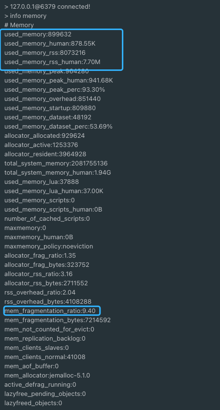

# 3中常用缓存读写策略
## Cache Aside Pattern(旁路缓存模式)
Cache Aside Pattern 是我们平时使用比较多的一个缓存读写模式，比较适合读请求比较多的场景。  
### 写
- 先更新DB。
- 然后直接删除cache。
### 读
- 从cache中读取数据，读取到就直接返回。
- cache中读取不到的话，就从DB中读取数据返回。
- 再把数据放到cache中。
### 问题
1. 在写数据的过程中，可以先删除cache，后更新DB吗？   
那肯定是不行的！因为这样可能会造成数据库（DB）和缓存（Cache）数据不一致的问题。
2. 在写数据的过程中，先更新DB，后删除cache就没有问题了么？  
理论上来说还是可能会出现数据不一致性的问题，不过概率非常小，因为缓存的写入速度是比数据库的写入速度快很多！  
3. 首次请求数据一定不在cache的问题？   
解决办法：可以将热点数据可以提前放入cache 中。  
4. 写操作比较频繁的话导致cache中的数据会被频繁被删除，这样会影响缓存命中率    
- 数据库和缓存数据强一致场景 ：更新DB的时候同样更新cache，不过我们需要加一个锁/分布式锁来保证更新cache的时候不存在线程安全问题。
- 可以短暂地允许数据库和缓存数据不一致的场景 ：更新DB的时候同样更新cache，但是给缓存加一个比较短的过期时间，这样的话就可以保证即使数据不一致的话影响也比较小

## Read/Write Through Pattern(读写穿透)
Read/Write Through Pattern 中服务端把 cache 视为主要数据存储，从中读取数据并将数据写入其中。cache 服务负责将此数据读取和写入 DB，从而减轻了应用程序的职责。

这种缓存读写策略小伙伴们应该也发现了在平时在开发过程中非常少见。抛去性能方面的影响，大概率是因为我们经常使用的分布式缓存 Redis 并没有提供 cache 将数据写入DB的功能。
### 写(Write Through):
- 先查cache，cache中不存在，直接更新DB。
- cache中存在，则先更新cache，然后cache服务自己更新DB(同步更新cache和DB)。

### 读(Read Through)：
- 从cache中读取数据，读取到就直接返回。
- 读取不到的话，先从DB加载，写入到cache后返回响应。

Read-Through Pattern 实际只是在 Cache-Aside Pattern 之上进行了封装。在 Cache-Aside Pattern 下，发生读请求的时候，如果 cache 中不存在对应的数据，是由客户端自己负责把数据写入 cache，而 Read-Through Pattern 则是 cache 服务自己来写入缓存的，这对客户端是透明的。

和 Cache Aside Pattern 一样， Read-Through Pattern 也有首次请求数据一定不再 cache 的问题，对于热点数据可以提前放入缓存中。

## Write Behind Pattern(异步缓存写入)
Write Behind Pattern 和 Read/Write Through Pattern 很相似，两者都是由 cache 服务来负责 cache 和 DB 的读写。

但是，两个又有很大的不同：Read/Write Through 是同步更新 cache 和 DB，而 Write Behind Caching 则是只更新缓存，不直接更新 DB，而是改为异步批量的方式来更新 DB。

很明显，这种方式对数据一致性带来了更大的挑战，比如cache数据可能还没异步更新DB的话，cache服务可能就就挂掉了。

这种策略在我们平时开发过程中也非常非常少见，但是不代表它的应用场景少，比如消息队列中消息的异步写入磁盘、MySQL 的 InnoDB Buffer Pool 机制都用到了这种策略。

Write Behind Pattern 下 DB 的写性能非常高，非常适合一些数据经常变化又对数据一致性要求没那么高的场景，比如浏览量、点赞量。
# Redis内存碎片   
## 什么是内存碎片？
内存碎片可以理解为不可用的空闲内存。   
## 为什么会有Redis内存碎片？   
1. Redis存储存储数据的时候向操作系统申请的内存空间可能会大于数据实际需要的存储空间。    
2. 频繁修改Redis中的数据也会产生内存碎片。   
## 如何查看Redis内存碎片的信息
使用info memory  

Redis 内存碎片率的计算公式：mem_fragmentation_ratio （内存碎片率）= used_memory_rss (操作系统实际分配给 Redis 的物理内存空间大小)/ used_memory(Redis 内存分配器为了存储数据实际申请使用的内存空间大小)

也就是说，mem_fragmentation_ratio （内存碎片率）的值越大代表内存碎片率越严重。

一定不要误认为used_memory_rss 减去 used_memory值就是内存碎片的大小！！！这不仅包括内存碎片，还包括其他进程开销，以及共享库、堆栈等的开销。

很多小伙伴可能要问了：“多大的内存碎片率才是需要清理呢？”。

通常情况下，我们认为 mem_fragmentation_ratio > 1.5 的话才需要清理内存碎片。 mem_fragmentation_ratio > 1.5 意味着你使用 Redis 存储实际大小 2G 的数据需要使用大于 3G 的内存。  
如果想要快速查看内存碎片率的话，你还可以通过下面这个命令：
    ```shell
    > redis-cli -p 6379 info | grep mem_fragmentation_ratio

    ```
另外，内存碎片率可能存在小于 1 的情况    

## 如何清理Redis内存碎片?
Redis4.0-RC3 版本以后自带了内存整理，可以避免内存碎片率过大的问题。

直接通过 config set 命令将 activedefrag 配置项设置为 yes 即可。  
```sh
config set activedefrag yes

```
具体什么时候清理需要通过下面两个参数控制：  
```sh
# 内存碎片占用空间达到 500mb 的时候开始清理
config set active-defrag-ignore-bytes 500mb
# 内存碎片率大于 1.5 的时候开始清理
config set active-defrag-threshold-lower 50

```
通过 Redis 自动内存碎片清理机制可能会对 Redis 的性能产生影响，我们可以通过下面两个参数来减少对 Redis 性能的影响：  
```sh
# 内存碎片清理所占用 CPU 时间的比例不低于 20%
config set active-defrag-cycle-min 20
# 内存碎片清理所占用 CPU 时间的比例不高于 50%
config set active-defrag-cycle-max 50

```
另外，重启节点可以做到内存碎片重新整理。如果你采用的是高可用架构的 Redis 集群的话，你可以将碎片率过高的主节点转换为从节点，以便进行安全重启。