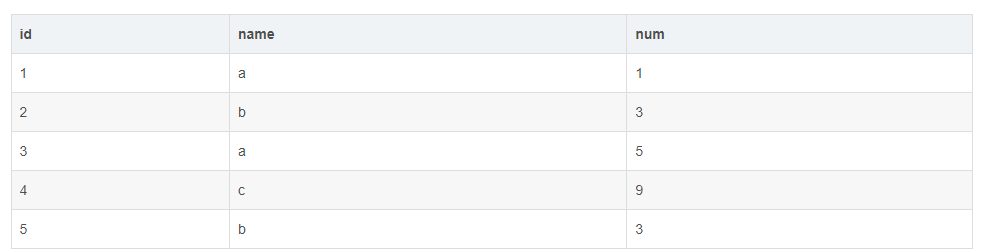

## 相邻连续最大天数
```sql
select name,max(cnt)
from
    (
        select name,grp_no,count(1) as cnt 
        from 
            (
                select name,id,day_id,date_sub
                    (
                        from_unixtime(unix_timestamp(day_id,'yyyyMMdd'),'yyyy-MM-dd'),ROW_NUMBER() OVER (partition by name order by day_id,id)
                    ) as grp_no, ROW_NUMBER() OVER(partition by name order by day_id,id) as row_no from temp_0001
            ) a group by name,grp_no
    )aa group by name;
```
### 窗口函数
#### over

- 此时每一行的窗口都是所有行
    ```sql
    select id,name,num,sum(num) over() sum1
    from 
        aa
    ```
    

- over(order by id) id=1的窗口只有一行，id=2的窗口包括id=1,id=2  
    ```sql
    select id,name,num,sum(num) over(order by id) sum1
    from 
        aa
    ```
    

- over(partition by name)每一行根据name来区分窗口
    ```sql
    select id,name,num,sum(num) over(partition by name)sum1
    from
        aa
    ```
    

- over(partition by name order by id)每一行根据窗口name来区分窗口，再根据order by取具体的范围
    ```sql
    select id,name,num, sum(num) over(partition by name order by id) sum1 
    from 
        aa
    ```
    

- over( order by id range between 1 preceding and 1 following ) range 代表范围 preceding 向前 following 向后 窗口范围当前行前后一行  
    ```sql
    select id,name,num,sum(num) over(order by id range between 1 preceding and 1 following)sum1 
    from
        aa
    ```
    

- over( order by id range between CURRENT ROW AND 1 following ) 窗口范围当前行和后面一行
    ```sql
    SELECT id,name,num,
    sum(num) over( order by id range between CURRENT ROW AND  1 following ) sum1 
    from 
        aa
    ```
    

#### rank
#### sum
#### avg
#### min
#### max
## hive时间戳函数unix_timestamp,from_unixtime
- 日期>>>>时间戳
    ```sql
    1. unix_timestamp() 获取当前时间戳
    2. unix_timestamp(string timestame)   输入的时间戳格式必须为'yyyy-MM-dd HH:mm:ss',如不符合则返回null
    3. unix_timestamp(string date,string pattern)   将指定时间字符串格式字符串转化成unix时间戳,如不符合则返回null

    select unix_timestamp('2019-08-15','yyyy-MM-dd')   --1565798400
 
    select unix_timestamp('2019-08-15 16:40:00','yyyy-MM-dd HH:mm:ss')   --1565858400
    
    select unix_timestamp('2019-08-15','yyyy-MM-dd HH:mm:ss')   --null
    ```
- 时间戳>>>>日期
    ```sql
    1. from_unixtime(bigint unixtime,string format)  将时间戳秒数转化为UTC时间，并用字符串表示，可通过format规定的时间格式，指定输出的时间格式，其中unixtime 是10位的时间戳值，而13位的所谓毫秒的是不可以的。
    select from_unixtime(1565858389,'yyyy-MM-dd HH:mm:ss')  --2019-08-15 16:39:49
    
    select from_unixtime(1565858389,'yyyy-MM-dd')   --2019-08-15
  


    2. 如果unixtime为13位的，需要先转成10位
    select from_unixtime(cast(1553184000488/1000 as int),'yyyy-MM-dd HH:mm:ss')   --2019-03-22 00:00:00
 
    select from_unixtime(cast(substr(1553184000488,1,10) as int),'yyyy-MM-dd HH:mm:ss')  --2019-03-22 00:00:00
    ```
- 获取当前时间
    ```sql
    select from_unixtime(unix_timestamp(),'yyyy-MM-dd HH:mm:ss')   -- 2019-08-15 17:18:55
    ```