# Java基础
## 基础概念
### Java 语言有哪些特点?  
- 简单易学； 
- 面向对象（封装，继承，多态）； 
- 平台无关性（ Java 虚拟机实现平台无关性）； 
- 支持多线程（ C++ 语言没有内置的多线程机制，因此必须调用操作系统的多线程功能来进行多线程程序设计，而 Java 语言却提供了多线程支持）； 
- 可靠性； 安全性； 
- 支持网络编程并且很方便（ Java 语言诞生本身就是为简化网络编程设计的，因此 Java 语言不仅支持网络编程而且很方便）； 
- 编译与解释并存；
### java运行过程  
.java-javac编译-.class-解析器&JIT-机器代码-OS  
编译与解析并存：编译：将java文件编译为class；解析：运行class文件
## 基本语法
### ==和equals()区别
== 对于基本类型和引用类型的作用类型是不同的：  
- 对于基本数据类型来说，==比较的是值。
- 对于引用数据类型来说，==比较的是对象的内存地址。
### equals() 方法存在两种使用情况： 
- 类没有覆盖 equals()方法 ：通过equals()比较该类的两个对象时，等价于通过“==”比较这两个对象，使用的默认是 Object类equals()方法。 
- 类覆盖了 equals()方法 ：一般我们都覆盖 equals()方法来比较两个对象中的属性是否相等；若它们的属性相等，则返回 true(即，认为这两个对象相等)。
### hashcode()与equals()
- hashcode()的作用是获取哈希码(int整数)，也称散列码。这个哈希码的作用是确定该对象在哈希表中的索引位置。缩小了查找的成本。
- hashcode()使用的哈希算法会产生哈希碰撞。
### 包装类型
- 装箱其实就是调用了 包装类的valueOf()方法，拆箱其实就是调用了 xxxValue()方法。
- 所有整型类对象之间值的比较，全部使用equals方法比较。
- 如果频繁拆装箱的话，也会严重影响系统的性能。我们应该尽量避免不必要的拆装箱操作。
## 面向对象
### 成员变量与局部变量的区别有哪些？ 
- 语法形式 ：从语法形式上看，成员变量是属于类的，而局部变量是在代码块或方法中定义的变量或是方法的参数；成员变量可以被 public,private,static 等修饰符所修饰，而局部变量不能被访问控制修饰符及 static 所修饰；但是，成员变量和局部变量都能被 final 所修饰。 
- 存储方式 ：从变量在内存中的存储方式来看,如果成员变量是使用 static 修饰的，那么这个成员变量是属于类的，如果没有使用 static 修饰，这个成员变量是属于实例的。而对象存在于堆内存，局部变量则存在于栈内存。 
- 生存时间 ：从变量在内存中的生存时间上看，成员变量是对象的一部分，它随着对象的创建而存在，而局部变量随着方法的调用而自动消失。 
- 默认值 ：从变量是否有默认值来看，成员变量如果没有被赋初，则会自动以类型的默认值而赋值（一种情况例外:被 final 修饰的成员变量也必须显式地赋值），而局部变量则不会自动赋值。
### 创建一个对象用什么运算符?对象实体与对象引用有何不同?
new 运算符，new 创建对象实例（对象实例在堆内存中），对象引用指向对象实例（对象引用存放在栈内存中）
### 面向对象的三大特征
- 封装
- 继承
- 多态（类的继承、接口的实现）
### 浅拷贝、深拷贝、引用拷贝
- 浅拷贝：浅拷贝会在堆上创建一个新的对象（区别于引用拷贝的一点），不过，如果原对象内部的属性是引用类型的话，浅拷贝会直接复制内部对象的引用地址，也就是说拷贝对象和原对象共用同一个内部对象。  
    浅拷贝的示例代码如下，我们这里实现了 Cloneable 接口，并重写了 clone() 方法。
    ```java
    public class Address implements Cloneable{
    private final String name;
    // 省略构造函数、Getter&Setter方法
    @Override
    public Address clone() {
        try {
            return (Address) super.clone();
        } catch (CloneNotSupportedException e) {
            throw new AssertionError();
        }
    }
}

public class Person implements Cloneable {
    private Address address;
    // 省略构造函数、Getter&Setter方法
    @Override
    public Person clone() {
        try {
            Person person = (Person) super.clone();
            return person;
        } catch (CloneNotSupportedException e) {
            throw new AssertionError();
        }
    }
}

    ```
测试：
```java
Person person1 = new Person(new Address("武汉"));
Person person1Copy = person1.clone();
// true
System.out.println(person1.getAddress() == person1Copy.getAddress());

```

- 深拷贝：深拷贝会完全复制整个对象，包括这个对象所包含的内部对象。  
这里我们简单对 Person 类的 clone() 方法进行修改，连带着要把 Person 对象内部的 Address 对象一起复制。
```java
@Override
public Person clone() {
    try {
        Person person = (Person) super.clone();
        person.setAddress(person.getAddress().clone());
        return person;
    } catch (CloneNotSupportedException e) {
        throw new AssertionError();
    }
}

```
测试：
```java
Person person1 = new Person(new Address("武汉"));
Person person1Copy = person1.clone();
// false
System.out.println(person1.getAddress() == person1Copy.getAddress());

```
- 引用拷贝呢？ 
简单来说，引用拷贝就是两个不同的引用指向同一个对象。
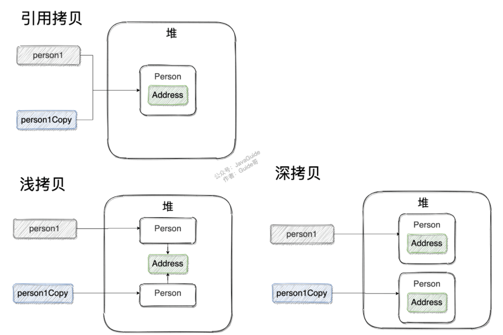
### java常见对象
- Object
```java
public final native Class<?> getClass()//native方法，用于返回当前运行时对象的Class对象，使用了final关键字修饰，故不允许子类重写。

public native int hashCode() //native方法，用于返回对象的哈希码，主要使用在哈希表中，比如JDK中的HashMap。
public boolean equals(Object obj)//用于比较2个对象的内存地址是否相等，String类对该方法进行了重写用户比较字符串的值是否相等。

protected native Object clone() throws CloneNotSupportedException//naitive方法，用于创建并返回当前对象的一份拷贝。一般情况下，对于任何对象 x，表达式 x.clone() != x 为true，x.clone().getClass() == x.getClass() 为true。Object本身没有实现Cloneable接口，所以不重写clone方法并且进行调用的话会发生CloneNotSupportedException异常。

public String toString()//返回类的名字@实例的哈希码的16进制的字符串。建议Object所有的子类都重写这个方法。

public final native void notify()//native方法，并且不能重写。唤醒一个在此对象监视器上等待的线程(监视器相当于就是锁的概念)。如果有多个线程在等待只会任意唤醒一个。

public final native void notifyAll()//native方法，并且不能重写。跟notify一样，唯一的区别就是会唤醒在此对象监视器上等待的所有线程，而不是一个线程。

public final native void wait(long timeout) throws InterruptedException//native方法，并且不能重写。暂停线程的执行。注意：sleep方法没有释放锁，而wait方法释放了锁 。timeout是等待时间。

public final void wait(long timeout, int nanos) throws InterruptedException//多了nanos参数，这个参数表示额外时间（以毫微秒为单位，范围是 0-999999）。 所以超时的时间还需要加上nanos毫秒。

public final void wait() throws InterruptedException//跟之前的2个wait方法一样，只不过该方法一直等待，没有超时时间这个概念

protected void finalize() throws Throwable { }//实例被垃圾回收器回收的时候触发的操作

```
- String
    1. String 中的对象是不可变的，也就可以理解为常量，线程安全。
    2. StringBuffer 对方法加了同步锁或者对调用的方法加了同步锁，所以是线程安全的。
    3. StringBuilder 并没有对方法进行加同步锁，所以是非线程安全的。
    4. 相同情况下使用 StringBuilder 相比使用 StringBuffer 仅能获得 10%~15% 左右的性能提升，但却要冒多线程不安全的风险。
- 总结  
    - 操作少量的数据: 适用 String
    - 单线程操作字符串缓冲区下操作大量数据: 适用 StringBuilder
    - 多线程操作字符串缓冲区下操作大量数据: 适用 StringBuffer  
## 泛型
泛型一般有三种使用方式: 泛型类、泛型接口、泛型方法。
常用的通配符为： T，E，K，V，？ ？ 表示不确定的 Java 类型 T (type) 表示具体的一个 Java 类型 K V (key value) 分别代表 Java 键值中的 Key Value E (element) 代表 Element
## 异常
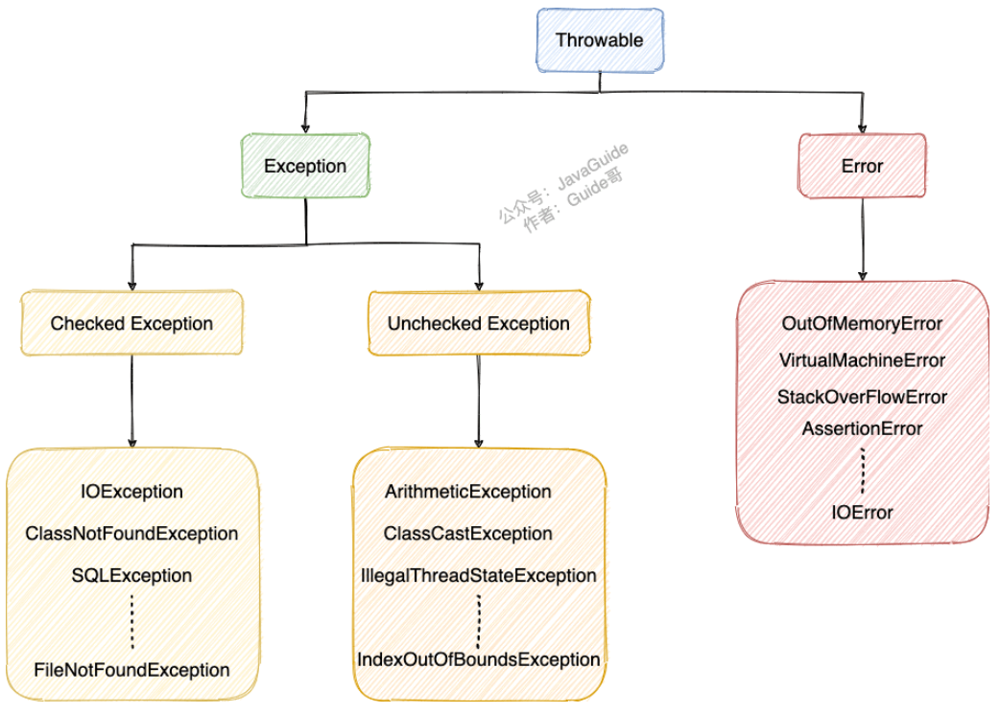
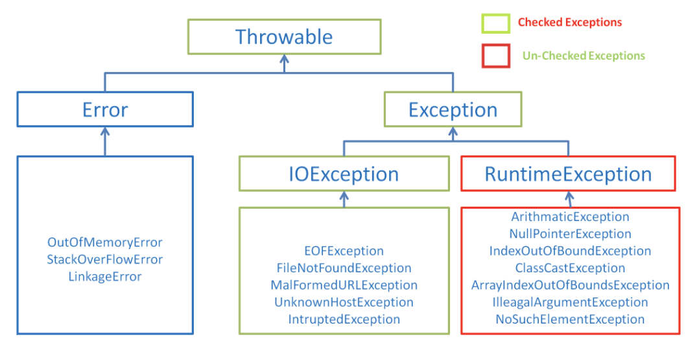
### Exception 和 Error 有什么区别？ 
在 Java 中，所有的异常都有一个共同的祖先 java.lang 包中的 Throwable 类。Throwable 类有两个重要的子类: 
- Exception :程序本身可以处理的异常，可以通过 catch 来进行捕获。Exception 又可以分为 Checked Exception (受检查异常，必须处理) 和 Unchecked Exception (不受检查异常，可以不处理)。 
- Error ：Error 属于程序无法处理的错误 ，我们没办法通过 catch 来进行捕获 。例如Java 虚拟机运行错误（Virtual MachineError）、虚拟机内存不够错误(OutOfMemoryError)、类定义错误（NoClassDefFoundError）等 。这些异常发生时，Java 虚拟机（JVM）一般会选择线程终止。
### Checked Exception 和 Unchecked Exception 有什么区别？
- Checked Exception 即受检查异常，Java 代码在编译过程中，如果受检查异常没有被 catch/throw 处理的话，就没办法通过编译 。
- Unchecked Exception 即 不受检查异常 ，Java 代码在编译过程中 ，我们即使不处理不受检查异常也可以正常通过编译。  
RuntimeException 及其子类都统称为非受检查异常，例如：NullPointerException、NumberFormatException（字符串转换为数字）、ArrayIndexOutOfBoundsException（数组越界）、ClassCastException（类型转换错误）、ArithmeticException（算术错误）等。
## IO

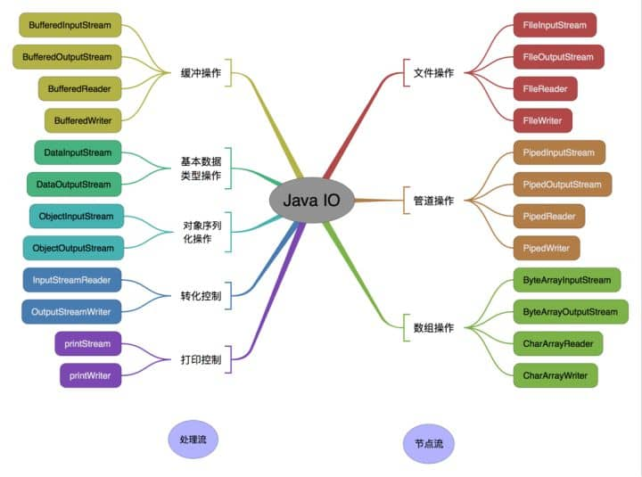
- 序列化：将数据结构或对象转换成二进制字节流的过程。
- 反序列化：将在序列化过程中所生成的二进制字节流转换成数据结构货值额对象的过程。  
### 字节流转字符流
- 字节输入流转换为字符输入流  
    InputSreamReader inside=new InputStreamReader（new FileInputStream（“c:\make.txt”））；  
- 字节输出流转换为字符输出流：   
    OutputStreamWriter ous=new OutputStreamWriter（new FileInputStream（“c:\make.txt”））；  
    
序列化的目的：

### 字段不想序列化
使用的关键字transient  
transient关键字的作用：阻止实例中那些用此关键字修饰的变量序列化；当对象被反序列化时，被transient修饰的变量值不会被持久化和恢复。
- 关于transient注意：
1. transient只能修饰变量，不能修饰类和方法。
2. transient修饰的变量，在反序列化变量值将会被置成类型的默认值。例如：INT会被反序列化结果为0；
3. 变量因为不属于任何对象，所以无论有没有transient关键字修饰，均不会被序列化。  
### 获取键盘常用的两种方法
1. 通过Scanner
```java
Scanner input = new Scanner(System.in);
String s = input.nextLine();
input.close();
```
2. 通过BufferedReader
```java
BufferedReader input = new BufferedReader(new InputStreamReader(System.in));
String s = input.readLine();
```
### Java中3中常见IO模型
1. BIO同步阻塞IO模型  
同步阻塞IO模型中，应用程序read调用后，会一直阻塞，直到内核把数据拷贝到用户空间

缺点：当面对十万甚至百万级连接的时候，传统的 BIO 模型是无能为力的。因此，我们需要一种更高效的 I/O 处理模型来应对更高的并发量。
2. NIO
Java 中的 NIO 于 Java 1.4 中引入，对应 java.nio 包，提供了 Channel , Selector，Buffer 等抽象。 对于高负载、高并发的（网络）应用，应使用 NIO 。  
同步非阻塞 IO 模型：

这种 IO 模型同样存在问题：应用程序不断进行 I/O 系统调用轮询数据是否已经准备好的过程是十分消耗 CPU 资源的。  
I/O多路复用模型：

IO 多路复用模型，通过减少无效的系统调用，减少了对 CPU 资源的消耗。
Java 中的 NIO ，有一个非常重要的选择器 ( Selector ) 的概念，也可以被称为 多路复用器。

3. AIO 异步IO模型

### BigDecimal工具包BigDecimalUtil 
```java
import java.math.BigDecimal;
import java.math.RoundingMode;

/**
 * 简化BigDecimal计算的小工具类
 */
public class BigDecimalUtil {

    /**
     * 默认除法运算精度
     */
    private static final int DEF_DIV_SCALE = 10;

    private BigDecimalUtil() {
    }

    /**
     * 提供精确的加法运算。
     *
     * @param v1 被加数
     * @param v2 加数
     * @return 两个参数的和
     */
    public static double add(double v1, double v2) {
        BigDecimal b1 = BigDecimal.valueOf(v1);
        BigDecimal b2 = BigDecimal.valueOf(v2);
        return b1.add(b2).doubleValue();
    }

    /**
     * 提供精确的减法运算。
     *
     * @param v1 被减数
     * @param v2 减数
     * @return 两个参数的差
     */
    public static double subtract(double v1, double v2) {
        BigDecimal b1 = BigDecimal.valueOf(v1);
        BigDecimal b2 = BigDecimal.valueOf(v2);
        return b1.subtract(b2).doubleValue();
    }

    /**
     * 提供精确的乘法运算。
     *
     * @param v1 被乘数
     * @param v2 乘数
     * @return 两个参数的积
     */
    public static double multiply(double v1, double v2) {
        BigDecimal b1 = BigDecimal.valueOf(v1);
        BigDecimal b2 = BigDecimal.valueOf(v2);
        return b1.multiply(b2).doubleValue();
    }

    /**
     * 提供（相对）精确的除法运算，当发生除不尽的情况时，精确到
     * 小数点以后10位，以后的数字四舍五入。
     *
     * @param v1 被除数
     * @param v2 除数
     * @return 两个参数的商
     */
    public static double divide(double v1, double v2) {
        return divide(v1, v2, DEF_DIV_SCALE);
    }

    /**
     * 提供（相对）精确的除法运算。当发生除不尽的情况时，由scale参数指
     * 定精度，以后的数字四舍五入。
     *
     * @param v1    被除数
     * @param v2    除数
     * @param scale 表示表示需要精确到小数点以后几位。
     * @return 两个参数的商
     */
    public static double divide(double v1, double v2, int scale) {
        if (scale < 0) {
            throw new IllegalArgumentException(
                    "The scale must be a positive integer or zero");
        }
        BigDecimal b1 = BigDecimal.valueOf(v1);
        BigDecimal b2 = BigDecimal.valueOf(v2);
        return b1.divide(b2, scale, RoundingMode.HALF_UP).doubleValue();
    }

    /**
     * 提供精确的小数位四舍五入处理。
     *
     * @param v     需要四舍五入的数字
     * @param scale 小数点后保留几位
     * @return 四舍五入后的结果
     */
    public static double round(double v, int scale) {
        if (scale < 0) {
            throw new IllegalArgumentException(
                    "The scale must be a positive integer or zero");
        }
        BigDecimal b = BigDecimal.valueOf(v);
        BigDecimal one = new BigDecimal("1");
        return b.divide(one, scale, RoundingMode.HALF_UP).doubleValue();
    }

    /**
     * 提供精确的类型转换(Float)
     *
     * @param v 需要被转换的数字
     * @return 返回转换结果
     */
    public static float convertToFloat(double v) {
        BigDecimal b = new BigDecimal(v);
        return b.floatValue();
    }

    /**
     * 提供精确的类型转换(Int)不进行四舍五入
     *
     * @param v 需要被转换的数字
     * @return 返回转换结果
     */
    public static int convertsToInt(double v) {
        BigDecimal b = new BigDecimal(v);
        return b.intValue();
    }

    /**
     * 提供精确的类型转换(Long)
     *
     * @param v 需要被转换的数字
     * @return 返回转换结果
     */
    public static long convertsToLong(double v) {
        BigDecimal b = new BigDecimal(v);
        return b.longValue();
    }

    /**
     * 返回两个数中大的一个值
     *
     * @param v1 需要被对比的第一个数
     * @param v2 需要被对比的第二个数
     * @return 返回两个数中大的一个值
     */
    public static double returnMax(double v1, double v2) {
        BigDecimal b1 = new BigDecimal(v1);
        BigDecimal b2 = new BigDecimal(v2);
        return b1.max(b2).doubleValue();
    }

    /**
     * 返回两个数中小的一个值
     *
     * @param v1 需要被对比的第一个数
     * @param v2 需要被对比的第二个数
     * @return 返回两个数中小的一个值
     */
    public static double returnMin(double v1, double v2) {
        BigDecimal b1 = new BigDecimal(v1);
        BigDecimal b2 = new BigDecimal(v2);
        return b1.min(b2).doubleValue();
    }

    /**
     * 精确对比两个数字
     *
     * @param v1 需要被对比的第一个数
     * @param v2 需要被对比的第二个数
     * @return 如果两个数一样则返回0，如果第一个数比第二个数大则返回1，反之返回-1
     */
    public static int compareTo(double v1, double v2) {
        BigDecimal b1 = BigDecimal.valueOf(v1);
        BigDecimal b2 = BigDecimal.valueOf(v2);
        return b1.compareTo(b2);
    }

}

```


## 重要知识
### 反射机制详解
- jdk动态代理
```java
public class DebugInvocationHandler implements InvocationHandler {
    /**
     * 代理类中的真实对象
     */
    private final Object target;

    public DebugInvocationHandler(Object target) {
        this.target = target;
    }


    public Object invoke(Object proxy, Method method, Object[] args) throws InvocationTargetException, IllegalAccessException {
        System.out.println("before method " + method.getName());
        Object result = method.invoke(target, args);
        System.out.println("after method " + method.getName());
        return result;
    }
}


```
- 反射实战
获取Class对象的四种方式
1. 知道具体类的情况下使用
```java
Class alunbarClass = TargetObject.class;

```
2. 通过Class.forName()传入类的路径获取：
```java
TargetObject o = new TargetObject();
Class alunbarClass2 = o.getClass();

```
3. 通过对象实例instance.getClass()获取： 
```java
TargetObject o = new TargetObject();
Class alunbarClass2 = o.getClass();
```
4. 通过类加载器xxxClassLoader.loadClass()传入类路径获取: 
```java
Class clazz = ClassLoader.loadClass("cn.javaguide.TargetObject");
```
- 反射操作案例
1. 创建一个我们要使用反射操作的类 TargetObject。
```java
package cn.javaguide;

public class TargetObject {
    private String value;

    public TargetObject() {
        value = "JavaGuide";
    }

    public void publicMethod(String s) {
        System.out.println("I love " + s);
    }

    private void privateMethod() {
        System.out.println("value is " + value);
    }
}

```
2. 使用反射操作这个类的方法以及参数
```java
package cn.javaguide;

import java.lang.reflect.Field;
import java.lang.reflect.InvocationTargetException;
import java.lang.reflect.Method;

public class Main {
    public static void main(String[] args) throws ClassNotFoundException, NoSuchMethodException, IllegalAccessException, InstantiationException, InvocationTargetException, NoSuchFieldException {
        /**
         * 获取TargetObject类的Class对象并且创建TargetObject类实例
         */
        Class<?> tagetClass = Class.forName("cn.javaguide.TargetObject");
        TargetObject targetObject = (TargetObject) tagetClass.newInstance();
        /**
         * 获取所有类中所有定义的方法
         */
        Method[] methods = tagetClass.getDeclaredMethods();
        for (Method method : methods) {
            System.out.println(method.getName());
        }
        /**
         * 获取指定方法并调用
         */
        Method publicMethod = tagetClass.getDeclaredMethod("publicMethod",
                String.class);

        publicMethod.invoke(targetObject, "JavaGuide");
        /**
         * 获取指定参数并对参数进行修改
         */
        Field field = tagetClass.getDeclaredField("value");
        //为了对类中的参数进行修改我们取消安全检查
        field.setAccessible(true);
        field.set(targetObject, "JavaGuide");
        /**
         * 调用 private 方法
         */
        Method privateMethod = tagetClass.getDeclaredMethod("privateMethod");
        //为了调用private方法我们取消安全检查
        privateMethod.setAccessible(true);
        privateMethod.invoke(targetObject);
    }
}


```
### 代理
#### 静态代理
实现步骤：
1. 定义一个接口及其实现类； 
2. 创建一个代理类同样实现这个接口 
3. 将目标对象注入进代理类，然后在代理类的对应方法调用目标类中的对应方法。这样的话，我们就可以通过代理类屏蔽对目标对象的访问，并且可以在目标方法执行前后做一些自己想做的事情
1. 定义发送短信的接口
```java
public interface SmsService {
    String send(String message);
}

```
2. 实现发送短信的接口
```java
public class SmsServiceImpl implements SmsService {
    public String send(String message) {
        System.out.println("send message:" + message);
        return message;
    }
}

```
3. 创建代理类同样实现发送短信的接口
```java
public class SmsProxy implements SmsService {

    private final SmsService smsService;

    public SmsProxy(SmsService smsService) {
        this.smsService = smsService;
    }

    @Override
    public String send(String message) {
        //调用方法之前，我们可以添加自己的操作
        System.out.println("before method send()");
        smsService.send(message);
        //调用方法之后，我们同样可以添加自己的操作
        System.out.println("after method send()");
        return null;
    }
}

```
4. 实际使用
```java
public class Main {
    public static void main(String[] args) {
        SmsService smsService = new SmsServiceImpl();
        SmsProxy smsProxy = new SmsProxy(smsService);
        smsProxy.send("java");
    }
}

```
#### 动态代理
##### JDK动态代理机制
在 Java 动态代理机制中 InvocationHandler 接口和 Proxy 类是核心。
```java
    public static Object newProxyInstance(ClassLoader loader,
                                          Class<?>[] interfaces,
                                          InvocationHandler h)
        throws IllegalArgumentException
    {
        ......
    }

```
loader :类加载器，用于加载代理对象。
interfaces : 被代理类实现的一些接口；
h : 实现了 InvocationHandler 接口的对象；  
要实现动态代理的话，还必须需要实现InvocationHandler 来自定义处理逻辑  
```java
public interface InvocationHandler {

    /**
     * 当你使用代理对象调用方法的时候实际会调用到这个方法
     */
    public Object invoke(Object proxy, Method method, Object[] args)
        throws Throwable;
}

```
proxy :动态生成的代理类
method : 与代理类对象调用的方法相对应
args : 当前 method 方法的参数  
JDK动态代理类使用步骤
- 定义一个接口及其实现类； 
- 自定义 InvocationHandler 并重写invoke方法，在 invoke 方法中我们会调用原生方法（被代理类的方法）并自定义一些处理逻辑； 
- 通过 Proxy.newProxyInstance(ClassLoader loader,Class<?>[] interfaces,InvocationHandler h) 方法创建代理对象；
1. 定义发送短信的接口
```java
public interface SmsService {
    String send(String message);
}

```
2. 实现发送短信的接口
```java
public class SmsServiceImpl implements SmsService {
    public String send(String message) {
        System.out.println("send message:" + message);
        return message;
    }
}

```
3. 定义一个JDK动态代理类
```java
import java.lang.reflect.InvocationHandler;
import java.lang.reflect.InvocationTargetException;
import java.lang.reflect.Method;

/**
 * @author shuang.kou
 * @createTime 2020年05月11日 11:23:00
 */
public class DebugInvocationHandler implements InvocationHandler {
    /**
     * 代理类中的真实对象
     */
    private final Object target;

    public DebugInvocationHandler(Object target) {
        this.target = target;
    }


    public Object invoke(Object proxy, Method method, Object[] args) throws InvocationTargetException, IllegalAccessException {
        //调用方法之前，我们可以添加自己的操作
        System.out.println("before method " + method.getName());
        Object result = method.invoke(target, args);
        //调用方法之后，我们同样可以添加自己的操作
        System.out.println("after method " + method.getName());
        return result;
    }
}


```
4. 获取代理对象的工程类
```java
public class JdkProxyFactory {
    public static Object getProxy(Object target) {
        return Proxy.newProxyInstance(
                target.getClass().getClassLoader(), // 目标类的类加载
                target.getClass().getInterfaces(),  // 代理需要实现的接口，可指定多个
                new DebugInvocationHandler(target)   // 代理对象对应的自定义 InvocationHandler
        );
    }
}

```
5. 实际使用
```java
SmsService smsService = (SmsService) JdkProxyFactory.getProxy(new SmsServiceImpl());
smsService.send("java");

```
##### CGLIB动态代理机制
- 介绍  
Spring 中的 AOP 模块中：如果目标对象实现了接口，则默认采用 JDK 动态代理，否则采用 CGLIB 动态代理。
- 在 CGLIB 动态代理机制中 MethodInterceptor 接口和 Enhancer 类是核心。
你需要自定义 MethodInterceptor 并重写 intercept 方法，intercept 用于拦截增强被代理类的方法。
```java
public interface MethodInterceptor
extends Callback{
    // 拦截被代理类中的方法
    public Object intercept(Object obj, java.lang.reflect.Method method, Object[] args,
                               MethodProxy proxy) throws Throwable;
}


```
obj :被代理的对象（需要增强的对象） method :被拦截的方法（需要增强的方法）   
args :方法入参   
proxy :用于调用原始方法   
你可以通过 Enhancer类来动态获取被代理类，当代理类调用方法的时候，实际调用的是 MethodInterceptor 中的 intercept 方法。
- CGLIB动态代理类使用步骤
定义一个类；   
自定义 MethodInterceptor 并重写 intercept 方法，intercept 用于拦截增强被代理类的方法，和 JDK 动态代理中的 invoke 方法类似；   
通过 Enhancer 类的 create()创建代理类； 
1. 实现一个阿里云发送短信的类
    ```java
    package github.javaguide.dynamicProxy.cglibDynamicProxy;

    public class AliSmsService {
        public String send(String message) {
        System.out.println("send message:" + message);
        return message;
        }
    }

    ```
2. 自定义MethodInterceptor（方法拦截器）
```java
import net.sf.cglib.proxy.MethodInterceptor;
import net.sf.cglib.proxy.MethodProxy;

import java.lang.reflect.Method;

/**
 * 自定义MethodInterceptor
 */
public class DebugMethodInterceptor implements MethodInterceptor {


    /**
     * @param o           代理对象（增强的对象）
     * @param method      被拦截的方法（需要增强的方法）
     * @param args        方法入参
     * @param methodProxy 用于调用原始方法
     */
    @Override
    public Object intercept(Object o, Method method, Object[] args, MethodProxy methodProxy) throws Throwable {
        //调用方法之前，我们可以添加自己的操作
        System.out.println("before method " + method.getName());
        Object object = methodProxy.invokeSuper(o, args);
        //调用方法之后，我们同样可以添加自己的操作
        System.out.println("after method " + method.getName());
        return object;
    }

}

```
3. 获取代理类
```java
import net.sf.cglib.proxy.Enhancer;

public class CglibProxyFactory {

    public static Object getProxy(Class<?> clazz) {
        // 创建动态代理增强类
        Enhancer enhancer = new Enhancer();
        // 设置类加载器
        enhancer.setClassLoader(clazz.getClassLoader());
        // 设置被代理类
        enhancer.setSuperclass(clazz);
        // 设置方法拦截器
        enhancer.setCallback(new DebugMethodInterceptor());
        // 创建代理类
        return enhancer.create();
    }
}

```
4. 实际使用
```java
AliSmsService aliSmsService = (AliSmsService) CglibProxyFactory.getProxy(AliSmsService.class);
aliSmsService.send("java");

```

# 容器
## 集合概述
### Java集合概览
主要是由两大接口派生而来：一个是 Collection接口，主要用于存放单一元素；另一个是 Map 接口，主要用于存放键值对。对于Collection 接口，下面又有三个主要的子接口：List、Set 和 Queue。
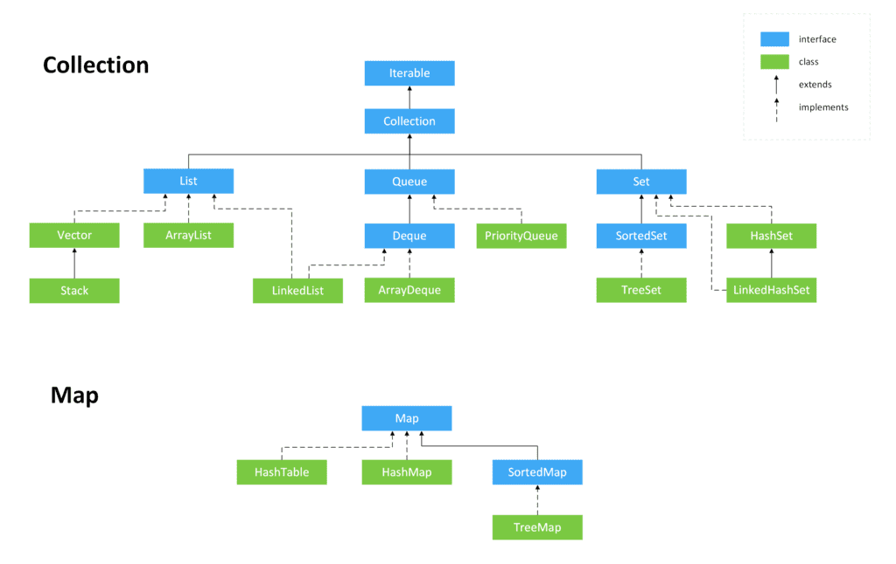

### 说说 List, Set, Queue, Map 四者的区别
- List(对付顺序的好帮手): 存储的元素是有序的、可重复的。 
- Set(注重独一无二的性质): 存储的元素是无序的、不可重复的。 
- Queue(实现排队功能的叫号机): 按特定的排队规则来确定先后顺序，存储的元素是有序的、可重复的。 
- Map(用 key 来搜索的专家): 使用键值对（key-value）存储，类似于数学上的函数 y=f(x)，"x" 代表 key，"y" 代表 value，key 是无序的、不可重复的，value 是无序的、可重复的，每个键最多映射到一个值
### 集合底层数据结构总结
List
- ArrayList:Object[]数组
- Verctor:Object[] 数组
- LinkedList:双向链表(JDK1.6之前为循环列表，JDK1.7取消了循环) 
Set
- HashSet(无序，唯一)：基于HashMap实现的，底层采用HashMap来保存元素。
- LinkedHashSet:LinkedHashSet是HashSet的子类，并且其内部是通过LinkedHashMap来实现的。
- TreeSet(有序，唯一)：红黑数(自平衡的排序二叉树)
Queue
- PriorityQueue:Object[]数组来实现二叉树
- ArrayQueue:Object[] 数组+双指针
Map(构造一个空的 HashMap ，默认初始容量（16）和默认负载系数（0.75）。)
- HashMap： JDK1.8 之前 HashMap 由数组+链表组成的，数组是 HashMap 的主体，链表则是主要为了解决哈希冲突而存在的（“拉链法”解决冲突）。JDK1.8 以后在解决哈希冲突时有了较大的变化，当链表长度大于阈值（默认为 8）（将链表转换成红黑树前会判断，如果当前数组的长度小于 64，那么会选择先进行数组扩容，而不是转换为红黑树）时，将链表转化为红黑树，以减少搜索时间.
- LinkedHashMap： LinkedHashMap 继承自 HashMap，所以它的底层仍然是基于拉链式散列结构即由数组和链表或红黑树组成。另外，LinkedHashMap 在上面结构的基础上，增加了一条双向链表，使得上面的结构可以保持键值对的插入顺序。同时通过对链表进行相应的操作，实现了访问顺序相关逻辑。
- Hashtable： 数组+链表组成的，数组是 Hashtable 的主体，链表则是主要为了解决哈希冲突而存在的
- TreeMap： 红黑树（自平衡的排序二叉树）
### 选用集合
需要根据键值获取到元素值时就选用 Map 接口下的集合，需要排序时选择 TreeMap,不需要排序时就选择 HashMap,需要保证线程安全就选用 ConcurrentHashMap。  
当我们只需要存放元素值时，就选择实现Collection 接口的集合，需要保证元素唯一时选择实现 Set 接口的集合比如 TreeSet 或 HashSet，不需要就选择实现 List 接口的比如 ArrayList 或 LinkedList
## Collection子接口之List
### ArrayList和Vector的区别
- ArrayList 是 List 的主要实现类，底层使用 Object[ ]存储，适用于频繁的查找工作，线程不安全 ； 
- Vector 是 List 的古老实现类，底层使用Object[ ] 存储，线程安全的。
### ArrayList(10)与LinkedList
1. 是否保证线程安全： ArrayList 和 LinkedList 都是不同步的，也就是不保证线程安全；
2. 底层数据结构： Arraylist 底层使用的是 Object 数组；LinkedList 底层使用的是 双向链表 数据结构
3. 插入和删除是否受元素位置的影响：
    - ArrayList 采用数组存储，所以插入和删除元素的时间复杂度受元素位置的影响。
    - LinkedList 采用链表存储，所以，如果是在头尾插入或者删除元素不受元素位置的影响
4. 是否支持快速随机访问： LinkedList 不支持高效的随机元素访问，而 ArrayList 支持。
5. 内存空间占用： ArrayList 的空 间浪费主要体现在在 list 列表的结尾会预留一定的容量空间，而 LinkedList 的空间花费则体现在它的每一个元素都需要消耗比 ArrayList 更多的空间
## Collection子接口之Set
### comparable 和 Comparator 的区别
- comparable 接口实际上是出自java.lang包 它有一个 compareTo(Object obj)方法用来排序
- comparator接口实际上是出自 java.util 包它有一个compare(Object obj1, Object obj2)方法用来排序
### 比较 HashSet、LinkedHashSet 和 TreeSet 三者的异同
- HashSet、LinkedHashSet 和 TreeSet 都是 Set 接口的实现类，都能保证元素唯一，并且都不是线程安全的。
- HashSet、LinkedHashSet 和 TreeSet 的主要区别在于底层数据结构不同。HashSet 的底层数据结构是哈希表（基于 HashMap 实现）。LinkedHashSet 的底层数据结构是链表和哈希表，元素的插入和取出顺序满足 FIFO。TreeSet 底层数据结构是红黑树，元素是有序的，排序的方式有自然排序和定制排序。
- 底层数据结构不同又导致这三者的应用场景不同。HashSet 用于不需要保证元素插入和取出顺序的场景，LinkedHashSet 用于保证元素的插入和取出顺序满足 FIFO 的场景，TreeSet 用于支持对元素自定义排序规则的场景
## Collection子接口之Queue
### Queue与Dequeue
- Queue 是单端队列，只能从一端插入元素，另一端删除元素，实现上一般遵循 先进先出（FIFO） 规则。
- Deque 是双端队列，在队列的两端均可以插入或删除元素。
### ArrayDequeue与LinkedList的区别
ArrayDeque 和 LinkedList 都实现了 Deque 接口，两者都具有队列的功能，但两者有什么区别呢？
- ArrayDeque 是基于可变长的数组和双指针来实现，而 LinkedList 则通过链表来实现。
- ArrayDeque 不支持存储 NULL 数据，但 LinkedList 支持
- ArrayDeque 是在 JDK1.6 才被引入的，而LinkedList 早在 JDK1.2 时就已经存在。
- ArrayDeque 插入时可能存在扩容过程, 不过均摊后的插入操作依然为 O(1)。虽然 LinkedList 不需要扩容，但是每次插入数据时均需要申请新的堆空间，均摊性能相比更慢。  
从性能的角度上，选用 ArrayDeque 来实现队列要比 LinkedList 更好。此外，ArrayDeque 也可以用于实现栈。
### PriorityQueue
这里列举其相关的一些要点： 
- PriorityQueue 利用了二叉堆的数据结构来实现的，底层使用可变长的数组来存储数据 
- PriorityQueue 通过堆元素的上浮和下沉，实现了在 O(logn) 的时间复杂度内插入元素和删除堆顶元素。
- PriorityQueue 是非线程安全的，且不支持存储 NULL 和 non-comparable 的对象。 
- PriorityQueue 默认是小顶堆，但可以接收一个 Comparator 作为构造参数，从而来自定义元素优先级的先后。
## Map接口
### HashMap和Hashtable区别
1. 线程是否安全： HashMap 是非线程安全的，Hashtable 是线程安全的,因为 Hashtable 内部的方法基本都经过synchronized 修饰。
2. 效率： 因为线程安全的问题，HashMap 要比 Hashtable 效率高一点。另外，Hashtable 基本被淘汰，不要在代码中使用它；
3. 对 Null key 和 Null value 的支持： HashMap 可以存储 null 的 key 和 value，但 null 作为键只能有一个，null 作为值可以有多个；Hashtable 不允许有 null 键和 null 值，否则会抛出 NullPointerException。
4. 初始容量大小和每次扩充容量大小的不同 ： ① 创建时如果不指定容量初始值，Hashtable 默认的初始大小为 11，之后每次扩充，容量变为原来的 2n+1。HashMap 默认的初始化大小为 16。之后每次扩充，容量变为原来的 2 倍。② 创建时如果给定了容量初始值，那么 Hashtable 会直接使用你给定的大小，而 HashMap 会将其扩充为 2 的幂次方大小（HashMap 中的tableSizeFor()方法保证，下面给出了源代码）。也就是说 HashMap 总是使用 2 的幂作为哈希表的大小,后面会介绍到为什么是 2 的幂次方。
5. 底层数据结构： JDK1.8 以后的 HashMap 在解决哈希冲突时有了较大的变化，当链表长度大于阈值（默认为 8）（将链表转换成红黑树前会判断，如果当前数组的长度小于 64，那么会选择先进行数组扩容，而不是转换为红黑树）时，将链表转化为红黑树，以减少搜索时间。Hashtable 没有这样的机制。
### HashMap和HashSet区别
- HashMap：实现了Map接口、存储键值对、调用put()向map中添加元素、HashMap使用键(Key)计算hashcode
- HashSet:实现Set接口、仅存储对象、调用add()方法向Set中添加元素、HashSet 使用成员对象来计算 hashcode 值，对于两个对象来说 hashcode 可能相同，所以equals()方法用来判断对象的相等性
### ConcurrentHashMap 和 Hashtable 的区别
- 底层数据结构： JDK1.7 的 ConcurrentHashMap 底层采用 分段的数组+链表 实现，JDK1.8 采用的数据结构跟 HashMap1.8 的结构一样，数组+链表/红黑二叉树。Hashtable 和 JDK1.8 之前的 HashMap 的底层数据结构类似都是采用 数组+链表 的形式，数组是 HashMap 的主体，链表则是主要为了解决哈希冲突而存在的；
- 实现线程安全的方式（重要）： ① 在 JDK1.7 的时候，ConcurrentHashMap（分段锁） 对整个桶数组进行了分割分段(Segment)，每一把锁只锁容器其中一部分数据，多线程访问容器里不同数据段的数据，就不会存在锁竞争，提高并发访问率。 到了 JDK1.8 的时候已经摒弃了 Segment 的概念，而是直接用 Node 数组+链表+红黑树的数据结构来实现，并发控制使用 synchronized 和 CAS 来操作。（JDK1.6 以后 对 synchronized 锁做了很多优化） 整个看起来就像是优化过且线程安全的 HashMap，虽然在 JDK1.8 中还能看到 Segment 的数据结构，但是已经简化了属性，只是为了兼容旧版本；② Hashtable(同一把锁) :使用 synchronized 来保证线程安全，效率非常低下。当一个线程访问同步方法时，其他线程也访问同步方法，可能会进入阻塞或轮询状态，如使用 put 添加元素，另一个线程不能使用 put 添加元素，也不能使用 get，竞争会越来越激烈效率越低。  
ConcurrentHashMap 是由 Segment 数组结构和 HashEntry 数组结构组成。 Segment 实现了 ReentrantLock,所以 Segment 是一种可重入锁，扮演锁的角色。HashEntry 用于存储键值对数据。
### Collections工具类
1. 排序
```java
void reverse(List list)//反转
void shuffle(List list)//随机排序
void sort(List list)//按自然排序的升序排序
void sort(List list, Comparator c)//定制排序，由Comparator控制排序逻辑
void swap(List list, int i , int j)//交换两个索引位置的元素
void rotate(List list, int distance)//旋转。当distance为正数时，将list后distance个元素整体移到前面。当distance为负数时，将 list的前distance个元素整体移到后面

```
2. 查找，替换
```java
int binarySearch(List list, Object key)//对List进行二分查找，返回索引，注意List必须是有序的
int max(Collection coll)//根据元素的自然顺序，返回最大的元素。 类比int min(Collection coll)
int max(Collection coll, Comparator c)//根据定制排序，返回最大元素，排序规则由Comparatator类控制。类比int min(Collection coll, Comparator c)
void fill(List list, Object obj)//用指定的元素代替指定list中的所有元素
int frequency(Collection c, Object o)//统计元素出现次数
int indexOfSubList(List list, List target)//统计target在list中第一次出现的索引，找不到则返回-1，类比int lastIndexOfSubList(List source, list target)
boolean replaceAll(List list, Object oldVal, Object newVal)//用新元素替换旧元素

```
3. 同步控制
```java
synchronizedCollection(Collection<T>  c) //返回指定 collection 支持的同步（线程安全的）collection。
synchronizedList(List<T> list)//返回指定列表支持的同步（线程安全的）List。
synchronizedMap(Map<K,V> m) //返回由指定映射支持的同步（线程安全的）Map。
synchronizedSet(Set<T> s) //返回指定 set 支持的同步（线程安全的）set。

```
### 集合使用
1. 集合判空
判断所有集合内部的元素是否为空，使用 isEmpty() 方法。
2. 集合转Map
在使用 java.util.stream.Collectors 类的 toMap() 方法转为 Map 集合时，一定要注意当 value 为 null 时会抛 NPE 异常。
```java
class Person {
    private String name;
    private String phoneNumber;
     // getters and setters
}

List<Person> bookList = new ArrayList<>();
bookList.add(new Person("jack","18163138123"));
bookList.add(new Person("martin",null));
// 空指针异常
bookList.stream().collect(Collectors.toMap(Person::getName, Person::getPhoneNumber));

```
3. 集合遍历
不要在 foreach 循环里进行元素的 remove/add 操作。remove 元素请使用 Iterator 方式，如果并发操作，需要对 Iterator 对象加锁。
4. 集合去重
可以利用 Set 元素唯一的特性，可以快速对一个集合进行去重操作，避免使用 List 的 contains() 进行遍历去重或者判断包含操作。
5. 集合转数组
使用集合转数组的方法，必须使用集合的 toArray(T[] array)，传入的是类型完全一致、长度为 0 的空数组。
```java
String [] s= new String[]{
    "dog", "lazy", "a", "over", "jumps", "fox", "brown", "quick", "A"
};
List<String> list = Arrays.asList(s);
Collections.reverse(list);
//没有指定类型的话会报错
s=list.toArray(new String[0]);

```
6. 数组转集合
使用工具类 Arrays.asList() 把数组转换成集合时，不能使用其修改集合相关的方法， 它的 add/remove/clear 方法会抛出 UnsupportedOperationException 异常。

```java
String[] myArray = {"Apple", "Banana", "Orange"};
List<String> myList = Arrays.asList(myArray);
//上面两个语句等价于下面一条语句
List<String> myList = Arrays.asList("Apple","Banana", "Orange");
```
**注意**
- Array.asList()是泛型方法，传递的数组必须是对象数组，而不是基本类型。
```java
int[] myArray = {1, 2, 3};
List myList = Arrays.asList(myArray);
System.out.println(myList.size());//1
System.out.println(myList.get(0));//数组地址值
System.out.println(myList.get(1));//报错：ArrayIndexOutOfBoundsException
int[] array = (int[]) myList.get(0);
System.out.println(array[0]);//1

```
解决：
```java
Integer[] myArray = {1, 2, 3};
```
- 使用结合的修改方法：add()、remove()、clear()会抛出异常
```java
List myList = Arrays.asList(1, 2, 3);
myList.add(4);//运行时报错：UnsupportedOperationException
myList.remove(1);//运行时报错：UnsupportedOperationException
myList.clear();//运行时报错：UnsupportedOperationException

```
Arrays.asList() 方法返回的并不是 java.util.ArrayList ，而是 java.util.Arrays 的一个内部类,这个内部类并没有实现集合的修改方法或者说并没有重写这些方法。
**实现数组转换为ArrayList**
1. 手动实现工具类
```java
//JDK1.5+
static <T> List<T> arrayToList(final T[] array) {
  final List<T> l = new ArrayList<T>(array.length);

  for (final T s : array) {
    l.add(s);
  }
  return l;
}


Integer [] myArray = { 1, 2, 3 };
System.out.println(arrayToList(myArray).getClass());//class java.util.ArrayList

```
2. 最简便的方法
```java
List list = new ArrayList<>(Arrays.asList("a", "b", "c"))

```
3. 使用Java8的Stream
```java
Integer [] myArray = { 1, 2, 3 };
List myList = Arrays.stream(myArray).collect(Collectors.toList());
//基本类型也可以实现转换（依赖boxed的装箱操作）
int [] myArray2 = { 1, 2, 3 };
List myList = Arrays.stream(myArray2).boxed().collect(Collectors.toList());

```
4. 使用Guava
对于不可变集合，你可以使用ImmutableList  (opens new window)类及其of()  (opens new window)与copyOf()  (opens new window)工厂方法：（参数不能为空）
```java
List<String> il = ImmutableList.of("string", "elements");  // from varargs
List<String> il = ImmutableList.copyOf(aStringArray);      // from array

```
对于可变集合，你可以使用Lists (opens new window)类及其newArrayList() (opens new window)工厂方法：
```java
List<String> l1 = Lists.newArrayList(anotherListOrCollection);    // from collection
List<String> l2 = Lists.newArrayList(aStringArray);               // from array
List<String> l3 = Lists.newArrayList("or", "string", "elements"); // from varargs

```
5. 使用Apache Commons Collections
```java
List<String> list = new ArrayList<String>();
CollectionUtils.addAll(list, str);

```
6. 使用 Java9 的 List.of()方法
```java
Integer[] array = {1, 2, 3};
List<Integer> list = List.of(array);

```
# 并发编程
## JVM线程与进程关系
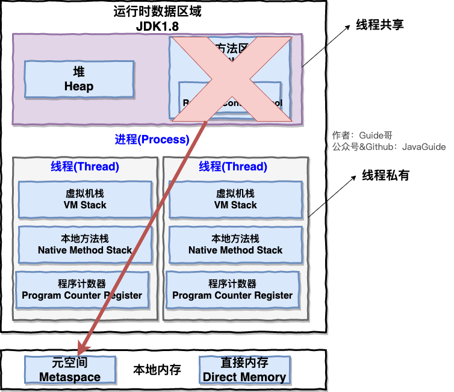
## 线程的生命周期和状态


## 死锁
### 死锁条件
- 互斥条件：资源是独占的且排他使用，进程互斥使用资源，即任意时刻一个资源只能给一个进程使用，其他进程若申请一个资源，而该资源被另一进程占有时，则申请者等待直到资源被占有者释放。
- 不可剥夺条件：进程所获得的资源在未使用完毕之前，不被其他进程强行剥夺，而只能由获得该资源的进程资源释放。
- 请求和保持条件：进程每次申请它所需要的一部分资源，在申请新的资源的同时，继续占用已分配到的资源。
- 循环等待条件：在发生死锁时必然存在一个进程等待队列{P1,P2,…,Pn},其中P1等待P2占有的资源，P2等待P3占有的资源，…，Pn等待P1占有的资源，形成一个进程等待环路，环路中每一个进程所占有的资源同时被另一个申请，也就是前一个进程占有后一个进程所深情地资源。
以上给出了导致死锁的四个必要条件，只要系统发生死锁则以上四个条件至少有一个成立。事实上循环等待的成立蕴含了前三个条件的成立，似乎没有必要列出然而考虑这些条件对死锁的预防是有利的，因为可以通过破坏四个条件中的任何一个来预防死锁的发生。
### 预防死锁
1. 破坏请求与保持条件 ：一次性申请所有的资源。
2. 破坏不剥夺条件 ：占用部分资源的线程进一步申请其他资源时，如果申请不到，可以主动释放它占有的资源。
3. 破坏循环等待条件 ：靠按序申请资源来预防。按某一顺序申请资源，释放资源则反序释放。破坏循环等待条件。
### sleep()方法和wait()方法区别和共同点
- 两者的最主要区别在于：sleep()方法没有释放锁，而wait()方法释放锁。
- 两者都可以暂停线程的执行。
- wait()通常被用于线程间交互/通信，sleep()通常被用于暂停执行。
- wait()方法被调用后，线程不会自动苏醒，需要别的线程调用同一个对象上的notify()或者notifyAll()方法。sleep()方法执行完成后，线程会自动苏醒。或者可以使用wait(long timeout)超时后线程会自动苏醒。
### 为什么我们调用 start() 方法时会执行 run() 方法，为什么我们不能直接调用 run() 方法？ 
这是另一个非常经典的 Java 多线程面试问题，而且在面试中会经常被问到。很简单，但是很多人都会答不上来！ new 一个 Thread，线程进入了新建状态。调用 start()方法，会启动一个线程并使线程进入了就绪状态，当分配到时间片后就可以开始运行了。 start() 会执行线程的相应准备工作，然后自动执行 run() 方法的内容，这是真正的多线程工作。 但是，直接执行 run() 方法，会把 run() 方法当成一个 main 线程下的普通方法去执行，并不会在某个线程中执行它，所以这并不是多线程工作。
总结： 调用 start() 方法方可启动线程并使线程进入就绪状态，直接执行 run() 方法的话不会以多线程的方式执行。
## 并发
1. synchronized关键字  
    1.1 synchronized关键字简介  
    synchronized关键字解决的是多个线程之前访问资源的同步性，synchronized关键字可以保证被它修饰的方法或者代码块在任意时刻只能有一个线程执行。  
    1.2 synchronized关键字的使用    
    **1. 修饰实例的方法：**作用于当前对象实例加锁，进入同步代码前要获得当前对象实例的锁。  
    **2.修饰静态方法：**也就是给当前类加锁，会作用于类的所有对象实例，进入同步代码前要获得当前class的锁。  
    **3.修饰代码块：**指定加锁对象，对给定对象/类加锁。synchronized(this|object) 表示进入同步代码库前要获得给定对象的锁。synchronized(类.class) 表示进入同步代码前要获得 当前 class 的锁  
    ```java
    synchronized(this|object) 表示进入同步代码库前要获得给定对象的锁。synchronized(类.class) 表示进入同步代码前要获得 当前 class 的锁
    ```
    **总结**  
    - synchronized 关键字加到 static 静态方法和 synchronized(class) 代码块上都是是给 Class 类上锁。  
    - synchronized 关键字加到实例方法上是给对象实例上锁。
    - 尽量不要使用 synchronized(String a) 因为 JVM 中，字符串常量池具有缓存功能！  

    1.3 synchronized锁的优化
    锁主要存在四种状态，依次是：无锁状态、偏向锁状态、轻量级锁状态、重量级锁状态，他们会随着竞争的激烈而逐渐升级。注意锁可以升级不可降级，这种策略是为了提高获得锁和释放锁的效率。  
    1.4 谈谈synchronized和ReentrantLock区别  
    1.4.1 两者都是可重入锁    
    “可重入锁” 指的是自己可以再次获取自己的内部锁。比如一个线程获得了某个对象的锁，此时这个对象锁还没有释放，当其再次想要获取这个对象的锁的时候还是可以获取的，如果不可锁重入的话，就会造成死锁。同一个线程每次获取锁，锁的计数器都自增 1，所以要等到锁的计数器下降为 0 时才能释放锁。  
    1.4.2 synchronized依赖于JVM而ReentrantLock依赖于API  
    synchronized是依赖于JVM实现的，实现层面在虚拟机，并未直接暴露给我们。ReentrantLock是JDK层面的(也就是API层面，需要lock()和unlock()方法配合try/finally语句来完成)，可以通过源代码查看实现过程。  
    1.4.3 ReentrantLock比synchronized增加了一些高级功能   

    - 等待可中断：ReentrantLock提供了一种能够中断等待锁的线程的机制，通过lock.lockInterruptibly()来实现这个机制。也就是说正在等待的线程可以选择放弃等待，改为处理其他事情。  
    - 可实现公平锁: ReentrantLock可以指定公平锁还是非公平锁。
    - 可实现选择性通知(锁可以绑定多个条件)synchronized关键字与wait()和notify()/notifyAll()方法相结合可以实现等待/通知机制。ReentrantLock类当然也可以实现，但是需要借助于Condition接口与newCondition()方法。  
2. volatile关键字  
    2.1 并发编程的三个重要特性  
    1. 原子性：
    2. 可见性：当一个线程对共享变量进行了修改，那么另外的线程都是立即可以看到修改后的最新值。volatile 关键字可以保证共享变量的可见性。
    3. 有序性：  

    2.2 synchronized关键字和volatile关键字的区别  
    synchronized关键字和volatile关键字是两个互补的存在，而不是对立的存在！  
    
    - volatile关键字是线程同步的轻量级实现，所有volatile性可能比synchronized关键字要好。但是volatile关键字只能用于变量而synchronized关键字可以修饰方法以及代码块。
    - volatile关键字能保证数据的可见性，但不能保证数据的原子性。synchronized关键字两者都能保证。
    - volatitle关键字主要用于解决变量在多个线程之间的可见性，而synchronized关键字解决的是多个线程之间访问资源的同步性。  

3. ThreadLocal   
    3.1 ThreadLocal类主要解决的就是让每个线程绑定自己的值。如果你创建了一个ThreadLocal变量，那么访问这个变量的每个线程都会有这个变量的本地副本，这也是ThreadLocal变量名的由来。他们可以使用 get（） 和 set（） 方法来获取默认值或将其值更改为当前线程所存的副本的值，从而避免了线程安全问题。  
    3.2 ThreadLocal内存泄露问题  
    ThreadLocalMap 中使用的 key 为 ThreadLocal 的弱引用,而 value 是强引用。所以，如果 ThreadLocal 没有被外部强引用的情况下，在垃圾回收的时候，key 会被清理掉，而 value 不会被清理掉。这样一来，ThreadLocalMap 中就会出现 key 为 null 的 Entry。假如我们不做任何措施的话，value 永远无法被 GC 回收，这个时候就可能会产生内存泄露。ThreadLocalMap 实现中已经考虑了这种情况，在调用 set()、get()、remove() 方法的时候，会清理掉 key 为 null 的记录。使用完 ThreadLocal方法后 最好手动调用remove()方法。  
4. 线程池  
    4.1 线程池的好处    

    - 降低资源消耗
    - 提高响应速度
    - 提高线程的可管理性   

    4.2 实现Runnable接口和Callable接口的区别  
    Callable仅在Java 1.5 中引入，目的就是为了来处理Runnable不支持的用例。Runnable接口不会返回结果或抛出检查异常，但是Callable接口可以。所以，如果任务不需要返回结果或者抛出异常推荐使用Runnable接口。  
    工具类Executors可以实现将Runnable对象转换成Callable对象。  
    Runnable.java
    ```java
    @FunctionalInterface
    public interface Runnable {
    /**
        * 被线程执行，没有返回值也无法抛出异常
        */
        public abstract void run();
    }
    ```
    Callable.java
    ```java
    @FunctionalInterface
    public interface Callable<V> {
        /**
        * 计算结果，或在无法这样做时抛出异常。
        * @return 计算得出的结果
        * @throws 如果无法计算结果，则抛出异常
        */
        V call() throws Exception;
    }
    ```
    4.3 执行execute()方法和submit()方法的区别  
    1. execute()方法用于提交不需要返回值的任务，所以无法判断任务是否被线程池执行成功与否；
    2. submit()方法用于提交需要返回值的任务，线程池会返回一个Future类型对象，通过这个Future对象可以判断任务是否执行成功，并且可以通过Future的get()方法来获取返回值，get()方法会阻塞当前线程直到任务完成，而使用get(long timeout,TimeUnit unit)方法则会阻塞当前线程一段时间后立即返回，这时候有可能任务没有执行完。  

    4.4 如何创建线程池   
    不允许使用Executors去创建，而是通过ThreadPoolExecutor方式。  
    Executor返回线程池对象的弊端如下：  
    
    - FixedThreadPool和SingleThreadExecutor:允许请求的队列长度Integer.MAX_VALUE，可能堆积大量的请求，从而导致OOM。
    - CachedThreadPool和ScheduledThreadPool:允许创建的线程数量为Integer.MAX_VALUE,可能会创建大量线程，从而导致OOM。  

    方式一：通过构造方法实现 
    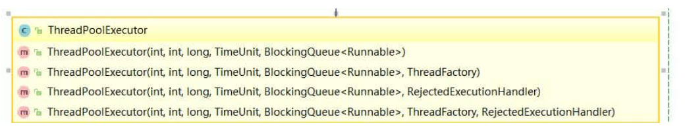

    方法二：通过Executor框架的工具类Executors来实现  
    创建三种类型的ThreadPoolExecutor  

    - FixedThreadPool:该方法返回一个固定线程数量的线程池。该线程池中的线程数量始终不变。当有一个新的任务提交时，线程池中若有空闲线程，则立即执行。若没有，则新的线程会被暂存在一个任务队列中，待有线程空闲时，便处理在任务队列中的任务。
    - SingleThreadExecutor：方法返回一个只有一个线程的线程池。若多余一个任务被提交到该线程池，任务会被保存在一个队列中，待线程空闲，按先入先出的顺序执行队列中的任务。  
    - CachedThreadPool:该方法返回一个可根据实际情况调整线程数量的线程池。线程池的线程数量不确定，但若有空线程可以复用，则会优先使用可复用的线程。若所有线程均在工作，又有新的任务提交，则会创建新的线程处理任务。所有线程在当前任务执行完毕后，将返回线程池复用。  

    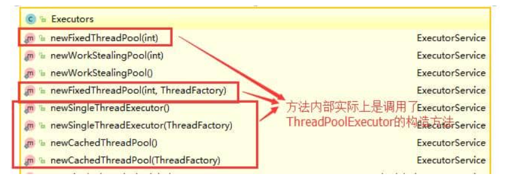
    4.5 ThreadPoolExecutor类分析  
    4.5.1 ThreadPoolExecutor构造函数重要参数分析  
    ThreadPoolExecutor 3个最重要的参数：  
    
    - corePoolSize:核心线程定义了最小可以同时运行的线程数量。
    - maximumPoolSize:当队列中存放的任务达到队列容量的时候，当前可以同时运行的线程数量变为最大线程数。  
    - workQueue:当新任务来的时候会先判断当前运行的线程数量是否达到核心线程数，如果达到的话，新任务就会被存放在队列中。 

    ThreadPoolExecutor其他常见参数：  
    1. keepAliveTime:当前线程池中的线程数量大于corePoolSize的时候，如果这时没有新的任务提交，核心线程外的线程不会立即销毁，而是会等待，直到等待的时间超过了keepAliveTime才会被回收销毁； 
    2. unit:keepAliveTime参数的时间单位
    3. threadFactory:executor创建新线程的时候会用到
    4. handler:饱和策略  

    4.5 ThreadPoolExecutor饱和策略  
    ThreadPoolExecutor饱和策略定义：  
    当前同时运行的线程数量达到最大线程数量并且队列也已经被放满任务时，ThreadPoolTaskExecutor定义一些策略：  

    - ThreadPoolExecutor.AbortPolicy:抛出RejectedExecutionException来拒绝新任务的处理。  
    - ThreadPoolExecutor.CallerRunsPolicy:调用执行自己的线程运行任务，也就是直接调用execute方法的线程中运行(run)被拒绝的任务，如果执行程序已关闭，则会丢弃该任务。因此这种策略会降低对于新任务的提交速度，影响程序的整体性能。如果您的应用程序可以承受此延迟并且你要求任何一个任务请求都要被执行的话，可以选择这个策略。
    - ThreadPoolExecutor.DiscardPolicy:不处理新任务，直接丢掉。
    - ThreadPoolExecutor.DiscardOldestPolicy:此策略将丢弃最早的未处理的任务请求。

    4.7 线程池原理分析
    ```java
    // 存放线程池的运行状态 (runState) 和线程池内有效线程的数量 (workerCount)
    private final AtomicInteger ctl = new AtomicInteger(ctlOf(RUNNING, 0));

    private static int workerCountOf(int c) {
        return c & CAPACITY;
    }

    private final BlockingQueue<Runnable> workQueue;

    public void execute(Runnable command) {
        // 如果任务为null，则抛出异常。
        if (command == null)
            throw new NullPointerException();
        // ctl 中保存的线程池当前的一些状态信息
        int c = ctl.get();

        //  下面会涉及到 3 步 操作
        // 1.首先判断当前线程池中执行的任务数量是否小于 corePoolSize
        // 如果小于的话，通过addWorker(command, true)新建一个线程，并将任务(command)添加到该线程中；然后，启动该线程从而执行任务。
        if (workerCountOf(c) < corePoolSize) {
            if (addWorker(command, true))
                return;
            c = ctl.get();
        }
        // 2.如果当前执行的任务数量大于等于 corePoolSize 的时候就会走到这里
        // 通过 isRunning 方法判断线程池状态，线程池处于 RUNNING 状态并且队列可以加入任务，该任务才会被加入进去
        if (isRunning(c) && workQueue.offer(command)) {
            int recheck = ctl.get();
            // 再次获取线程池状态，如果线程池状态不是 RUNNING 状态就需要从任务队列中移除任务，并尝试判断线程是否全部执行完毕。同时执行拒绝策略。
            if (!isRunning(recheck) && remove(command))
                reject(command);
                // 如果当前线程池为空就新创建一个线程并执行。
            else if (workerCountOf(recheck) == 0)
                addWorker(null, false);
        }
        //3. 通过addWorker(command, false)新建一个线程，并将任务(command)添加到该线程中；然后，启动该线程从而执行任务。
        //如果addWorker(command, false)执行失败，则通过reject()执行相应的拒绝策略的内容。
        else if (!addWorker(command, false))
            reject(command);
    }

    ```
    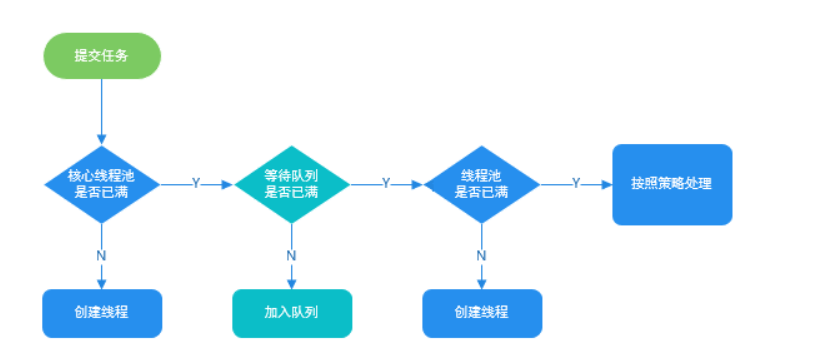
5. Atomic原子类
    5.1 介绍一下Atomic原子类  
    所谓原子类说简单点就是具有原子/原子操作特征的类。
    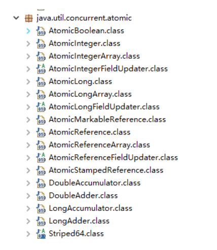
    5.2 JUC包中的4类原子类  
    **基本类型**  
    使用原子方式更新基本类型  
    - AtomicInteger：整型原子类
    - AtomicLong:长整型原子类
    - AtomicBoolean:布尔原子类  

    **数组类型**  
    使用原子的方式更新数组里的某个元素    
    
    - AtomicIntegerArray:整形数组原子类
    - AtomicLongArray:长整形数组原子类
    - AtomicReferenceArray:引用类型数组原子类  
    
    **引用类型**  
    使用原子的方式更新数组里的某个元素  
    
    - AtomicReference:引用原子类
    - AtomicStampeReference:原子更新带有版本号的引用类型。该类将整数值与引用关联起来，可用于解决原子的更新数据和数据的版本号，可以解决使用 CAS 进行原子更新时可能出现的 ABA 问题。  
    - AtomicMarkableReference:原子更新带有标记位的引用类型。  

    **对象的属性修改类型**  

    - AtomicIntegerFieldUpdater:原子更新整形字段的更新器  
    - AtomicLongFieldUpdater:原子更新长整形的更新器  
    - AtomicReferenceFieldUpdater:原子更新引用类型字段的更新器
    
    5.3 AtomicInteger的使用  
    AtomicInteger类常用方法   
    ```java
    public final int get() //获取当前的值
    public final int getAndSet(int newValue)//获取当前的值，并设置新的值
    public final int getAndIncrement()//获取当前的值，并自增
    public final int getAndDecrement() //获取当前的值，并自减
    public final int getAndAdd(int delta) //获取当前的值，并加上预期的值
    boolean compareAndSet(int expect, int update) //如果输入的数值等于预期值，则以原子方式将该值设置为输入值（update）
    public final void lazySet(int newValue)//最终设置为newValue,使用 lazySet 设置之后可能导致其他线程在之后的一小段时间内还是可以读到旧的值。

    ```
    **AtomicInteger类使用示例**  
    使用AtomicInteger之后，不用对increment()方法加锁也可以保证线程安全。
    ```java
    class AtomicIntegerTest {
        private AtomicInteger count = new AtomicInteger();
        //使用AtomicInteger之后，不需要对该方法加锁，也可以实现线程安全。
        public void increment() {
            count.incrementAndGet();
        }

        public int getCount() {
            return count.get();
        }
    }

    ```
6. AQS  
    6.1 AQS介绍  
    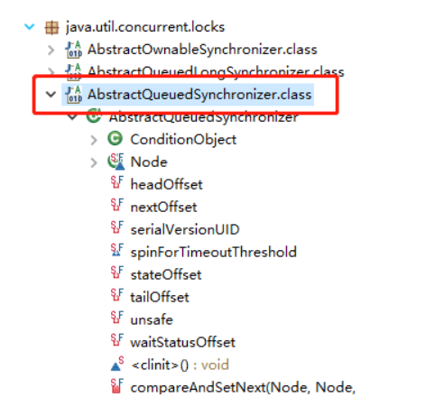
    AQS是一个用来构建锁和同步器的框架，使用AQS能简单且高效地构造出大量应用广泛的同步器，比如我们提到的ReentranLock,Semaphore其他的诸如ReentrantReadWriteLock,SynchronousQueue,FutureTask等都是基于AQS。  
    6.2 AQS原理概览  
    AQS 核心思想是，如果被请求的共享资源空闲，则将当前请求资源的线程设置为有效的工作线程，并且将共享资源设置为锁定状态。如果被请求的共享资源被占用，那么就需要一套线程阻塞等待以及被唤醒时锁分配的机制，这个机制 AQS 是用 CLH 队列锁实现的，即将暂时获取不到锁的线程加入到队列中。