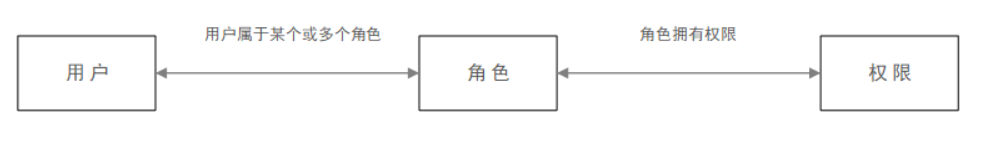
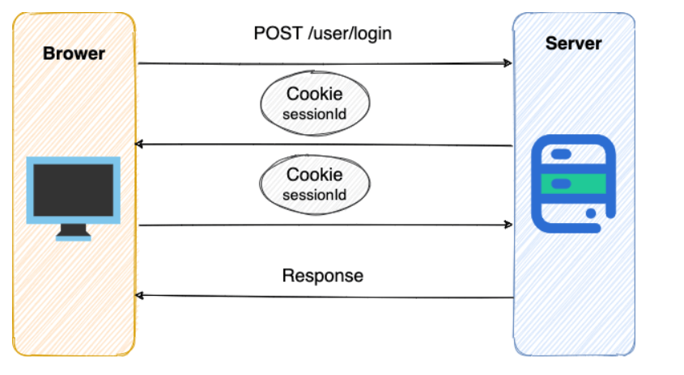
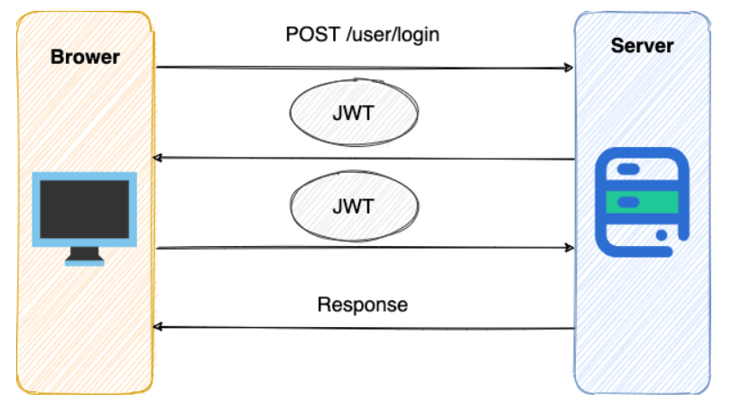
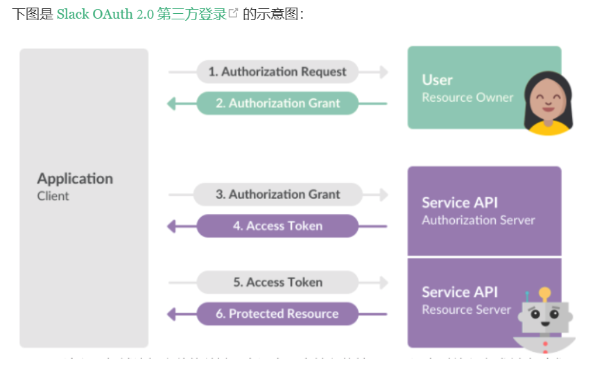

# 认证授权基础
## 认证和授权的区别
- Authentication(认证):是验证您的身份的凭据，通过这个凭据，系统确认用户；称之为身份/用户验证。
- Authorization(授权)
## RBAC模型
**什么是RBAC呢？**  
RBAC 即基于角色的权限访问控制（Role-Based Access Control）。这是一种通过角色关联权限，角色同时又关联用户的授权的方式。  

## Cookie
Cookie存放在客户端，一般用来保存用户信息。  
1. 我们在 Cookie 中保存已经登录过的用户信息，下次访问网站的时候页面可以自动帮你登录的一些基本信息给填了。除此之外，Cookie 还能保存用户首选项，主题和其他设置信息。 
2. 使用 Cookie 保存 Session 或者 Token ，向后端发送请求的时候带上 Cookie，这样后端就能取到 Session 或者 Token 了。这样就能记录用户当前的状态了，因为 HTTP 协议是无状态的。 
3. Cookie 还可以用来记录和分析用户行为。举个简单的例子你在网上购物的时候，因为 HTTP 协议是没有状态的，如果服务器想要获取你在某个页面的停留状态或者看了哪些商品，一种常用的实现方式就是将这些信息存放在 Cookie。
## springboot中使用Cookie
1. 设置Cookie返回给客户端
    ```java
    @GetMapping("/change-username")
    public String setCookie(HttpServletResponse response) {
        // 创建一个 cookie
        Cookie cookie = new Cookie("username", "Jovan");
        //设置 cookie过期时间
        cookie.setMaxAge(7 * 24 * 60 * 60); // expires in 7 days
        //添加到 response 中
        response.addCookie(cookie);

        return "Username is changed!";
    }

    ```
2. 使用 Spring 框架提供的 @CookieValue 注解获取特定的 cookie 的值
    ```java
    @GetMapping("/")
    public String readCookie(@CookieValue(value = "username", defaultValue = "Atta") String username) {
        return "Hey! My username is " + username;
    }

    ```
3. 读取所有的Cookie值
    ```java
    @GetMapping("/all-cookies")
    public String readAllCookies(HttpServletRequest request) {

        Cookie[] cookies = request.getCookies();
        if (cookies != null) {
            return Arrays.stream(cookies)
                    .map(c -> c.getName() + "=" + c.getValue()).collect(Collectors.joining(", "));
        }

        return "No cookies";
    }

    ```
## Cookie和Session的区别？
session 的主要作用就是通过服务端记录用户的状态；因为 HTTP 协议是无状态的。服务端给特定的用户创建特定的 Session 之后就可以标识这个用户并且跟踪这个用户了。  

Cookie 数据保存在客户端(浏览器端)，Session 数据保存在服务器端。相对来说 Session 安全性更高。如果使用 Cookie 的一些敏感信息不要写入 Cookie 中，最好能将 Cookie 信息加密然后使用到的时候再去服务器端解密。
## 使用Session-Cookie方案进行身份验证？
很多时候我们都是通过 SessionID 来实现特定的用户，SessionID 一般会选择存放在 Redis 中。举个例子： 
1. 用户成功登陆系统，然后返回给客户端具有 SessionID 的 Cookie 
2. 当用户向后端发起请求的时候会把 SessionID 带上，这样后端就知道你的身份状态了。 

关于这种认证方式更详细的过程如下：

1. 用户向服务器发送用户名、密码、验证码用于登陆系统。
2. 服务器验证通过后，服务器为用户创建一个Session，并将Session信息存储起来；
3. 服务器向用户返回一个SessionID,写入用户的Cookie。
4. 当用户保持登陆状态时，Cookie 将与每个后续请求一起被发送出去。
5. 服务器可以将存储在 Cookie 上的 SessionID 与存储在内存中或者数据库中的 Session 信息进行比较，以验证用户的身份，返回给用户客户端响应信息的时候会附带用户当前的状态。

使用Session的时候注意点：

1. 依赖 Session 的关键业务一定要确保客户端开启了 Cookie。
2. 注意 Session 的过期时间。
# 延展
## 多服务器节点Session-Cookie方案
1. 某个用户的所有请求都通过特性的哈希策略分配给同一个服务器处理。这样的话，每个服务器都保存了一部分用户的 Session 信息。服务器宕机，其保存的所有 Session 信息就完全丢失了。 
2. 每一个服务器保存的 Session 信息都是互相同步的，也就是说每一个服务器都保存了全量的 Session 信息。每当一个服务器的 Session 信息发生变化，我们就将其同步到其他服务器。这种方案成本太大，并且，节点越多时，同步成本也越高。 
3. 单独使用一个所有服务器都能访问到的数据节点（比如缓存）来存放 Session 信息。为了保证高可用，数据节点尽量要避免是单点。
## 如果没有Cookie的话Session如何使用
1. 将SessionID通过Url带回
2. 将SessionID加密通过Url带回
## Cookie无法放置CSRF攻击，而TOKEN可以
1. **CSRF（Cross Site Request Forgery）**一般被翻译为 跨站请求伪造 ；
2. CSRF攻击会窃取用户浏览器中的cookie来伪造用户请求网站；而token是用户号在后端登陆成功之后生成的，然后在用户的每次请求中会添加此token，使得校验此次请求是否合法；
3. 都无法避免跨站脚本攻击XSS;
## JWT
JWT （JSON Web Token） 就是这种方式的实现，通过这种方式服务器端就不需要保存 Session 数据了，只用在客户端保存服务端返回给客户的 Token 就可以了，扩展性得到提升。  
**JWT 本质上就一段签名的 JSON 格式的数据。由于它是带有签名的，因此接收者便可以验证它的真实性。**  
JWT由3个部分构成：
1. Header:描述JWT的元数据，定义了生成签名的算法以及Token的类型。
2. Payload：用来存放实际需要传递的数据。
3. Signature(签名):服务器通过Pyload、Header和一个秘钥(secret)使用Header里面指定的签名算法(默认是SHA256)生成。
## 基于Token进行身份验证？
在基于 Token 进行身份验证的的应用程序中，服务器通过Payload、Header和一个密钥(secret)创建令牌（Token）并将 Token 发送给客户端，客户端将 Token 保存在 Cookie 或者 localStorage 里面，以后客户端发出的所有请求都会携带这个令牌。你可以把它放在 Cookie 里面自动发送，但是这样不能跨域，所以更好的做法是放在 HTTP Header 的 Authorization 字段中：Authorization: Bearer Token。

1. 用户向服务器发送用户名和密码用于登陆系统。 
2. 身份验证服务响应并返回了签名的 JWT，上面包含了用户是谁的内容。 
3. 用户以后每次向后端发请求都在 Header 中带上 JWT。
4. 服务端检查 JWT 并从中获取用户相关信息。
## SSO(单点登录)

## OAuth2.0
OAuth 是一个行业的标准授权协议，主要用来授权第三方应用获取有限的权限。  
OAuth 2.0 比较常用的场景就是第三方登录，当你的网站接入了第三方登录的时候一般就是使用的 OAuth 2.0 协议。 另外，现在 OAuth 2.0 也常见于支付场景（微信支付、支付宝支付）和开发平台（微信开放平台、阿里开放平台等等）。  

## [demo代码](https://mp.weixin.qq.com/s?__biz=Mzg2OTA0Njk0OA==&mid=2247485622&idx=1&sn=e9750ed63c47457ba1896db8dfceac6a&chksm=cea2477df9d5ce6b7af20e582c6c60b7408a6459b05b849394c45f04664d1651510bdee029f7&token=684071313&lang=zh_CN&scene=21#wechat_redirect)
# JWT身份验证优缺点分析
## Token认证的优势
1. 无状态
服务端无需存储Session信息，也正是由于 token 的无状态，也导致了它最大的缺点：当后端在token 有效期内废弃一个 token 或者更改它的权限的话，不会立即生效，一般需要等到有效期过后才可以。另外，当用户 Logout 的话，token 也还有效。除非，我们在后端增加额外的处理逻辑。
2. 有效避免CSRF攻击
3. 适合移动端应用
4. 单点登录友好
使用 Session 进行身份认证的话，实现单点登录，需要我们把用户的 Session 信息保存在一台电脑上，并且还会遇到常见的 Cookie 跨域的问题。但是，使用 token 进行认证的话， token 被保存在客户端，不会存在这些问题。
## Token认证常见问题以及解决办法
1. 注销登录场景下token还有效  
与之类似的具体场景有：  
    1. 退出登陆；  
    2. 修改密码；
    3. 服务端修改了某个用户具有的权限或者角色；
    4. 用户的账户被删除/暂停。
    5. 用户由管理员注销；  

    token 一旦派发出去，如果后端不增加其他逻辑的话，它在失效之前都是有效的。那么，我们如何解决这个问题呢？查阅了很多资料，总结了下面几种方案：

    - 将token存入内存数据库：将 token 存入 DB 中，redis 内存数据库在这里是不错的选择。如果需要让某个 token 失效就直接从 redis 中删除这个 token 即可。但是，这样会导致每次使用 token 发送请求都要先从 DB 中查询 token 是否存在的步骤，而且违背了 JWT 的无状态原则。 
    - 黑名单机制：和上面的方式类似，使用内存数据库比如 redis 维护一个黑名单，如果想让某个 token 失效的话就直接将这个 token 加入到 黑名单 即可。然后，每次使用 token 进行请求的话都会先判断这个 token 是否存在于黑名单中。
    - 修改秘钥(Secret):我们为每个用户都创建一个专属密钥，如果我们想让某个 token 失效，我们直接修改对应用户的密钥即可。但是，这样相比于前两种引入内存数据库带来了危害更大，比如：1) 如果服务是分布式的，则每次发出新的 token 时都必须在多台机器同步密钥。为此，你需要将密钥存储在数据库或其他外部服务中，这样和 Session 认证就没太大区别了。 2) 如果用户同时在两个浏览器打开系统，或者在手机端也打开了系统，如果它从一个地方将账号退出，那么其他地方都要重新进行登录，这是不可取的。
    - 保持令牌的有效期限短并经常轮换：很简单的一种方式。但是，会导致用户登录状态不会被持久记录，而且需要用户经常登录。  
    **使用用户的密码的哈希值对 token 进行签名。因此，如果密码更改，则任何先前的令牌将自动无法验证。**
2. token的续签问题  
Session的做法：假如 session 的有效期30分钟，如果 30 分钟内用户有访问，就把 session 有效期延长30分钟。  
    1. 类似于Session认证中的做法：这种方案满足于大部分场景。假设服务端给的 token 有效期设置为30分钟，服务端每次进行校验时，如果发现 token 的有效期马上快过期了，服务端就重新生成 token 给客户端。客户端每次请求都检查新旧token，如果不一致，则更新本地的token。这种做法的问题是仅仅在快过期的时候请求才会更新 token ,对客户端不是很友好。  
    2. 每次请求都返回新token:这种方案的的思路很简单，但是，很明显，开销会比较大。
    3. token有效期设置到半夜：这种方案是一种折衷的方案，保证了大部分用户白天可以正常登录，适用于对安全性要求不高的系统。
    4. 用户登陆返回两个token:第一个是 accessToken ，它的过期时间 token 本身的过期时间比如半个小时，另外一个是 refreshToken 它的过期时间更长一点比如为1天。客户端登录后，将 accessToken和refreshToken 保存在本地，每次访问将 accessToken 传给服务端。服务端校验 accessToken 的有效性，如果过期的话，就将 refreshToken 传给服务端。如果有效，服务端就生成新的 accessToken 给客户端。否则，客户端就重新登录即可。该方案的不足是：1) 需要客户端来配合；2) 用户注销的时候需要同时保证两个 token 都无效；3) 重新请求获取 token 的过程中会有短暂 token 不可用的情况（可以通过在客户端设置定时器，当accessToken 快过期的时候，提前去通过 refreshToken 获取新的accessToken）。

总结  
JWT 最适合的场景是不需要服务端保存用户状态的场景，如果考虑到 token 注销和 token 续签的场景话，没有特别好的解决方案，大部分解决方案都给 token 加上了状态，这就有点类似 Session 认证了。