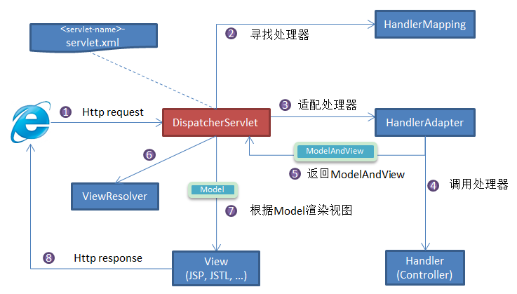
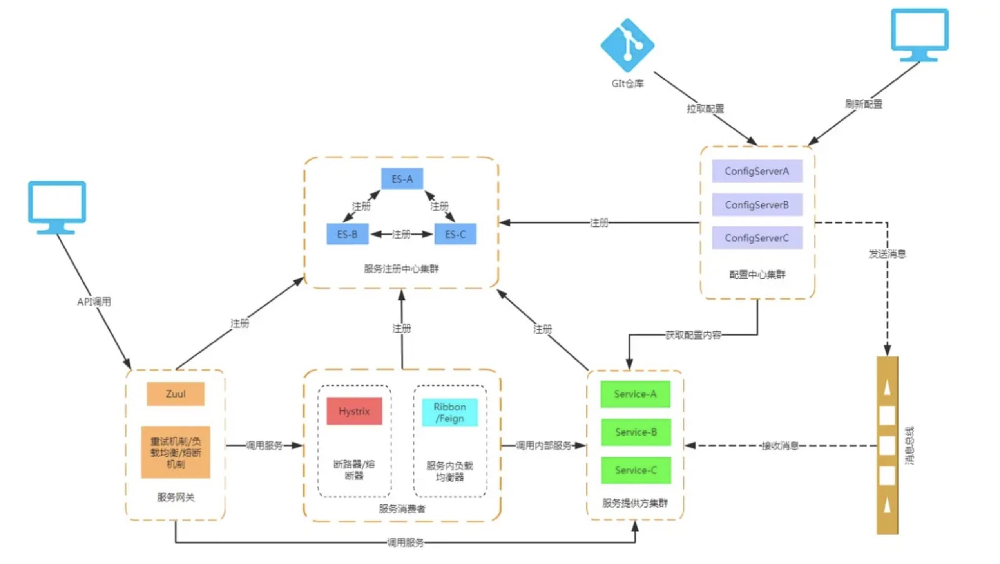

# Spring
## SpringIOC&AOP
### 对Spring IoC的了解
1. 概念
IoC(控制反转)是一种思想，而不是一个具体的技术实现.IoC的思想就是将原本在程序中手动创建对象的控制权，交由Spring框架来管理。
2. 为啥叫控制反转
- 控制：指的是对象创建(实例化、管理)的权利
- 反转：控制权交给外部环境(Spring框架、IoC容器)

将对象之间的相互依赖关系交给IoC容器来管理，并由IoC容器完成对象的注入。  
在Spring中，IoC容器时Spring用来实现IoC的载体，IoC容器时间就是一个Map，Map中存放的是各种对象。
### 对AOP的了解
1. 概念
面向切面编程：能够将那些与业务无关，却为业务模块所共用调用的逻辑或责任(例如事务处理、日志管理、权限控制等)封装起来，便于减少系统的重复代码，降低模块间的耦合度，并有利于未来的可扩展性和可维护性。  
Spring AOP就是基于动态代理。
- 如果实现了某个接口，那么Spring AOP会使用JDK Proxy，去创建代理对象；
- 没有实现接口的对象，Spring AOP会使用Cglib生成一个被代理对象的子类来作为代理。
- 使用AspectJ

### Spring AOP 和AspectJ AOP
- Spring AOP属于运行时增强，而AspectJ是编译时增；
- Spring AOP基于代理，而AspectJ基于字节码操作；
- AspectJ功能强大，Spring AOP更简单；
## Spring Bean
### 什么是bean
bean代指的就是那些被IoC容器所管理的对象。
### @Component 和 @Bean 的区别是什么？
1. @Component注解作用于类，而@Bean注解作用于方法
2. @Component通常是通过类路径扫描来自动侦测以及自动装配到Spring容器中。@Bean注解通常是我们在标有该注解
的方法中产生这个bean，@Bean告诉Spring这是某个类的实例。
3. @Bean注解比@Component注解的自定义性更强，而且很多地方我们只能通过@Bean注解来注册bean。
### bean的什么周期

- Bean容器找到配置文件中Spring Bean的定义。
- Bean容器利用Java Reflection API创建一个Bean的实例
- 如果涉及到一些属性值利用set()方法设置一些属性值。
- 如果Bean实现了BeanNameAware接口，调用setBeanName()方法，传入Bean名字。
- 如果Bean实现了BeanClassLoaderAware接口，调用setBeanClassLoader()方法，传入ClassLoader对象的实例。
- 如果Bean实现了BeanFactoryAware接口，调用setBeanFactory()方法，传入BeanFactory对象的实例。
- 与上面的类似，如果实现了其他的*.Aware接口，就调用相应的方法。
- 如果有和加载这个Bean的Spring容器相关的BeanPostProcessor对象，执行postProcessBeforeInitialization()方法。
- 如果Bean在配置文件中定义包含init-method属性，执行指定的方法。
- 如果有和加载这个Bean的Spring容器相关的BeanPostProcessor对象，执行postProcessAfterInitializtion()方法
- 当要销毁Bean的时候，如果Bean实现了DisposableBean接口，执行destory()方法。
- 当要销毁Bean的时候，如果Bean在配置文件中的定义包含destroy-method属性，执行指定方法。

### bean的作用域
- singleton:唯一bean实例，Spring中bean默认都是单例，对单例设计模式的应用。
- prototype:每次请求都会创建一个新的bean实例。
- request：每一次HTTP请求都会产生一个新的bean，该bean仅在当前HTTP request内有效。
- session:每一次来自新session的HTTP请求都会产生一个新的bean，该bean仅在当前HTTP session内有效。
- global-session:全局session作用域，仅仅基于porlet的weby应用中才有意义，Spring5以及没有了。
### 单例bean的线程安全问题
单例bean存在线程安全问题，主要是因为当多个线程操作同一个对象的时候是存在资源竞争的。
解决方法：
1. 在 bean 中尽量避免定义可变的成员变量。
2. 在类中定义一个 ThreadLocal 成员变量，将需要的可变成员变量保存在 ThreadLocal 中（推荐的一种方式）  
不过，大部分 bean 实际都是无状态（没有实例变量）的（比如 Dao、Service），这种情况下， bean 是线程安全的。
### 将一个类声明为 bean 的注解有哪些?
我们一般使用 @Autowired 注解自动装配 bean，要想把类标识成可用于 @Autowired 注解自动装配的 bean 的类,采用以下注解可实现： 
- @Component ：通用的注解，可标注任意类为 Spring 组件。如果一个 Bean 不知道属于哪个层，可以使用@Component 注解标注。
- @Repository : 对应持久层即 Dao 层，主要用于数据库相关操作。 
- @Service : 对应服务层，主要涉及一些复杂的逻辑，需要用到 Dao 层。 
- @Controller : 对应 Spring MVC 控制层，主要用户接受用户请求并调用 Service 层返回数据给前端页面。
## Spring MVC
### SpringMVC了解
MVC 是模型(Model)、视图(View)、控制器(Controller)的简写，其核心思想是通过将业务逻辑、数据、显示分离来组织代码。  
Spring MVC 下我们一般把后端项目分为 Service 层（处理业务）、Dao 层（数据库操作）、Entity 层（实体类）、Controller 层(控制层，返回数据给前台页面)。
### Spring MVC的工作原理

1. 客户端（浏览器）发送请求，直接请求到 DispatcherServlet。 
2. DispatcherServlet 根据请求信息调用 HandlerMapping，解析请求对应的 Handler。 
3. 解析到对应的 Handler（也就是我们平常说的 Controller 控制器）后，开始由 HandlerAdapter 适配器处理。 
4. HandlerAdapter 会根据 Handler来调用真正的处理器开处理请求，并处理相应的业务逻辑。
5. 处理器处理完业务后，会返回一个 ModelAndView 对象，Model 是返回的数据对象，View 是个逻辑上的 View。 
6. ViewResolver 会根据逻辑 View 查找实际的 View。 
7. DispaterServlet 把返回的 Model 传给 View（视图渲染）。 
8. 把 View 返回给请求者（浏览器)

## Spring事务
### Spring 管理事务的方法
- 编程式事务 ： 在代码中硬编码(不推荐使用) : 通过 TransactionTemplate或者 TransactionManager 手动管理事务，实际应用中很少使用，但是对于你理解 Spring 事务管理原理有帮助。  
使用TransactionTemplate 进行编程式事务管理的示例代码如下：  
```java
@Autowired
private TransactionTemplate transactionTemplate;
public void testTransaction() {

        transactionTemplate.execute(new TransactionCallbackWithoutResult() {
            @Override
            protected void doInTransactionWithoutResult(TransactionStatus transactionStatus) {

                try {

                    // ....  业务代码
                } catch (Exception e){
                    //回滚
                    transactionStatus.setRollbackOnly();
                }

            }
        });
}

```
使用 TransactionManager 进行编程式事务管理的示例代码如下：  
```java
@Autowired
private PlatformTransactionManager transactionManager;

public void testTransaction() {

  TransactionStatus status = transactionManager.getTransaction(new DefaultTransactionDefinition());
          try {
               // ....  业务代码
              transactionManager.commit(status);
          } catch (Exception e) {
              transactionManager.rollback(status);
          }
}

```
- 声明式事务 ： 在 XML 配置文件中配置或者直接基于注解（推荐使用） : 实际是通过 AOP 实现（基于@Transactional 的全注解方式使用最多）
```java
@Transactional(propagation=propagation.PROPAGATION_REQUIRED)
public void aMethod {
  //do something
  B b = new B();
  C c = new C();
  b.bMethod();
  c.cMethod();
}

```
### Spring事务管理接口
- PlatformTransactionManager:（平台）事务管理器，Spring 事务策略的核心。
- TransactionDefinition： 事务定义信息(事务隔离级别、传播行为、超时、只读、回滚规则)。
- TransactionStatus： 事务运行状态。
我们可以把 PlatformTransactionManager 接口可以被看作是事务上层的管理者，而 TransactionDefinition 和 TransactionStatus 这两个接口可以看作是事务的描述。  
PlatformTransactionManager 会根据 TransactionDefinition 的定义比如事务超时时间、隔离级别、传播行为等来进行事务管理 ，而 TransactionStatus 接口则提供了一些方法来获取事务相应的状态比如是否新事务、是否可以回滚等等。
1. PlatformTransactionManager:事务管理接口
Spring并不直接管理事务，而是提供了多种事务管理器。Spring事务管理器的接口是：PlatformTransactionManager。通过这个接口，Spring为各个平台如JDBC、Hibernate、JPA等提供了对应事务管理器。PlatformTransactionManager接口中定义了三个方法：  
```java
package org.springframework.transaction;

import org.springframework.lang.Nullable;

public interface PlatformTransactionManager {
    //获得事务
    TransactionStatus getTransaction(@Nullable TransactionDefinition var1) throws TransactionException;
    //提交事务
    void commit(TransactionStatus var1) throws TransactionException;
    //回滚事务
    void rollback(TransactionStatus var1) throws TransactionException;
}


```
2. TransactionDefinition:事务属性
事务属性：隔离级别、传播行为、回滚规则、是否只读、事务超时。  
TransactionDefinition 接口中定义了 5 个方法以及一些表示事务属性的常量比如隔离级别、传播行为等等。
```java
package org.springframework.transaction;

import org.springframework.lang.Nullable;

public interface TransactionDefinition {
    int PROPAGATION_REQUIRED = 0;
    int PROPAGATION_SUPPORTS = 1;
    int PROPAGATION_MANDATORY = 2;
    int PROPAGATION_REQUIRES_NEW = 3;
    int PROPAGATION_NOT_SUPPORTED = 4;
    int PROPAGATION_NEVER = 5;
    int PROPAGATION_NESTED = 6;
    int ISOLATION_DEFAULT = -1;
    int ISOLATION_READ_UNCOMMITTED = 1;
    int ISOLATION_READ_COMMITTED = 2;
    int ISOLATION_REPEATABLE_READ = 4;
    int ISOLATION_SERIALIZABLE = 8;
    int TIMEOUT_DEFAULT = -1;
    // 返回事务的传播行为，默认值为 REQUIRED。
    int getPropagationBehavior();
    //返回事务的隔离级别，默认值是 DEFAULT
    int getIsolationLevel();
    // 返回事务的超时时间，默认值为-1。如果超过该时间限制但事务还没有完成，则自动回滚事务。
    int getTimeout();
    // 返回是否为只读事务，默认值为 false
    boolean isReadOnly();

    @Nullable
    String getName();
}

```
3. TransactionStatus:事务状态
```java
public interface TransactionStatus{
    boolean isNewTransaction(); // 是否是新的事务
    boolean hasSavepoint(); // 是否有恢复点
    void setRollbackOnly();  // 设置为只回滚
    boolean isRollbackOnly(); // 是否为只回滚
    boolean isCompleted; // 是否已完成
}

```
### Spring事务中集中传播行为
事务传播行为时为了解决业务层方法之间相互调用的事务问题。正常的事务传播行为可能的值如下：  
1. TransctionDefinitioin.PROPAGATION_REQUIRED
使用@Transactional注解默认使用就是这个事务传播行为。如果当前存在事务，则加入该事务；如果当前没有事务，则创建一个新的事务。
2. TransactionDefinition.PROPAGATION_REQUIRES_NEW  
创建一个新的事务，如果当前存在事务，则把当前事务挂起。也就是说不管外部方法是否开启事务，Propation.REQUIRES_NEW修饰的内部方法会新开启自己的事务，且开启的事务相互独立，互不干扰。
3. TransactionDefinition.PROPAGATION_NESTED  
如果当前存在事务，则创建一个事务作为当前事务的嵌套事务来运行；如果当前没有事务，则该取值等价于TransactionDefinition.PROPAGATION_REQUIRED。
4. TransactionDefinition.PROPAGATION_MANDATORY  
如果当前存在事务，则加入该事务；如果当前没有事务，则抛出异常。(mandatory:强制性)这个使用的很少。  
若是错误的配置一下3中事务传播行为，事务将不会发生回滚：  
- TransactionDefinition.PROPAGATION_SUPPORTS：如果当前存在事务，则加入该事务；如果当前没有事务，则以非事务的方式继续运行。  
- TransactionDefinition.PROPAGATION_NOT_SUPPORTED:以非事务方式运行，如果当前存在事务，则把当前事务挂起。
- TransactionDefinition.PROPAGATION_NEVER:以非事务方式运行，如果当前存在事务，则抛出异常。
### Spring事务中的隔离级别有哪几种(Isolation)
- TransactionDefinition.ISOLATION_DEFAULT:使用后端数据库默认的隔离级别，MySQL默认采用REPEATABLE_READ隔离级别，Oracle默认采用READ_COMMITTED隔离级别。
- TransactionDefinition.ISOLATION_READ_UNCOMMITTED:最低隔离级别，使用这个隔离级别很少，因为它运行读取尚未提交的数据变更，可能会导致脏读、幻读或不可重复读。
- TransactionDefinition.ISOLATION_READ_COMMITTED:运行读取并发事务已经提交的数据，可以阻止脏读，但是幻读或不可重复读仍有可能发生。
- TransactionDefinition.ISOLATION_SERIALIZABLE:最高的隔离级别，完全服从ACID的隔离级别。所有的事务依次逐个执行，这个事务之间就完全不可能产生干扰，也就是说，该级别可以阻止脏读、不可重复读以及幻读。但是这将严重影响程序的性能。通常情况下也不会用到该级别。
### 事务的特性(ACID)
- 原子性
- 一致性
- 隔离性
- 持久性
MySQL数据库的innodb 引擎，


## Spring/Spring Boot常用注解
### 1. @SpringBootApplication
这里先单独拎出@SpringBootApplication 注解说一下，虽然我们一般不会主动去使用它。  
我们可以把 @SpringBootApplication看作是 @Configuration、@EnableAutoConfiguration、@ComponentScan 注解的集合。  
根据 SpringBoot 官网，这三个注解的作用分别是：
- @EnableAutoConfiguration：启用 SpringBoot 的自动配置机制 
- @ComponentScan： 扫描被@Component (@Service,@Controller)注解的 bean，注解默认会扫描该类所在的包下所有的类。 
- @Configuration：允许在 Spring 上下文中注册额外的 bean 或导入其他配置类   

### 2. Spring Bean相关  
2.1. @Autowired
自动导入对象到类中，被注入进的类同样要被 Spring 容器管理比如：Service 类注入到 Controller 类中。  

2.2. @Component,@Repository,@Service, @Controller   
 我们一般使用 @Autowired 注解让 Spring 容器帮我们自动装配 bean。要想把类标识成可用于 @Autowired 注解自动装配的 bean 的类,可以采用以下注解实现： 
    - @Component ：通用的注解，可标注任意类为 Spring 组件。如果一个 Bean 不知道属于哪个层，可以使用@Component 注解标注。 
    - @Repository : 对应持久层即 Dao 层，主要用于数据库相关操作。 
    - @Service : 对应服务层，主要涉及一些复杂的逻辑，需要用到 Dao 层。 
    - @Controller : 对应 Spring MVC 控制层，主要用于接受用户请求并调用 Service 层返回数据给前端页面。  

2.3. @RestController 
@RestController注解是@Controller和@ResponseBody的合集,表示这是个控制器 bean,并且是将函数的返回值直接填入 HTTP 响应体中,是 REST 风格的控制器。

2.4. @Scope
声明 Spring Bean 的作用域，使用方法:
四种常见的 Spring Bean 的作用域：
- singleton : 唯一 bean 实例，Spring 中的 bean 默认都是单例的。 
- prototype : 每次请求都会创建一个新的 bean 实例。 
- request : 每一次 HTTP 请求都会产生一个新的 bean，该 bean 仅在当前 HTTP request 内有效。 
- session : 每一次 HTTP 请求都会产生一个新的 bean，该 bean 仅在当前 HTTP session 内有效。
2.5. @Configuration
一般用来声明配置类，可以使用 @Component注解替代，不过使用@Configuration注解声明配置类更加语义化
### 3. 处理常见的 HTTP 请求类型
5 种常见的请求类型: 
- GET ：请求从服务器获取特定资源。举个例子：GET /users（获取所有学生） 
- POST ：在服务器上创建一个新的资源。举个例子：POST /users（创建学生） 
- PUT ：更新服务器上的资源（客户端提供更新后的整个资源）。举个例子：PUT /users/12（更新编号为 12 的学生）
- DELETE ：从服务器删除特定的资源。举个例子：DELETE /users/12（删除编号为 12 的学生） 
- PATCH ：更新服务器上的资源（客户端提供更改的属性，可以看做作是部分更新），使用的比较少，这里就不举例子了。
### 4. 前后端传值
4.1. @PathVariable 和 @RequestParam
@PathVariable用于获取路径参数，@RequestParam用于获取查询参数

4.2. @RequestBody 用于读取 Request 请求（可能是 POST,PUT,DELETE,GET 请求）的 body 部分并且Content-Type 为 application/json 格式的数据，接收到数据之后会自动将数据绑定到 Java 对象上去。系统会使用HttpMessageConverter或者自定义的HttpMessageConverter将请求的 body 中的 json 字符串转换为 java 对象。一个请求方法只可以有一个@RequestBody，但是可以有多个@RequestParam和@PathVariable。

### 5.读取配置信息
5.1. @Value(常用)
使用 @Value("${property}") 读取比较简单的配置信息：

5.2. @ConfigurationProperties(常用)
通过@ConfigurationProperties读取配置信息并与 bean 绑定。

5.3. @PropertySource（不常用）
@PropertySource读取指定 properties 文件

### 6. 参数校验
6.1. 一些常用的字段验证的注解 
 - @NotEmpty 被注释的字符串的不能为 null 也不能为空 
 - @NotBlank 被注释的字符串非 null，并且必须包含一个非空白字符 @Null 被注释的元素必须为 null 
 - @NotNull 被注释的元素必须不为 null 
 - @AssertTrue 被注释的元素必须为 true 
 - @AssertFalse 被注释的元素必须为 false 
 - @Pattern(regex=,flag=)被注释的元素必须符合指定的正则表达式 
 - @Email 被注释的元素必须是 Email 格式。 
 - @Min(value)被注释的元素必须是一个数字，其值必须大于等于指定的最小值 
 - @Max(value)被注释的元素必须是一个数字，其值必须小于等于指定的最大值 
 - @DecimalMin(value)被注释的元素必须是一个数字，其值必须大于等于指定的最小值 
 - @DecimalMax(value) 被注释的元素必须是一个数字，其值必须小于等于指定的最大值 
 - @Size(max=, min=)被注释的元素的大小必须在指定的范围内 
 - @Digits(integer, fraction)被注释的元素必须是一个数字，其值必须在可接受的范围内 
 - @Past被注释的元素必须是一个过去的日期 
 - @Future 被注释的元素必须是一个将来的日期
 
6.2. 验证请求体(RequestBody)
我们在需要验证的参数上加上了@Valid注解，如果验证失败，它将抛出MethodArgumentNotValidException。

6.3. 验证请求参数(Path Variables 和 Request Parameters)
一定一定不要忘记在类上加上 @Validated 注解了，这个参数可以告诉 Spring 去校验方法参数。

### 7.  全局处理 Controller 层异常
相关注解：
- @ControllerAdvice :注解定义全局异常处理类
- @ExceptionHandler :注解声明异常处理方法
## 8. JPA 相关
8.1. 创建表
@Entity声明一个类对应一个数据库实体。
@Table 设置表名

8.2. 创建主键 
@Id ：声明一个字段为主键。 使用@Id声明之后，我们还需要定义主键的生成策略。我们可以使用 @GeneratedValue 指定主键生成策略。 
1. 通过 @GeneratedValue直接使用 JPA 内置提供的四种主键生成策略来指定主键生成策略
JPA 使用枚举定义了 4 种常见的主键生成策略，如下：
```java
public enum GenerationType {

    /**
     * 使用一个特定的数据库表格来保存主键
     * 持久化引擎通过关系数据库的一张特定的表格来生成主键,
     */
    TABLE,

    /**
     *在某些数据库中,不支持主键自增长,比如Oracle、PostgreSQL其提供了一种叫做"序列(sequence)"的机制生成主键
     */
    SEQUENCE,

    /**
     * 主键自增长
     */
    IDENTITY,

    /**
     *把主键生成策略交给持久化引擎(persistence engine),
     *持久化引擎会根据数据库在以上三种主键生成 策略中选择其中一种
     */
    AUTO
}

```
@GeneratedValue注解默认使用的策略是GenerationType.AUTO
一般使用 MySQL 数据库的话，使用GenerationType.IDENTITY策略比较普遍一点（分布式系统的话需要另外考虑使用分布式 ID）。
2. 通过 @GenericGenerator声明一个主键策略，然后 @GeneratedValue使用这个策略
```java
@Id
@GeneratedValue(strategy = GenerationType.IDENTITY)
private Long id;
```
jpa 提供的主键生成策略有如下几种:
```java
public class DefaultIdentifierGeneratorFactory
		implements MutableIdentifierGeneratorFactory, Serializable, ServiceRegistryAwareService {

	@SuppressWarnings("deprecation")
	public DefaultIdentifierGeneratorFactory() {
		register( "uuid2", UUIDGenerator.class );
		register( "guid", GUIDGenerator.class );			// can be done with UUIDGenerator + strategy
		register( "uuid", UUIDHexGenerator.class );			// "deprecated" for new use
		register( "uuid.hex", UUIDHexGenerator.class ); 	// uuid.hex is deprecated
		register( "assigned", Assigned.class );
		register( "identity", IdentityGenerator.class );
		register( "select", SelectGenerator.class );
		register( "sequence", SequenceStyleGenerator.class );
		register( "seqhilo", SequenceHiLoGenerator.class );
		register( "increment", IncrementGenerator.class );
		register( "foreign", ForeignGenerator.class );
		register( "sequence-identity", SequenceIdentityGenerator.class );
		register( "enhanced-sequence", SequenceStyleGenerator.class );
		register( "enhanced-table", TableGenerator.class );
	}

	public void register(String strategy, Class generatorClass) {
		LOG.debugf( "Registering IdentifierGenerator strategy [%s] -> [%s]", strategy, generatorClass.getName() );
		final Class previous = generatorStrategyToClassNameMap.put( strategy, generatorClass );
		if ( previous != null ) {
			LOG.debugf( "    - overriding [%s]", previous.getName() );
		}
	}

}

```
8.3. 设置字段类型
@Column 声明字段。

8.4. 指定不持久化特定字段
@Transient ：声明不需要与数据库映射的字段，在保存的时候不需要保存进数据库 。

8.5. 声明大字段
@Lob:声明某个字段为大字段。

8.6. 创建枚举类型的字段
可以使用枚举类型的字段，不过枚举字段要用@Enumerated注解修饰。

8.7. 增加审计功能
只要继承了 AbstractAuditBase的类都会默认加上下面四个字段。
1. @CreatedDate: 表示该字段为创建时间字段，在这个实体被 insert 的时候，会设置值 
2. @CreatedBy :表示该字段为创建人，在这个实体被 insert 的时候，会设置值 
@LastModifiedDate、@LastModifiedBy同理。
@EnableJpaAuditing：开启 JPA 审计功能。

8.8. 删除/修改数据
@Modifying 注解提示 JPA 该操作是修改操作,注意还要配合@Transactional注解使用

8.9. 关联关系
@OneToOne 声明一对一关系
@OneToMany 声明一对多关系
@ManyToOne 声明多对一关系
@MangToMang 声明多对多关系

9. 事务 @Transactional
在要开启事务的方法上使用@Transactional注解即可!
@Transactional 注解一般可以作用在类或者方法上。 
作用于类：当把@Transactional 注解放在类上时，表示所有该类的 public 方法都配置相同的事务属性信息。 
作用于方法：当类配置了@Transactional，方法也配置了@Transactional，方法的事务会覆盖类的事务配置信息。

10. json 数据处理
#10.1. 过滤 json 数据
@JsonIgnoreProperties 作用在类上用于过滤掉特定字段不返回或者不解析。
@JsonIgnore一般用于类的属性上，作用和上面的@JsonIgnoreProperties 一样。

10.2. 格式化 json 数据
@JsonFormat一般用来格式化 json 数据。

10.3. 扁平化对象
```java
@Getter
@Setter
@ToString
public class Account {
    private Location location;
    private PersonInfo personInfo;

  @Getter
  @Setter
  @ToString
  public static class Location {
     private String provinceName;
     private String countyName;
  }
  @Getter
  @Setter
  @ToString
  public static class PersonInfo {
    private String userName;
    private String fullName;
  }
}


```
未扁平化之前：
```json
{
    "location": {
        "provinceName":"湖北",
        "countyName":"武汉"
    },
    "personInfo": {
        "userName": "coder1234",
        "fullName": "shaungkou"
    }
}

```
使用@JsonUnwrapped 扁平对象之后：
```java
@Getter
@Setter
@ToString
public class Account {
    @JsonUnwrapped
    private Location location;
    @JsonUnwrapped
    private PersonInfo personInfo;
    ......
}

```
```json
{
  "provinceName":"湖北",
  "countyName":"武汉",
  "userName": "coder1234",
  "fullName": "shaungkou"
}

```
11. 测试相关
@ActiveProfiles一般作用于测试类上， 用于声明生效的 Spring 配置文件。
@Test声明一个方法为测试方法 
@Transactional被声明的测试方法的数据会回滚，避免污染测试数据。 
@WithMockUser Spring Security 提供的，用来模拟一个真实用户，并且可以赋予权限。
# MyBatis
1. #{}和${}的区别是什么？
- ${}是Properties文件中的变量占位符，它可以用于标签属性值和sql内部，属于静态文本替换；
- #{}是sql的参数占位符，MyBatis会将sql中的#{}替换为?号，在 sql 执行前会使用 PreparedStatement 的参数设置方法，按序给 sql 的? 号占位符设置参数值。
2. Xml映射文件中，除了select|insert|update|delete标签外，还有那些标签  
还有很多其他的标签， <resultMap> 、 <parameterMap> 、 <sql> 、 <include> 、 <selectKey> ，加上动态 sql 的 9 个标签， trim|where|set|foreach|if|choose|when|otherwise|bind 等，其中 <sql> 为 sql 片段标签，通过 <include> 标签引入 sql 片段， <selectKey> 为不支持自增的主键生成策略标签。
3. 最佳实践中，通常一个 Xml 映射文件，都会写一个 Dao 接口与之对应，请问，这个 Dao 接口的工作原理是什么？Dao 接口里的方法，参数不同时，方法能重载吗？
Dao 接口，就是人们常说的 Mapper 接口，接口的全限名，就是映射文件中的 namespace 的值，接口的方法名，就是映射文件中 MappedStatement 的 id 值，接口方法内的参数，就是传递给 sql 的参数。 Mapper 接口是没有实现类的，当调用接口方法时，接口全限名+方法名拼接字符串作为 key 值，可唯一定位一个 MappedStatement ，举例： com.mybatis3.mappers. StudentDao.findStudentById ，可以唯一找到 namespace 为 com.mybatis3.mappers. StudentDao 下面 id = findStudentById 的 MappedStatement 。在 MyBatis 中，每一个 
    ```sql
    <select> 、 <insert> 、 <update> 、 <delete>
    ```
    标签，都会被解析为一个 MappedStatement 对象。  
Dao 接口里的方法可以重载，但是 Mybatis 的 XML 里面的 ID 不允许重复。
4. MyBatis 是如何进行分页的？分页插件的原理是什么？
(1) MyBatis 使用 RowBounds 对象进行分页，它是针对 ResultSet 结果集执行的内存分页，而非物理分页；  
(2) 可以在 sql 内直接书写带有物理分页的参数来完成物理分页功能，  
(3) 也可以使用分页插件来完成物理分页。 分页插件的基本原理是使用 MyBatis 提供的插件接口，实现自定义插件，在插件的拦截方法内拦截待执行的 sql，然后重写 sql，根据 dialect 方言，添加对应的物理分页语句和物理分页参数。   
举例： select _ from student ，拦截 sql 后重写为： 
```sql
select t._ from （select * from student）t limit 0，10
```
5. 简述 MyBatis 的插件运行原理，以及如何编写一个插件
MyBatis 仅可以编写针对 ParameterHandler 、 ResultSetHandler 、 StatementHandler 、 Executor 这 4 种接口的插件，MyBatis 使用 JDK 的动态代理，为需要拦截的接口生成代理对象以实现接口方法拦截功能，每当执行这 4 种接口对象的方法时，就会进入拦截方法，具体就是 InvocationHandler 的 invoke() 方法，当然，只会拦截那些你指定需要拦截的方法。  
实现 MyBatis 的 Interceptor 接口并复写 intercept() 方法，然后在给插件编写注解，指定要拦截哪一个接口的哪些方法即可，记住，别忘了在配置文件中配置你编写的插件。
6. MyBatis 执行批量插入，能返回数据库主键列表吗？
能，JDBC 都能，MyBatis 当然也能
7. MyBatis 动态 sql 是做什么的？都有哪些动态 sql？能简述一下动态 sql 的执行原理不？
MyBatis 动态 sql 可以让我们在 Xml 映射文件内，以标签的形式编写动态 sql，完成逻辑判断和动态拼接 sql 的功能，MyBatis 提供了 9 种动态 sql 标签 trim|where|set|foreach|if|choose|when|otherwise|bind 。  
其执行原理为，使用 OGNL 从 sql 参数对象中计算表达式的值，根据表达式的值动态拼接 sql，以此来完成动态 sql 的功能。
8. MyBatis是如何将sql执行结果封装为目标对象并返回的？都有那些映射形式？
第一种：使用 <resultMap> 标签，逐一定义列名和对象属性名之间的映射关系  
第二种：第二种是使用 sql 列的别名功能，将列别名书写为对象属性名，比如 T_NAME AS NAME，对象属性名一般是 name，小写，但是列名不区分大小写，MyBatis 会忽略列名大小写，智能找到与之对应对象属性名，你甚至可以写成 T_NAME AS NaMe，MyBatis 一样可以正常工作。  
有了列名与属性名的映射关系后，MyBatis 通过反射创建对象，同时使用反射给对象的属性逐一赋值并返回，那些找不到映射关系的属性，是无法完成赋值的。 
9. 关联查询
关联对象查询，有两种实现方式，一种是单独发送一个 sql 去查询关联对象，赋给主对象，然后返回主对象。  
另一种是使用嵌套查询，嵌套查询的含义为使用 join 查询，一部分列是 A 对象的属性值，另外一部分列是关联对象 B 的属性值，好处是只发一个 sql 查询，就可以把主对象和其关联对象查出来。
10. 延迟加载
MyBatis 仅支持 association 关联对象和 collection 关联集合对象的延迟加载，association 指的就是一对一，collection 指的就是一对多查询。在 MyBatis 配置文件中，可以配置是否启用延迟加载 lazyLoadingEnabled=true|false。  
它的原理是，使用 CGLIB 创建目标对象的代理对象，当调用目标方法时，进入拦截器方法，比如调用 a.getB().getName() ，拦截器 invoke() 方法发现 a.getB() 是 null 值，那么就会单独发送事先保存好的查询关联 B 对象的 sql，把 B 查询上来，然后调用 a.setB(b)，于是 a 的对象 b 属性就有值了，接着完成 a.getB().getName() 方法的调用。这就是延迟加载的基本原理。
11. MyBatis 的 Xml 映射文件中，不同的 Xml 映射文件，id 是否可以重复？
不同的 Xml 映射文件，如果配置了 namespace，那么 id 可以重复；如果没有配置 namespace，那么 id 不能重复；毕竟 namespace 不是必须的，只是最佳实践而已。
12. MyBatis 中如何执行批处理？
使用 BatchExecutor 完成批处理。
13. MyBatis 都有哪些 Executor 执行器？它们之间的区别是什么？
- **SimpleExecutor ：**每执行一次 update 或 select，就开启一个 Statement 对象，用完立刻关闭 Statement 对象。
- **ReuseExecutor ：**执行 update 或 select，以 sql 作为 key 查找 Statement 对象，存在就使用，不存在就创建，用完后，不关闭 Statement 对象，而是放置于 Map<String, Statement>内，供下一次使用。简言之，就是重复使用 Statement 对象。 
- **BatchExecutor ：**执行 update（没有 select，JDBC 批处理不支持 select），将所有 sql 都添加到批处理中（addBatch()），等待统一执行（executeBatch()），它缓存了多个 Statement 对象，每个 Statement 对象都是 addBatch()完毕后，等待逐一执行 executeBatch()批处理。与 JDBC 批处理相同。 作用范围：Executor 的这些特点，都严格限制在 SqlSession 生命周期范围内。
14. MyBatis 中如何指定使用哪一种 Executor 执行器？
在 MyBatis 配置文件中，可以指定默认的 ExecutorType 执行器类型，也可以手动给 DefaultSqlSessionFactory 的创建 SqlSession 的方法传递 ExecutorType 类型参数。
# Sping Cloud

Spring Cloud:服务发现注册 、配置中心 、消息总线 、负载均衡 、断路器 、数据监控等
## Spring Cloud的服务框架--Eureka
- Eureka 客户会每隔30秒(默认情况下)发送一次心跳来续约;
- 获取注册列表信息 Fetch Registries;
- 服务下线 Cancel;
- 服务剔除 Eviction：当Eureka客户端连续90秒(3个续约周期)没有向Eureka服务器发送服务续约，即心跳，Eureka服务器会将该服务实例从服务注册列表删除，即服务剔除。
## 负载均衡之 Ribbon
### 什么是RestTemplate?
RestTemplate是Spring提供的一个访问Http服务的客户端类;
### 为什么需要Ribbon
是一个客户端/进程内负载均衡器，运行在消费者端。
### Nginx 和 Ribbon 的对比 
提到 负载均衡 就不得不提到大名鼎鼎的 Nignx 了，而和 Ribbon 不同的是，它是一种集中式的负载均衡器。 何为集中式呢？简单理解就是 将所有请求都集中起来，然后再进行负载均衡。
### Ribbon的负载均衡算法
- RoundRobinRule：轮询策略。
- RandomRule: 随机策略。
- RetryRule: 重试策略。
## 什么是 Open Feign
能够像调用原来代码一样进行各个服务间的调用。
## 必不可少的 Hystrix
Hystrix 就是一个能进行 熔断 和 降级 的库，通过使用它能提高整个系统的弹性。
- 服务降级：降级是为了更好的用户体验，当一个方法调用异常时，通过执行另一种代码逻辑来给用户友好的回复。
- 熔断 就是服务雪崩的一种有效解决方案。当指定时间窗内的请求失败率达到设定阈值时，系统将通过 断路器 直接将此请求链路断开。
## 微服务网关——Zuul
用于对请求进行鉴权、限流、 路由、监控等功能。
### Config 是什么
Spring Cloud Config 就是能将各个 应用/系统/模块 的配置文件存放到 统一的地方然后进行管理(Git 或者 SVN)。
## 引出 Spring Cloud Bus
Spring Cloud Bus 的作用就是管理和广播分布式系统中的消息，也就是消息引擎系统中的广播模式。
**总结**
- Eureka 服务发现框架 
- Ribbon 进程内负载均衡器 
- Open Feign 服务调用映射 
- Hystrix 服务降级熔断器 
- Zuul 微服务网关 
- Config 微服务统一配置中心 
- Bus 消息总线
